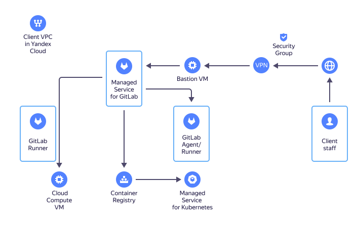

# Resource relationships in {{ mgl-name }}

[{{ GL }}](https://about.gitlab.com/) is an open-source web-based DevOps lifecycle tool. It is a system for managing code repositories for [Git](https://git-scm.com/) with error tracking, a [CI/CD](https://en.wikipedia.org/wiki/CI/CD) pipeline, a dedicated Wiki, and other functionality.

{{ mgl-name }} helps configure application deployment to [{{ compute-full-name }}](../../compute/) [virtual machines](../../compute/concepts/vm.md) and supports integration with [{{ container-registry-full-name }}](../../container-registry/) and [{{ managed-k8s-full-name }}](../../managed-kubernetes/).

How {{ mgl-name }} works:

## {{ GL }} instance {#instance}

A {{ GL }} _instance_ is the service's primary entity. It is a VM deployed in {{ yandex-cloud }}. {{ mgl-name }} takes care of its routine maintenance, such as storage fault tolerance, security updates, automated {{ GL }} version upgrades, and so on.

## Instance configuration {#config}

When creating an instance, you specify:
* Instance type: [The number of vCPUs and the amount of RAM](../../compute/concepts/vm-platforms.md). After creating an instance, you can change its type only by contacting [support]({{ link-console-support }}).
* [Subnet](../../vpc/concepts/network.md#subnet).

  

* Storage size. After creating an instance, you can increase its storage space only by contacting support. It is not possible to reduce storage size.
* Name in the `.gitlab.yandexcloud.net` domain: Your {{ GL }} instance's internet address.
* Administrator information:
  * Email.
  * Login.


