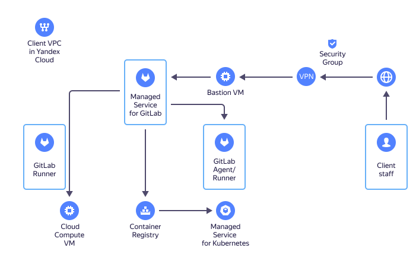

# Resource relationships in {{ mgl-name }}

[{{ GL }}](https://about.gitlab.com/) is an open-source web-based DevOps lifecycle tool. It is a code repository management system for [Git](https://git-scm.com/) with error tracking, [CI/CD](https://en.wikipedia.org/wiki/CI/CD) pipeline, dedicated Wiki, and other features.

{{ mgl-name }} helps configure application deployment on [VMs](../../compute/concepts/vm.md) in [{{ compute-full-name }}](../../compute/) and supports integration with [{{ container-registry-full-name }}](../../container-registry/) and [{{ managed-k8s-full-name }}](../../managed-kubernetes/).

How {{ mgl-name }} works:

## {{ GL }} instance {#instance}

A {{ GL }} _instance_ is the service's primary entity. It is a VM deployed in {{ yandex-cloud }}. {{ mgl-name }} takes care of its routine maintenance, such as storage fault tolerance, security updates, automated {{ GL }} version upgrades, and so on.

Users can mange instances from the [{{ yandex-cloud }} management console]({{ link-console-main }}), [CLI](../cli-ref/index.md), and [API](../api-ref/authentication.md).

## Instance configuration {#config}

When creating an instance, you specify:
* Instance type: [The number of vCPUs and the amount of RAM](../../compute/concepts/vm-platforms.md). Available instance types:

  | Type            | Computing resources |
  |----------------|------------------------|
  | s2.micro       | 2 vCPUs, 8 GB RAM       |
  | s2.small       | 4 vCPUs, 16 GB RAM      |
  | s2.medium      | 8 vCPUs, 32 GB RAM      |
  | s2.large       | 16 vCPUs, 64 GB RAM     |

  After you create an instance, you can [change its type](../operations/instance/instance-update.md) to a higher performing one.
* [Subnet](../../vpc/concepts/network.md#subnet).

  

* Disk size. After you create an instance, [you can increase](../operations/instance/instance-update.md) its disk size.
* Name in the `.gitlab.yandexcloud.net` domain: Your {{ GL }} instance's internet address.
* Administrator information:
  * Email.
  * Login.



## {{ GLR }} {#runners}

[{{ GLR }}](https://docs.gitlab.com/runner/) is an open-source application which executes {{ GL }} [CI/CD](https://en.wikipedia.org/wiki/CI/CD) pipeline jobs based on instructions from a special file named `.gitlab-ci.yml`. It helps run automated builds in [{{ managed-k8s-name }} clusters](../../managed-kubernetes/concepts/index.md#kubernetes-cluster) and on [{{ compute-name }} VMs](../../compute/concepts/vm.md).

You can get started with {{ GLR }} in the following ways:

* [Install {{ GLR }} in a {{ managed-k8s-name }} cluster](../../managed-kubernetes/operations/applications/gitlab-runner.md).
* Create a {{ compute-name }} VM and [install {{ GLR }} on it manually](../tutorials/install-gitlab-runner.md#install).
* [Create a runner managed by {{ yandex-cloud }}](#managed-runners).

### Managed runners {#managed-runners}







You can specify the following managed runner settings:
* Scaling settings:

    

* Worker VM settings:
  * Worker computing resource configuration:
    * 2 vCPUs, 4 GB RAM
    * 2 vCPUs, 8 GB RAM
    * 4 vCPUs, 16 GB RAM
    * 8 vCPUs, 64 GB RAM
    * 16 vCPUs, 128 GB RAM
  * Disk type (HDD or SSD) and size. For more information, see [{#T}](../../compute/concepts/disk.md#disks-types).
  * [Service account](../../iam/concepts/users/service-accounts.md).

    

  * [Security group](../../vpc/concepts/security-groups.md).

For more on managed runners, see these pages:
* [{#T}](../operations/runner.md)
* [{#T}](../tutorials/install-gitlab-runner.md)

## {{ GL }} Pages {#pages}

{{ GL }} Pages is a tool for publishing static websites composed of files residing in a {{ GL }} repository. Websites are deployed by {{ GL }} CI/CD jobs. {{ GL }} Pages works with static website generators and standard HTML, CSS, and JavaScript files.

{{ GL }} Pages enables you to use your own domains and SSL/TLS certificates and to configure access to websites.

[For more information, see the official {{ GL }} documentation](https://docs.gitlab.com/user/project/pages/).



## Use cases {#examples}

* [{#T}](../tutorials/gitlab-lockbox-integration.md)
* [{#T}](../tutorials/ci-cd-serverless.md)
* [{#T}](../tutorials/install-gitlab-runner.md)
* [{#T}](../tutorials/gitlab-containers.md)
