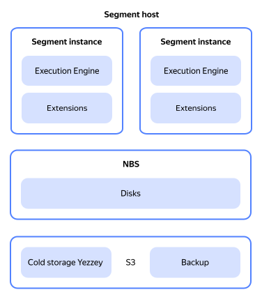
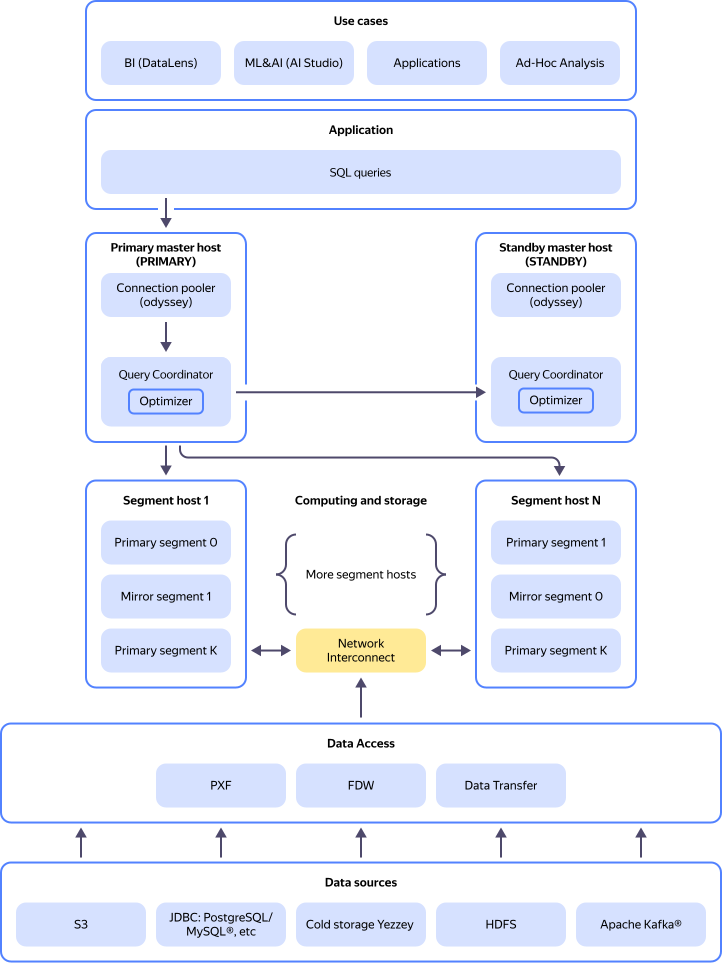

# Resource relationships in {{ mgp-name }}

The main entity used in {{ mgp-name }} is a _cluster_.

A database cluster consists of hosts, which are virtual machines with databases deployed on them. Learn more about [databases in {{ mgp-name }}](overview.md).

A database cluster includes:

* Two _master hosts_ (primary and standby).
* Two or more _segment hosts_.

The _primary_ master host (`PRIMARY`) accepts client connections and SQL queries from applications using the [Odissey connection pooler](pooling.md) and distributes them to the segment hosts for processing.

The _standby_ master host (`STANDBY`) continuously replicates the primary master host's data but accepts no user connections.

If the primary master host fails, the standby one takes over its functions. This way, a cluster with two master hosts will continue processing queries if any single master fails.

Segment hosts store distributed cluster data and process queries.

## Segment host architecture {#architecture-segment}

The segment host architecture is presented on the diagram:

Segment hosts have standalone database management systems, known as _segments_, deployed on them. The number of segments is the same for each host. Each cluster segment has a replica, i.e., a mirror segment located on another host, which stores a copy of the main segment's data.

Each segment includes the following components:

* Execution engine.
* Configurable extensions.

You can store data in a cluster storage or [hybrid storage](hybrid-storage.md).

You can [expand](../operations/cluster-expand.md) a cluster by adding more segment hosts. When expanding a cluster, you can also increase the number of segments per host. You cannot increase the number of segments without expanding a cluster.

## Executing queries in a cluster {#cluster-query-execution}

Whatever your use case, the application sends an SQL query to the cluster. The cluster processes the query as part of the user session as follows:

1. Establishes a session with the master host with the help of the Odyssey connection pooler, which manages authorization and reduces cluster overheads.
1. Forwards the query to the Query Coordinator process on the master host. Query Coordinator analyzes the query, breaks it into parts, and selects an execution plan for each one using the Optimizer.
1. Forwards the query parts with execution plans to the segments. When executing a query, the segments can access a local storage as well as external data sources with the help of [{{ data-transfer-full-name }}](../../data-transfer/index.yaml) or [external tables](external-tables.md).

The resource relationships in a {{ mgp-name }} cluster and the data exchange model within the cluster, as well as between the primary master host and applications, are shown in the diagram:

## Hosting cluster hosts {#host-placement}

{{ mgp-name }} cluster hosts are cloud VMs. Such VMs can reside on:

* _Regular {{ yandex-cloud }} hosts_:

    These are physical servers for hosting cluster VMs. They are randomly selected from a pool of available hosts that meet the selected cluster configuration.

* _Dedicated {{ yandex-cloud }} hosts_:

    These are physical servers reserved exclusively for your VMs. VMs on dedicated hosts have all the features of regular VMs. In addition, they are physically isolated from other users' VMs and have access to the whole volume of the physical server's local disks.

    Dedicated hosts are selected from _dedicated host groups_ specified when creating a cluster. You must first [create](../../compute/operations/dedicated-host/create-host-group.md) a group of dedicated hosts in {{ compute-full-name }}.

    For more information, see [{#T}](../../compute/concepts/dedicated-host.md).

All {{ mgp-name }} cluster hosts reside in one of these availability zones: `{{ region-id }}-a`, `{{ region-id }}-b`, or `{{ region-id }}-d`.

When creating a cluster, specify:

* _Host class_: Template for deploying cluster hosts. For a list of available host classes and their characteristics, see [Host classes](instance-types.md).

* _Environment_: Environment where the cluster will be deployed:
    * `PRODUCTION`: For stable versions of your applications.
    * `PRESTABLE`: For testing purposes. The prestable environment is similar to the production environment and likewise covered by an SLA, but it is the first to get new features, improvements, and bug fixes. In the prestable environment, you can test service updates for compatibility with your application.




