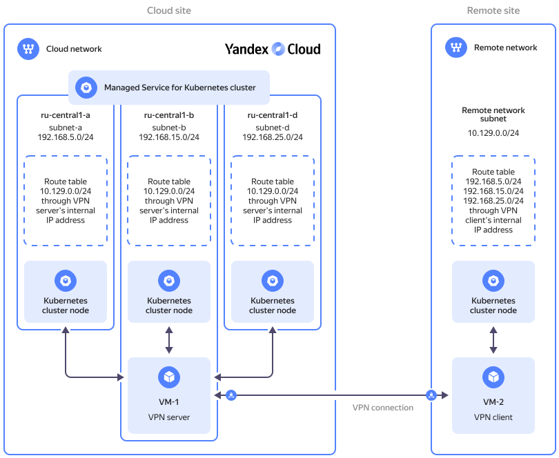

# Configuring WireGuard gateways to connect external nodes to a cluster

With {{ managed-k8s-full-name }}, you can connect servers from outside {{ yandex-cloud }} as [{{ k8s }} cluster](../../managed-kubernetes/concepts/index.md#kubernetes-cluster) nodes. To connect one, first, set up network connectivity between the remote network hosting the external server and the [cloud network](../../vpc/concepts/network.md#network) hosting your {{ managed-k8s-name }} cluster. You can do this using a VPN.

Below is an example of establishing network connectivity over the [WireGuard](https://www.wireguard.com) protocol. Here, the external server is a VM residing in another {{ yandex-cloud }} cloud network.

You can see the solution architecture in the diagram below:



## Getting started {#before-you-begin}

1. [Create](../../vpc/operations/network-create.md) your main cloud network with three [subnets](../../vpc/concepts/network.md#subnet) in different availability zones.

1. In the main network, [create](kubernetes-cluster/kubernetes-cluster-create.md) a {{ managed-k8s-name }} cluster with a [highly available](../../managed-kubernetes/concepts/index.md#master) master.

    To create an external node group, the {{ managed-k8s-name }} cluster must operate in [tunnel mode](../concepts/network-policy.md#cilium). This mode can be enabled only when creating the cluster.

1. 

1. In the main network, [create](../../compute/operations/vm-create/create-linux-vm.md) a {{ compute-name }} VM with a [public IP address](../../vpc/concepts/address.md#public-addresses); name it `VM-1`. On this VM, you will set up the main WireGuard gateway.

1. [Create](../../vpc/operations/network-create.md) an additional cloud network with one subnet.

1. In the additional network, [create](../../compute/operations/vm-create/create-linux-vm.md) a {{ compute-name }} VM with a public IP address; name it `VM-2`. On this VM, you will set up the additional WireGuard gateway.

## Configuring security groups {#sg}

1. In the main network, [create](../../vpc/operations/security-group-create.md) a security group and assign it to `VM-1`. [Add](../../vpc/operations/security-group-add-rule.md) the following rules to the group:

    

    - Outgoing traffic {#outgoing}

      {{ ui-key.yacloud.vpc.network.security-groups.forms.field_sg-rule-description }} | {{ ui-key.yacloud.vpc.network.security-groups.forms.field_sg-rule-port-range }} | {{ ui-key.yacloud.vpc.network.security-groups.forms.field_sg-rule-protocol }} | {{ ui-key.yacloud.vpc.network.security-groups.forms.field_sg-rule-destination }} | {{ ui-key.yacloud.vpc.network.security-groups.forms.field_sg-rule-cidr-blocks }}
      --- | --- | --- | --- | ---
      `any` | `{{ port-any }}` | `{{ ui-key.yacloud.vpc.network.security-groups.forms.value_any }}` | `{{ ui-key.yacloud.vpc.network.security-groups.forms.value_sg-rule-destination-cidr }}` | `0.0.0.0/0`

    - Incoming traffic {#incoming}

      {{ ui-key.yacloud.vpc.network.security-groups.forms.field_sg-rule-description }} | {{ ui-key.yacloud.vpc.network.security-groups.forms.field_sg-rule-port-range }} | {{ ui-key.yacloud.vpc.network.security-groups.forms.field_sg-rule-protocol }} | {{ ui-key.yacloud.vpc.network.security-groups.forms.field_sg-rule-source }} | {{ ui-key.yacloud.vpc.network.security-groups.forms.field_sg-rule-cidr-blocks }}
      --- | --- | --- | --- | ---
      `icmp` | `{{ port-any }}` | `ICMP` | `{{ ui-key.yacloud.vpc.network.security-groups.forms.value_sg-rule-destination-cidr }}` | `0.0.0.0/0`
      `ssh` | `22` | `TCP` | `{{ ui-key.yacloud.vpc.network.security-groups.forms.value_sg-rule-destination-cidr }}` | `0.0.0.0/0`
      `wireguard` | `51821` | `UDP` | `{{ ui-key.yacloud.vpc.network.security-groups.forms.value_sg-rule-destination-cidr }}` | `<VM_2_public_address>/32`
      `VM-2-subnet` | `{{ port-any }}` | `{{ ui-key.yacloud.vpc.network.security-groups.forms.value_any }}` | `{{ ui-key.yacloud.vpc.network.security-groups.forms.value_sg-rule-destination-cidr }}` | `<VM_2_subnet_CIDR>`
      
    

1. In the additional network, [create](../../vpc/operations/security-group-create.md) a security group and assign it to `VM-2`. [Add](../../vpc/operations/security-group-add-rule.md) the following rules to the group:

    

    - Outgoing traffic {#outgoing}

      {{ ui-key.yacloud.vpc.network.security-groups.forms.field_sg-rule-description }} | {{ ui-key.yacloud.vpc.network.security-groups.forms.field_sg-rule-port-range }} | {{ ui-key.yacloud.vpc.network.security-groups.forms.field_sg-rule-protocol }} | {{ ui-key.yacloud.vpc.network.security-groups.forms.field_sg-rule-destination }} | {{ ui-key.yacloud.vpc.network.security-groups.forms.field_sg-rule-cidr-blocks }}
      --- | --- | --- | --- | ---
      `any` | `{{ port-any }}` | `{{ ui-key.yacloud.vpc.network.security-groups.forms.value_any }}` | `{{ ui-key.yacloud.vpc.network.security-groups.forms.value_sg-rule-destination-cidr }}` | `0.0.0.0/0`
      
    - Incoming traffic {#incoming}
      
      {{ ui-key.yacloud.vpc.network.security-groups.forms.field_sg-rule-description }} | {{ ui-key.yacloud.vpc.network.security-groups.forms.field_sg-rule-port-range }} | {{ ui-key.yacloud.vpc.network.security-groups.forms.field_sg-rule-protocol }} | {{ ui-key.yacloud.vpc.network.security-groups.forms.field_sg-rule-source }} | {{ ui-key.yacloud.vpc.network.security-groups.forms.field_sg-rule-cidr-blocks }}
      --- | --- | --- | --- | ---
      `icmp` | `{{ port-any }}` | `ICMP` | `{{ ui-key.yacloud.vpc.network.security-groups.forms.value_sg-rule-destination-cidr }}` | `0.0.0.0/0`
      `ssh` | `22` | `TCP` | `{{ ui-key.yacloud.vpc.network.security-groups.forms.value_sg-rule-destination-cidr }}` | `0.0.0.0/0`
      `wireguard` | `51822` | `UDP` | `{{ ui-key.yacloud.vpc.network.security-groups.forms.value_sg-rule-destination-cidr }}` | `<VM_1_public_address>/32`
      `k8s-VM-1-subnets` | `{{ port-any }}` | `{{ ui-key.yacloud.vpc.network.security-groups.forms.value_any }}` | `{{ ui-key.yacloud.vpc.network.security-groups.forms.value_sg-rule-destination-cidr }}` | `<main_subnet1_CIDR>`, `<main_subnet2_CIDR>`, `<<main_subnet3_CIDR>`
      `cluster&services` | `{{ port-any }}` | `{{ ui-key.yacloud.vpc.network.security-groups.forms.value_any }}` | `{{ ui-key.yacloud.vpc.network.security-groups.forms.value_sg-rule-destination-cidr }}` | `<cluster_CIDR>`, `<CIDRs_of_services>`

        

1. [Add](../../vpc/operations/security-group-add-rule.md) the following rule to the security group of the {{ managed-k8s-name }} cluster and node groups:

    

    - Incoming traffic {#incoming}

      {{ ui-key.yacloud.vpc.network.security-groups.forms.field_sg-rule-description }} | {{ ui-key.yacloud.vpc.network.security-groups.forms.field_sg-rule-port-range }} | {{ ui-key.yacloud.vpc.network.security-groups.forms.field_sg-rule-protocol }} | {{ ui-key.yacloud.vpc.network.security-groups.forms.field_sg-rule-source }} | {{ ui-key.yacloud.vpc.network.security-groups.forms.field_sg-rule-cidr-blocks }}
      --- | --- | --- | --- | ---
      `VM-2-subnet` | `{{ port-any }}` | `{{ ui-key.yacloud.vpc.network.security-groups.forms.value_any }}` | `{{ ui-key.yacloud.vpc.network.security-groups.forms.value_sg-rule-destination-cidr }}` | `<VM_2_subnet_CIDR>`

        

## Configuring routing {#rt}

1. Configure routing for the main WireGuard gateway:

   1. In the main network, [create a route table and add a static route to it](../../vpc/operations/static-route-create.md):

      * **{{ ui-key.yacloud.vpc.add-static-route.field_destination-prefix }}**: Specify the CIDR of the `VM-2`'s subnet.
      * **{{ ui-key.yacloud.vpc.add-static-route.value_ip-address }}**: Specify the `VM-1`'s internal IP address.

   1. Associate the route table with all subnets in your main network.

1. Configure routing for the additional WireGuard gateway:

   1. In the additional network, create a route table.

   1. Add a static route for the route table:

      * **{{ ui-key.yacloud.vpc.add-static-route.field_destination-prefix }}**: Specify the CIDR of the `VM-1`'s subnet.
      * **{{ ui-key.yacloud.vpc.add-static-route.value_ip-address }}**: Specify the `VM-2`'s internal IP address.

      Repeat this step for each subnet in your main network.

   1. Associate the route table to the `VM-2`'s subnet.

## Setting up WireGuard gateways {#gw}

1. Set up the main WireGuard gateway:

    1. [Connect](../../compute/operations/vm-connect/ssh.md) to `VM-1` over SSH.

    1. Install WireGuard:

        ```bash
        sudo apt update && sudo apt install wireguard
        ```

    1. Generate and save the encryption keys:

        ```
        wg genkey | sudo tee vm1_private.key | wg pubkey | sudo tee vm1_public.key > /dev/null
        wg genkey | sudo tee vm2_private.key | wg pubkey | sudo tee vm2_public.key > /dev/null
        ```
       In the current directory, the system will create these four files:

          * `vm1_private.key`: Contains the private encryption key for `VM-1`.
          * `vm1_public.key`: Contains the public encryption key for `VM-1`.
          * `vm2_private.key`: Contains the private encryption key for `VM-2`.
          * `vm2_public.key`: Contains the public encryption key for `VM-2`.

    1. Create a configuration file named `wg0.conf`:

        ```bash
        sudo nano /etc/wireguard/wg0.conf
        ```

    1. Add the following configuration to it:

        ```text
        [Interface]
        PrivateKey = <vm1_private.key_file_contents>
        Address = 10.0.0.1/32
        ListenPort = 51821

        PreUp = sysctl -w net.ipv4.ip_forward=1

        [Peer]
        PublicKey = <vm2_public.key_file_contents>
        Endpoint = <VM_2_public_address>:51822
        AllowedIPs = <VM_2_subnet_CIDR>, 10.0.0.2/32
        PersistentKeepalive = 15
        ```
  
       [Learn more about the configuration parameters](https://www.procustodibus.com/blog/2020/12/wireguard-site-to-site-config).

       Save the changes and close the file.    

    1. Apply the configuration:

        ```bash
        sudo systemctl restart wg-quick@wg0
        ```        

1. Set up the additional WireGuard gateway:

    1. [Connect](../../compute/operations/vm-connect/ssh.md) to `VM-2` over SSH.

    1. Install WireGuard:

        ```bash
        sudo apt update && sudo apt install wireguard
        ```

    1. Create a configuration file named `wg0.conf`:

        ```bash
        sudo nano /etc/wireguard/wg0.conf
        ```

    1. Add the following configuration to it:

        ```text
        [Interface]
        PrivateKey = <vm2_private.key_file_contents>
        Address = 10.0.0.2/32
        ListenPort = 51822

        PreUp = sysctl -w net.ipv4.ip_forward=1

        [Peer]
        PublicKey = <vm1_public.key_file_contents>
        Endpoint = <VM_1_public_address>:51821
        AllowedIPs = <main_subnet1_CIDR>, <main_subnet2_CIDR>, <main_subnet3_CIDR>, 10.0.0.1/32
        PersistentKeepalive = 15
        ```

       [Learn more about the configuration parameters](https://www.procustodibus.com/blog/2020/12/wireguard-site-to-site-config).

       Save the changes and close the file.        

    1. Apply the configuration:

        ```bash
        sudo systemctl restart wg-quick@wg0
        ```

1. Check the connection status on both VMs:

   ```bash
   sudo wg show
   ```

    You should see `latest handshake` in the command output, indicating a successfully established connection: 

    ```text
    ...
    latest handshake: 3 seconds ago
    ...
    ```

1. 

1. [Connect](../../managed-kubernetes/operations/external-nodes-connect.md) `VM-2` to the {{ managed-k8s-name }} cluster as its external node.

## Troubleshooting {#troubleshooting}

