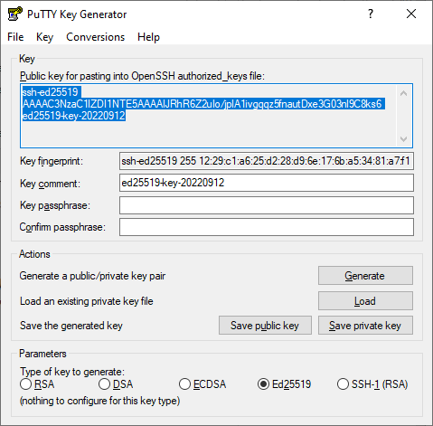
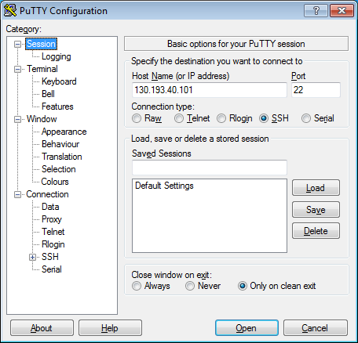
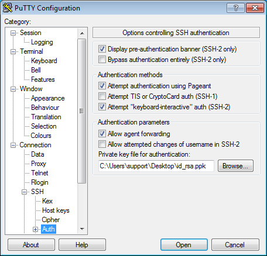
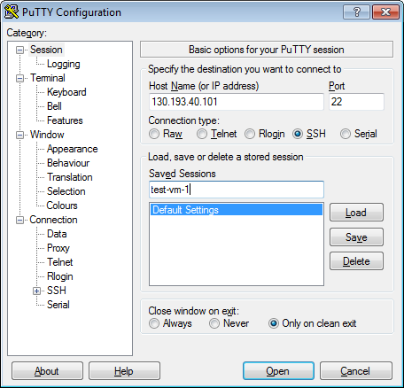
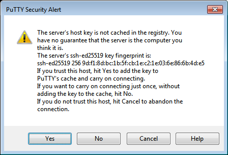
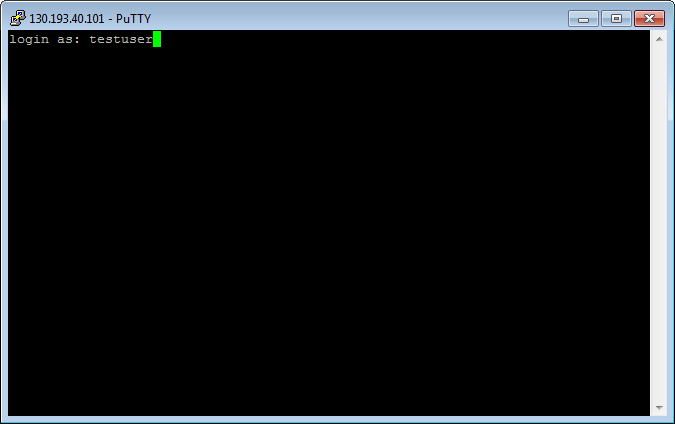

# Connecting to a node over SSH

To connect to a node over SSH, you must add the public key to the metainformation when creating the node group.



SSH connection using a login and password is disabled by default on Linux images that are used on nodes.



For more information about connecting over SSH, see [Connecting to a VM via SSH](../../compute/operations/vm-connect/ssh.md).

## Create SSH key pairs {#creating-ssh-keys}

Prepare the keys for use with your node. To do this:



- Linux/MacOS

  1. Open the terminal.
  1. Use the `ssh-keygen` command to create a new key:

     ```bash
     ssh-keygen -t rsa -b 2048
     ```

     After the command runs, you will be asked to specify the names of files where the keys will be saved and enter the password for the private key. The default name is `id_rsa`. Keys are created in the `~./ssh` directory.

     The public part of the key will be saved in a file with the name `<key name>.pub`.

- Windows 10

  1. Run `cmd.exe` or `powershell.exe`.
  1. Use the `ssh-keygen` command to create a new key. Run the command:

     ```bash
     ssh-keygen -t rsa -b 2048
     ```

     After the command runs, you will be asked to specify the names of files where the keys will be saved and enter the password for the private key. The default name is `id_rsa`. Keys are created in the `C:\Users\<username>\.ssh\` directory.

     The public part of the key will be saved in a file with the name `<key name>.pub`.

- Windows 7/8

  To create keys for Windows, use the PuTTY application.

  1. [Download](https://www.putty.org) and install PuTTY.
  1. Make sure that the directory where you installed PuTTY is included in `PATH`:
     1. Right-click on **My computer**. Click **Properties**.
     1. In the window that opens, select **Additional system parameters**, then **Environment variables** (located in the lower part of the window).
     1. Under **System variables**, find `PATH` and click **Edit**.
     1. In the **Variable value** field, append the path to the directory where you installed PuTTY.
  1. Launch the PuTTYgen app.
  1. Select **RSA** for the type of pair to generate and set the length to `2048`. Click **Generate** and move the cursor in the field above it until key creation is complete.

     

  1. In **Key passphrase**, enter a strong password. Enter it again in the field below.
  1. Click **Save private key** and save the private key. Never share it with anyone and do not tell anyone the passphrase for it.
  1. Save the key in a text file in a single line. To do this, copy the public key from the text field to a text file with the name `id_rsa.pub`.



## Convert the public key to the relevant format {#key-format}

Users and SSH keys are managed with [OS Login](https://cloud.google.com/compute/docs/oslogin/), so the keys must be passed in a specific format.

The file with the public key is created in the format:

```
ssh-rsa AAAAB3NzaC*********** rsa-key-20190412
```

You need to convert the key to the format `<username>:ssh-rsa <key body> <username>`, so that it looks like this:

```
username:ssh-rsa AAAAB3NzaC***********zo/lP1ww== username
```

You can pass multiple public keys in the same file to grant access to different users:

```
username:ssh-rsa AAAAB3NzaC***********zo/lP1ww== username
username2:ssh-rsa ONEMOREkey***********88OavEHw== username2
```

## Create a node group and add the public key {#node-create}

To create a node group with the necessary parameters, use the following command:

```bash
yc managed-kubernetes node-group create \
  --name <node group name> \
  --cluster-name <{{ k8s }} cluster name> \
  --fixed-size <number of nodes in the group> \
  --location zone=<availability zone>,subnet-name=<subnet name> \
  --public-ip \
  --metadata-from-file ssh-keys=<name of the file with public keys>
```



## Update node group keys {#node-add-metadata}

To update the SSH keys of a node group, use the following command:

```bash
yc managed-kubernetes node-group add-metadata \
  --name <node group name> \
  --metadata-from-file ssh-keys=<name of the file with public keys>
```

## Get the public IP address of the node {#node-public-ip}

To connect, specify the [public IP address](../../vpc/concepts/address.md#public-addresses) of the node. You can find it using one of the following methods.



- kubectl CLI

  Use the following command for kubectl. The public IP address is listed in the `EXTERNAL-IP` column.

  ```bash
  kubectl get nodes -o wide
  ```

  Result:

  ```bash
  NAME                       STATUS  ROLES   AGE  VERSION  INTERNAL-IP  EXTERNAL-IP     OS-IMAGE            KERNEL-VERSION     CONTAINER-RUNTIME
  cl17i6943n92sb98jifg-itif  Ready   <none>  31m  v1.13.3  10.0.0.27    84.201.145.251  Ubuntu 18.04.1 LTS  4.15.0-29-generic  docker://18.6.2
  cl17i6943n92sb98jifg-ovah  Ready   <none>  31m  v1.13.3  10.0.0.22    84.201.149.184  Ubuntu 18.04.1 LTS  4.15.0-29-generic  docker://18.6.2
  ```

- Management console
  1. Open the **{{ compute-name }}** section in the folder where you created your {{ k8s }} cluster.
  1. On the **Virtual machines** page, go to the **Instance groups** tab.
  1. Click on the instance group with the name that matches the node group ID.
  1. In the window that opens, go to the **List of VMs** tab.
  1. Click the VM that you want to find the public address for.
  1. The public IP address is shown in the **Network** section in **Public IPv4**.

- YC CLI

  1. Find the ID of the instance group that corresponds to the node group.

     This parameter is shown in the `INSTANCE GROUP ID` column.

     ```bash
     yc managed-kubernetes node-group list
     ```

     Result:

     ```bash
     +----------------------+----------------------+----------------+----------------------+---------------------+---------+------+
     |          ID          |      CLUSTER ID      |      NAME      |  INSTANCE GROUP ID   |     CREATED AT      | STATUS  | SIZE |
     +----------------------+----------------------+----------------+----------------------+---------------------+---------+------+
     | cat684ojo3irchtpeg84 | cata9ertn6tcr09bh9rm | test-nodegroup | cl17i6943n92sb98jifg | 2019-04-12 12:38:35 | RUNNING |    2 |
     +----------------------+----------------------+----------------+----------------------+---------------------+---------+------+
     ```

  1. View the list of nodes that belong to this group.

     The public IP address of the node is shown in the `IP` column after the `~` character.

     ```bash
     yc compute instance-group list-instances cl17i6943n92sb98jifg
     ```

     Result:

     ```bash
     +----------------------+---------------------------+--------------------------+---------------+----------------+
     |     INSTANCE ID      |           NAME            |            IP            |    STATUS     | STATUS MESSAGE |
     +----------------------+---------------------------+--------------------------+---------------+----------------+
     | ef31h24k03pg0mhunfm1 | cl17i6943n92sb98jifg-itif | 10.0.0.27~84.201.145.251 | RUNNING [53m] |                |
     | ef37ddhg9i7jhs7tc3pe | cl17i6943n92sb98jifg-ovah | 10.0.0.22~84.201.149.184 | RUNNING [53m] |                |
     +----------------------+---------------------------+--------------------------+---------------+----------------+
     ```



## Connect to the node {#node-connect}

You can connect to a node over SSH once it is started (with the `RUNNING` status). You can use the `ssh` tool in Linux and macOS or [PuTTY](https://www.chiark.greenend.org.uk/~sgtatham/putty/) for Windows.



- Linux/macOS/Windows 10

  In the terminal, run the following command:

  ```bash
  ssh <username>@<public_IP_address_of_the_node>
  ```

  If this is the first time you connect to the node, you might see a warning about an unknown host:

  ```bash
  The authenticity of host '130.193.40.101 (130.193.40.101)' can't be established.
  ECDSA key fingerprint is SHA256:PoaSwqxRc8g6iOXtiH7ayGHpSN0MXwUfWHkGgpLELJ8.
  Are you sure you want to continue connecting (yes/no)?
  ```

  Type `yes` in the terminal and press **Enter**.

- Windows 7/8

  In Windows, a connection is established using the PuTTY application.
  1. Run the Pageant application.
     1. Right-click on the Pageant icon in the task bar.
     1. In the context menu, select **Add key**.
     1. Select a PuTTY-generated private key in the `.ppk` format. If a password is set for the key, enter it.
  1. Run PuTTY.
     1. In the **Host Name (or IP address)** field, enter the public IP address of the VM you want to connect to. Specify port `22` and **SSH** as the connection type.

        

     1. In the tree on the left, select **Connection** - **SSH** - **Auth**.
     1. Set the **Allow agent forwarding** option.
     1. In the **Private key file for authentication** field, select the file with the private key.

        

     1. Go back to the **Sessions** menu. In the **Saved sessions** field, enter any session name and click **Save**. The session settings are saved under the specified name. You can use this session profile to connect using Pageant.

        

     1. Click **Open**. If this is the first time you connect to the node, you might see a warning about an unknown host:

        

        Click **Yes**. A terminal window opens suggesting that you enter the login of the user on whose behalf the connection is being established. Type the user name you specified in the file with the public key and click **Enter**. If everything is configured correctly, the connection with the server will be established.

        

  If you saved the session profile in PuTTY, you can use Pageant to establish a connection in the future:
  1. Right-click on the Pageant icon in the task bar.
  1. Select the **Saved sessions** menu item.
  1. In the saved sessions list, select the necessary session.

