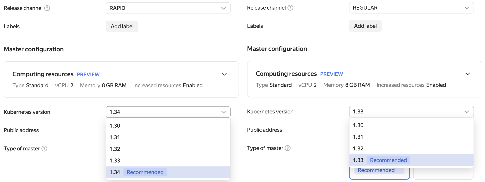
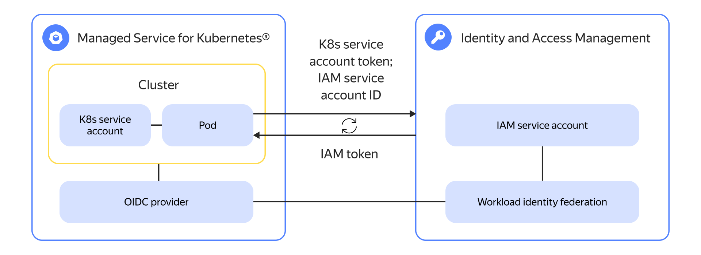

# {{ managed-k8s-full-name }} release notes

<!-- Changelog begin -->


```
date: 2025-12
index: 3
```

### {{ k8s }} 1.34 in RAPID, 1.33 in REGULAR



Use the latest version of {{ k8s }} in your clusters. The following {{ k8s }} versions are now available in the [release channels]({{ link-docs }}/managed-kubernetes/concepts/release-channels-and-updates):
* 1.34 in `RAPID`
* 1.33 in `REGULAR`




```
date: 2025-09
index: 2
```

### Accessing the {{ yandex-cloud }} API from a cluster using an {{ iam-short-name }} workload identity federation



Get an IAM token for the {{ yandex-cloud }} API authentication directly from your cluster pod by integrating with an {{ iam-name }} workload identity federation. For more information, see the following:
* [Integration guide]({{ link-docs }}/managed-kubernetes/tutorials/wlif-managed-k8s-integration)
* [Yandex Neuro Scale 2025 report](https://scale.yandex.cloud/?broadcast=89&speech=2653)




```
date: 2025-09
index: 1
```

### {{ yandex-cloud }} Gwin controller 


Use the new {{ yandex-cloud }} Gwin controller for balancing with {{ alb-name }}. Both the {{ k8s }} [Ingress](https://kubernetes.io/docs/concepts/services-networking/ingress/) and [Gateway API](https://gateway-api.sigs.k8s.io/) specifications are supported. For more information, see the following:
* [Gwin tutorials]({{ link-docs }}/managed-kubernetes/alb-ref/gwin-index)
* [Yandex Neuro Scale 2025 report](https://scale.yandex.cloud/?broadcast=89&speech=2658)

#### Ubuntu 22.04 on cluster nodes

Starting with {{ k8s }} version 1.30, the node OS changed from Ubuntu 20.04 to Ubuntu 22.04. When you update node groups within these versions, new nodes are automatically created from an Ubuntu 22.04 VM image. For more information, see [Updating node group OS]({{ link-docs }}/managed-kubernetes/concepts/node-os-update).

#### Selecting the master configuration in the CLI and {{ TF }}

Use the [{{ yandex-cloud }} CLI]({{ link-docs }}/cli/) and [{{ TF }}]({{ link-docs }}/terraform/) tools to [configure]({{ link-docs }}/managed-kubernetes/concepts/#master-resources) master resources. For more information, see [Creating a {{ managed-k8s-name }} cluster]({{ link-docs }}/managed-kubernetes/operations/kubernetes-cluster/kubernetes-cluster-create).



<!-- Changelog end -->

{{ managed-k8s-full-name }} [release channels](./concepts/release-channels-and-updates.md) receive updates in the set order. First, updates with new features and improvements are released in the `rapid` channel, after a while, in the `regular` channel, and only then they become available in the `stable` channel.

## Q4 2025 {#q4-2025}

### Improvements {#q4-2025-improvements}

* Added support for {{ k8s }} [1.34](https://kubernetes.io/blog/2025/08/27/kubernetes-v1-34-release/). For more information, see [{#T}](./concepts/release-channels-and-updates.md).
* Added support for [cluster autoscaling](./concepts/autoscale.md#ca) in response to pod requests for [ephemeral storage](https://kubernetes.io/docs/concepts/storage/ephemeral-storage/).
* Upgraded the [node-problem-detector](https://github.com/kubernetes/node-problem-detector) component to version [0.8.21](https://github.com/kubernetes/node-problem-detector/releases/tag/v0.8.21). Enabled an endpoint for collecting metrics from this component. 
* Added the `criticalAddonsOnly` field to the `calico-typha-horizontal-autoscaler` and `calico-typha-vertical-autoscaler` manifests to be able to group system pods on specific nodes.

### Fixes {#q4-2025-problems-solved}

* Fixed the [issue](https://github.com/kubernetes/kubernetes/issues/126440) of containers in pods remaining in `Created` status in clusters with {{ k8s }} versions 1.29 or 1.30.
* Fixed the [ip-masq-agent](https://github.com/kubernetes-sigs/ip-masq-agent) configuration issue that could lead to traffic loss in clusters with large numbers of `LoadBalancer`-type services under heavy traffic.
* Fixed the issue where in some cases attempts to create several node groups at the same time resulted in creating one group only.
* Updated IP address range validation for cluster services (Service CIDR). Now the range cannot be wider than `/12`.
* Fixed the issue where the user's cluster stop operation would freeze if the service account lacked permissions, e.g., if the service account's permissions were revoked before the cluster was stopped.

### Other updates {#q4-2025-other-changes}

* Added cluster-level permission checks for all operations with clusters and node groups.
* Changed permissions for access to {{ k8s }} configuration files on cluster nodes to more restrictive values for better security.
* Now it is impossible to delete a {{ kms-full-name }} encryption key if it is used for encryption in a {{ managed-k8s-full-name }} cluster.

## Q3 2025 {#q3-2025}

### New features {#q3-2025-new-features}

* Now you can select a [master configuration](./concepts/index.md#master-resources) using [{{ TF }}](../terraform/) and the [{{ yandex-cloud }} CLI](../cli/) when creating or updating a cluster. For more information, see [{#T}](./operations/kubernetes-cluster/kubernetes-cluster-create.md).
* Now you can [access the {{ yandex-cloud }} API from a {{ managed-k8s-name }} cluster using a {{ iam-full-name }} workload identity federation](./tutorials/wlif-managed-k8s-integration.md). Now you can exchange {{ k8s }} service account tokens for {{ yandex-cloud }} IAM tokens for simple authentication and authorization in the cloud from cluster pods.
* Added support for authentication in [{{ cloud-registry-full-name }}](../cloud-registry/) using a node group service account. To access {{ cloud-registry-name }} registries, [assign](../iam/operations/sa/assign-role-for-sa.md) the `cloud-registry.artifacts.puller` [role](../cloud-registry/security/index.md#cloud-registry-artifacts-puller) to the node group service account.
* Added support for simultaneous [upscaling](./concepts/volume.md#volume-expansion) of multiple persistent volumes mounted on a single node. For more information, see [{#T}](./operations/volumes/volume-expansion.md).

### Improvements {#q3-2025-improvements}

* Added support for {{ k8s }} [1.33](https://kubernetes.io/blog/2025/04/23/kubernetes-v1-33-release/). For more information, see [{#T}](./concepts/release-channels-and-updates.md).
* Updated the [containerd](https://containerd.io/) runtime to version [1.7.27](https://github.com/containerd/containerd/releases/tag/v1.7.27) for clusters with {{ k8s }} 1.30 or higher.
* Starting with {{ k8s }} version 1.30, the node OS changed from Ubuntu 20.04 to Ubuntu 22.04. When you update node groups within these versions, new nodes are automatically created from an Ubuntu 22.04 VM image. For more information, see [{#T}](./concepts/node-os-update.md).
* [Cluster Autoscaler](./concepts/autoscale.md#ca) now checks [zones](../overview/concepts/geo-scope.md) for availability when selecting a node group for scaling. The system will no longer try to autoscale node groups in zones that are unavailable.

### Fixes {#q3-2025-problems-solved}

* Fixed an error where, during the updating of master resources, the cluster would get the `Running` status before the update operation was completed.
* Fixed an error that disrupted the master's connectivity with nodes in tunnel clusters when migrating the master from one subnet to another. The issue rendered the {{ k8s }} Webhook and Aggregated API inoperable on the newly migrated master.

### Other updates {#q3-2025-other-changes}

Removed the option to disable upscaling of master resources in response to increased load; the feature is now enabled for all {{ managed-k8s-name }} clusters. Removed from the [{{ managed-k8s-full-name }}® service level](https://yandex.com/legal/cloud_sla_kb/en/) document the clause requiring that said feature must be enabled in master settings.

## Q2 2025 {#q2-2025}

### New features {#q2-2025-new-features}

* Added support for {{ k8s }} version [1.32](https://github.com/kubernetes/kubernetes/blob/master/CHANGELOG/CHANGELOG-1.32.md). For more information, see [{#T}](./concepts/release-channels-and-updates.md).
* You can now specify the same value for the minimum and maximum number of nodes in an [autoscaling](./concepts/node-group/cluster-autoscaler.md) group. This way, you can achieve a fixed size and effectively disable autoscaling without switching to the fixed group type.
* Added support for [encrypted {{ compute-full-name }} disks](./concepts/volume.md#encrypted-disks) for static and dynamic provisioning of persistent volumes.
* Now you can send an `UpdateClusterCertificate` [management event](./at-ref.md#control-plane-events) to {{ at-full-name }} when updating a [cluster certificate](./concepts/release-channels-and-updates.md#certificates).
* Updated the [Calico](./concepts/network-policy.md#calico) network controller to version [3.30](https://github.com/projectcalico/calico/blob/release-v3.30/release-notes/v3.30.0-release-notes.md).

### Improvements {#q2-2025-improvements}

* Implemented forced removal of a node in an [autoscaling](./concepts/node-group/cluster-autoscaler.md) group if, for any reason, it was unable to connect to the cluster within 15 minutes. Once removed, the node is automatically recreated.
* In accordance with the [CIS {{ k8s }} Benchmarks](https://www.cisecurity.org/benchmark/kubernetes), disabled profiling for master components.
* In clusters with [tunnel mode](./concepts/network-policy.md#cilium), added support for [Topology Aware Routing](https://kubernetes.io/docs/concepts/services-networking/topology-aware-routing/) to keep traffic in one [availability zone](../overview/concepts/geo-scope.md) to reduce network latency.
* Made cluster node registration more secure: now you can use a bootstrap configuration to issue a certificate for a node only from that node itself, not from any other node or pod.

### Fixes {#q2-2025-problems-solved}

* Fixed the [Cilium](./concepts/network-policy.md#cilium) network controller's bug making the cluster network unavailable if the masters failed. Now, the network and applications in the cluster remain available even if the masters fail completely. Only supported on clusters running Cilium 1.15 or higher ({{ k8s }} 1.31).
* Fixed a bug that could cause master components to keep operating with an expired certificate.
* Fixed a bug that could prevent [autoscaling](./concepts/node-group/cluster-autoscaler.md) in node groups of over 80 nodes.
* Fixed a bug that could prevent updating {{ network-load-balancer-full-name }} [target groups](../network-load-balancer/concepts/target-resources.md) for `LoadBalancer` type services.

## Q1 2025 {#q1-2025}

### New features {#q1-2025-new-features}

* You can now configure [computing resources](./concepts/index.md#master-resources) for masters using the [quotas](./concepts/limits.md#managed-k8s-quotas) we added.
* Updated the master configuration types: 
  * _Base_: Contains one master host in a single availability zone. Its former name is _zonal_.
  * _Highly available in three availability zones_: Contains three master hosts in three different availability zones. Its former name is _regional_.
  * _Highly available in one availability zone_: Contains three master hosts in one availability zone and one subnet. This is a new configuration.

  For more information, see the [master description](./concepts/index.md#master).

### Fixes and improvements {#q1-2025-problems-solved}

* Switched encrypting cluster secrets in [etcd](https://kubernetes.io/docs/concepts/architecture/#etcd) to [KMS v2](https://kubernetes.io/docs/tasks/administer-cluster/kms-provider/#kms-v2).
* Fixed an error that would, in some cases, prevent creating a {{ managed-k8s-name }} cluster with logging enabled.
* Fixed the issue where a {{ network-load-balancer-name }} with enabled deletion protection managed by the {{ managed-k8s-name }} cluster, would block cluster deletion. Cluster deletion is no longer blocked, and load balancers remain in the user folder.

## Q4 2024 {#q4-2024}

### New features {#q4-2024-new-features}

* Added support for {{ k8s }} version [1.31](https://github.com/kubernetes/kubernetes/blob/master/CHANGELOG/CHANGELOG-1.31.md). For more information, see [{#T}](./concepts/release-channels-and-updates.md).
* Updated [Cilium](https://cilium.io/) from version [1.12.9](https://github.com/cilium/cilium/releases/tag/v1.12.9) to [1.15.10](https://github.com/cilium/cilium/releases/tag/v1.15.10) for clusters with {{ k8s }} version 1.31 and higher.
* Updated [CoreDNS](https://coredns.io/) from version [1.9.4](https://github.com/coredns/coredns/releases/tag/v1.9.4) to [1.11.3](https://github.com/coredns/coredns/releases/tag/v1.11.3) for all supported {{ k8s }} versions.

### Fixes and improvements {#q4-2024-problems-solved}

* Added a _preflight check_ for compatibility of objects or configurations with the new {{ k8s }} version before cluster upgrade.

  If the check identifies incompatible objects or configurations, the upgrade will return an error with a list of incompatible resources and their description. 

  Currently, only [Cilium network policies](./concepts/network-policy.md#cilium) are checked.
* Fixed an issue that in some cases made it impossible to connect a new node to the cluster, the node ending up permanently in the `NOT_CONNECTED` status.

## Q3 2024 {#q3-2024}

### New features {#q3-2024-new-features}

Added support for migrating [masters](./concepts/index.md#master) between [subnets](../vpc/concepts/network.md#subnet) within a single [availability zone](../overview/concepts/geo-scope.md).

### Fixes and improvements {#q3-2024-problems-solved}

* Fixed the error that prevented saving cluster audit log files with records larger than 128 KB. Record clipping is now enabled.
* Revised the [cluster roles](https://kubernetes.io/docs/reference/access-authn-authz/rbac/#user-facing-roles)  for the [Cilium](./concepts/network-policy.md#cilium) network policy controller. Now they have only the minimum required permissions.
* Added the `subnet-id` field validation when updating a [node group](./concepts/index.md#node-group) using the CLI, {{ TF }}, and API. Now, if both the `network-interface` and `locations` parameters are specified in an update request, the `subnet-id` fields under `locations` must either be all empty or fully match the `subnet-id` list under `network-interface` (the `subnet-id` items may be listed in any order). If the `network-interface` array in your request has more than one element, the `subnet-id` fields under `locations` must be empty.

## H1 2024 {#h1-2024}

### New features {#h1-2024-new-features}

* Added support for {{ k8s }} [1.28](https://github.com/kubernetes/kubernetes/blob/master/CHANGELOG/CHANGELOG-1.28.md), [1.29](https://github.com/kubernetes/kubernetes/blob/master/CHANGELOG/CHANGELOG-1.29.md), and [1.30](https://github.com/kubernetes/kubernetes/blob/master/CHANGELOG/CHANGELOG-1.30.md). For more information, see [{#T}](./concepts/release-channels-and-updates.md).
* Updated the [CSI](https://github.com/container-storage-interface/spec/blob/master/spec.md) limits to support disks larger than 200 TB.

### Fixes and improvements {#h1-2024-problems-solved}

* Fixed the error that could cause the [snapshot](https://kubernetes.io/docs/concepts/storage/volume-snapshots/) size to be missing if the [PersistentVolume](./concepts/volume.md#persistent-volume) was large.
* Fixed the error where, during some [node group](./concepts/index.md#node-group) updates, routes to [podCIDR](https://kubernetes.io/docs/reference/kubernetes-api/cluster-resources/node-v1/#NodeSpec) would fail to update, causing pods on the node to become unavailable.
* Fixed a number of vulnerabilities in [runC](https://github.com/opencontainers/runc).
* Fixed the issue with running a [cluster](./concepts/index.md#kubernetes-cluster) after updating certificates while it was stopped.
* Fixed the error that, in some cases, caused a new node to permanently remain in the `NOT_CONNECTED` status.

## 2023 {#2023}

### Release 2023-6 {#2023-6}

In the `rapid`, `regular`, and `stable` release channels, the following updates are available:
* Added support for [ultra high-speed network storages with three replicas (SSD)](../compute/concepts/disk.md#disks-types) for [storage classes](./operations/volumes/manage-storage-class.md) and [persistent volumes](./concepts/volume.md#persistent-volume).
* You can now use node groups with [GPUs](../compute/concepts/gpus.md) without pre-installed drivers. Use the [GPU Operator](https://docs.nvidia.com/datacenter/cloud-native/gpu-operator/overview.html) application to select an appropriate driver version. For more information, see [{#T}](./tutorials/driverless-gpu.md).
* Removed the CPU resource limit for [CoreDNS](https://kubernetes.io/docs/tasks/administer-cluster/coredns/) pods to prevent throttling.
* Added support for [placement groups of non-replicable disks](../compute/concepts/disk-placement-group.md) in the {{ k8s }} CSI driver. Placement group parameters are available for [storage classes](./operations/volumes/manage-storage-class.md).
* Fixed the error of ignoring a [log group](../logging/concepts/log-group.md) ID when updating the `master_logging` parameter in a cluster.
* Updated the [Calico](./concepts/network-policy.md#calico) network controller to version [3.25](https://docs.tigera.io/archive/v3.25/release-notes/) for {{ k8s }} versions beginning with 1.24.

### Release 2023-5 {#2023-5}

In the `rapid`, `regular`, and `stable` release channels, the following updates are available:
* Fixed the issue where the Guest Agent on nodes would access a resource outside a cluster.
* Updated the [patch version](https://github.com/kubernetes/kubernetes/blob/master/CHANGELOG/CHANGELOG-1.27.md#changelog-since-v1273) for {{ k8s }} version 1.27.
* Added support for {{ k8s }} version 1.26.
