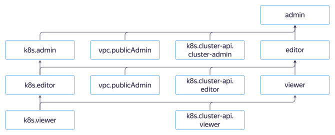

# Access management

In this section, you'll learn:
* [What resources you can assign roles to](#resources).
* [What roles exist in the service](#roles-list).
* [What roles are required for {{ managed-k8s-name }}](#sa-annotation) cluster service accounts.
* [What roles are required to work with {{ managed-k8s-name }} via the {{ yandex-cloud }}](#ui-annotation) management console.



## What resources you can assign roles to {#resources}



## What roles exist in the service {#roles-list}





### {{ managed-k8s-name }} roles {#yc-api}

The roles described below let you manage {{ managed-k8s-name }} clusters and node groups without public access via the {{ yandex-cloud }} API. To manage cluster resources, these roles should be combined with [roles for the Kubernetes API](#k8s-api). To create a cluster with public access to the {{ k8s }} API or a group of {{ k8s }} nodes with a public IP address, the `k8s.admin`, `k8s.editor`, and `k8s.clusters.agent` roles must be supplemented with the `vpc.publicAdmin` role.

Role | Permissions
--- | ---
`k8s.admin` | Lets you create, delete, edit, stop, and start clusters and node groups. In the future, it will also let you manage granular access to clusters and groups.
`k8s.editor` | Lets you create, delete, edit, stop, and start clusters and node groups.
`k8s.viewer` | Lets you view information about {{ managed-k8s-name }} clusters and node groups.
`k8s.clusters.agent` | A special role for cluster service accounts. Lets you create groups of nodes, disks, and internal load balancers, as well as use previously created [{{ kms-full-name }} keys](../../kms/concepts/key.md) to encrypt and decrypt secrets and connect previously created security groups.<br>In combination with the `load-balancer.admin` role, it lets you create a network load balancer with a public IP address.<br>Includes such roles as `compute.admin`, `vpc.privateAdmin`, `load-balancer.privateAdmin`, `kms.keys.encrypterDecrypter`, and `iam.serviceAccounts.user`.

### Roles required to access the {{ k8s }} API {#k8s-api}



The `k8s.cluster-api.cluster-admin`, `k8s.cluster-api.editor` and `k8s.cluster-api.viewer` roles are available in {{ k8s }} starting from version 1.17.



The following roles give the right to manage cluster resources via the {{ k8s }} API. To manage clusters, these roles should be combined with [roles for the {{ yandex-cloud }} API](#yc-api).

Role | Permissions
--- | ---
`k8s.cluster-api.cluster-admin` | Users with this {{ iam-short-name }} role get the `yc:cluster-admin` group and the `cluster-admin` role to access the {{ k8s }} API.
`k8s.cluster-api.editor` | Users with this {{ iam-short-name }} role get the `yc:edit` group and the `edit` role to access the {{ k8s }} API.
`k8s.cluster-api.viewer` | Users with this {{ iam-short-name }} role get the `yc:view` group and the `view` role to access the {{ k8s }} API.

To learn more about the roles required to access the {{ k8s }} API, see the [reference](https://kubernetes.io/docs/reference/access-authn-authz/rbac/#user-facing-roles).

To view a role's rights to {{ k8s }} cluster resources, run the command:

```bash
kubectl describe clusterrole <role required to access the {{ k8s }} API>
```

### Primitive roles {#primitive}

Primitive {{ iam-short-name }} roles contain the above roles in the following combinations:

Primitive role | Combination of {{ managed-k8s-name }} roles
--- | ---
`admin` | `k8s.cluster-api.cluster-admin`, `k8s.admin`, and `vpc.publicAdmin`.
`editor` | `k8s.cluster-api.cluster-editor`, `k8s.editor`, and `vpc.publicAdmin`.
`viewer` | `k8s.cluster-api.viewer` and `k8s.viewer`.

## {{ managed-k8s-name }} cluster service accounts {#sa-annotation}

When creating a cluster in {{ managed-k8s-name }}, you should specify two service accounts:
* **A cluster service account**: On behalf of this service account, a {{ managed-k8s-name }} cluster manages cluster nodes, subnets for pods and services, disks, and load balancers, as well as encrypts and decrypts secrets. The minimum recommended role for this account is `k8s.clusters.agent`.
* **A node group service account**: On behalf of this service account, a cluster node is authenticated in [{{ container-registry-full-name }}](../../container-registry/concepts/index.md). To use image registries, you need to assign this account a [service role](../../container-registry/security/index.md#service-roles) in {{ container-registry-short-name }}. If you use a different registry, you can skip assigning roles to this service account.

## Access to the {{ managed-k8s-name }} management console {#ui-annotation}

To access {{ managed-k8s-name }} via the {{ yandex-cloud }} [management console]({{ link-console-main }}), the minimum required role is `k8s.viewer.`

To get detailed information about clusters and node groups, you'll need an additional role: `k8s.cluster-api.viewer`. Since the `k8s.cluster-api.viewer` role does not grant access rights to all {{ k8s }} API objects, to use all the features of the management console, the `k8s.cluster-api.editor` or `k8s.cluster-api.cluster-admin` role is required.