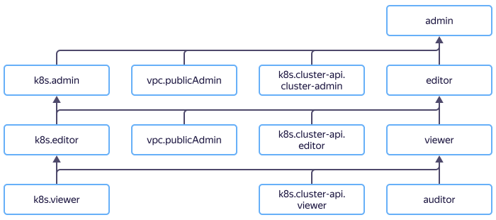

# Access management in {{ managed-k8s-name }}

In this section, you'll learn:
* [What resources you can assign roles to](#resources).
* [What roles exist in the service](#roles-list).
* [What roles are required for {{ managed-k8s-name }} cluster service accounts](#sa-annotation).
* [What roles are required to work with {{ managed-k8s-name }} via the {{ yandex-cloud }} management console](#ui-annotation).



## What resources you can assign roles to {#resources}



## What roles exist in the service {#roles-list}





### {{ managed-k8s-name }} roles {#yc-api}

The roles described below let you manage {{ managed-k8s-name }} clusters and node groups without public access via the {{ yandex-cloud }} API. To manage cluster resources, these roles should be combined with [{{ k8s }} API roles](#k8s-api). When creating a cluster, the roles of its service account are verified.
To create a cluster and node groups without public access, the `k8s.clusters.agent` role is required.
To create a cluster and node groups with public access, the following roles are required:
* `k8s.clusters.agent`
* `vpc.publicAdmin`

Role | Permissions
--- | ---
`k8s.admin` | Lets you create, delete, edit, stop, and start clusters and node groups. In the future, it will also let you manage granular access to clusters and groups.
`k8s.editor` | Lets you create, delete, edit, stop, and start clusters and node groups.
`k8s.viewer` | Lets you view information about {{ managed-k8s-name }} clusters and node groups.
`k8s.clusters.agent` | A special role for cluster service accounts. Lets you create node groups, disks, and internal load balancers. Lets you use previously created [KMS keys](../../kms/concepts/key.md) to encrypt and decrypt secrets and connect previously created [security groups](../operations/connect/security-groups.md).<br>When combined with the `load-balancer.admin` role, it lets you create a network load balancer with a public IP address.<br>It includes such roles as `compute.admin`, `vpc.privateAdmin`, `load-balancer.privateAdmin`, `kms.keys.encrypterDecrypter`, and `iam.serviceAccounts.user`.

### Roles required to access the {{ k8s }} API {#k8s-api}



The `k8s.cluster-api.cluster-admin`, `k8s.cluster-api.editor`, and `k8s.cluster-api.viewer` roles are available in {{ k8s }} starting from version 1.17.



The following roles grant rights to [manage cluster resources via the {{ k8s }} API based on roles ](https://kubernetes.io/docs/reference/access-authn-authz/rbac/) (Role-Based Access Control, RBAC). To manage clusters, these roles should be combined with [roles for the {{ yandex-cloud }} API](#yc-api). For more information about roles in {{ k8s }} RBAC, see the [{{ k8s }} documentation](https://kubernetes.io/docs/reference/access-authn-authz/rbac/#user-facing-roles).

The following roles give the right to manage cluster resources via the {{ k8s }} API. {{ k8s }} API roles follow the [role-based access control ](https://kubernetes.io/docs/reference/access-authn-authz/rbac/) (RBAC) model. To manage clusters, these roles should be combined with [roles for the {{ yandex-cloud }} API](#yc-api). For more information about roles in {{ k8s }} RBAC, see the [{{ k8s }} documentation](https://kubernetes.io/docs/reference/access-authn-authz/rbac/#user-facing-roles).

Role | Permissions
--- | ---
`k8s.cluster-api.cluster-admin` | Users with this {{ iam-full-name }} role get the `yc:cluster-admin` group and the `cluster-admin` role in {{ k8s }} RBAC.
`k8s.cluster-api.editor` | Users with this {{ iam-name }} role get the `yc:edit` group and the `edit` role in {{ k8s }} RBAC for all [namespaces](../concepts/index.md#namespace) in a cluster.
`k8s.cluster-api.viewer` | Users with this {{ iam-name }} role get the `yc:view` group and the `view` role in {{ k8s }} RBAC for all namespaces in a cluster.

For more information about roles in {{ k8s }} RBAC, see the [reference](https://kubernetes.io/docs/reference/access-authn-authz/rbac/#user-facing-roles).

To view the rights to the {{ k8s }} cluster resources available for a specific role, run the command:

```bash
kubectl describe clusterrole <role in {{ k8s }} RBAC>
```

### Primitive roles {#primitive}

Primitive {{ iam-name }} roles contain the above roles in the following combinations:

Primitive role | Combination of {{ managed-k8s-name }} roles
--- | ---
`admin` | `k8s.cluster-api.cluster-admin`, `k8s.admin`, and `vpc.publicAdmin`.
`editor` | `k8s.cluster-api.cluster-admin`, `k8s.editor`, `vpc.publicAdmin`.
`viewer` | `k8s.cluster-api.viewer` and `k8s.viewer`.

## {{ managed-k8s-name }} cluster service accounts {#sa-annotation}

When creating a cluster in {{ managed-k8s-name }}, you should specify two service accounts:
* **Cluster service account**: From this service account, a {{ managed-k8s-name }} cluster manages cluster nodes, subnets for pods and services, disks, and load balancers, as well as encrypts and decrypts secrets. The minimum recommended role for this account is `k8s.clusters.agent`.
* **Node group service account**: From this service account, cluster nodes are authenticated in [{{ container-registry-full-name }}](../../container-registry/concepts/index.md). To deploy applications in a cluster using images from {{ container-registry-name }}, you need to assign this account a [service role](../../container-registry/security/index.md#service-roles) in {{ container-registry-name }}. If you use a different container registry, you can skip assigning roles to this service account.

## Accessing the {{ managed-k8s-name }} management console {#ui-annotation}

To access {{ managed-k8s-name }} via the {{ yandex-cloud }} [management console]({{ link-console-main }}), the minimum required role is `k8s.viewer`.

To get detailed information about clusters and node groups, you'll need an additional role: `k8s.cluster-api.viewer`. This role corresponds to the `viewer` role in {{ k8s }} RBAC and grants access rights to a limited set of resources in the {{ k8s }} API, so the console's features are limited.

Users with the `k8s.cluster-api.cluster-admin` role have full access to the cluster's {{ k8s }} API and can use all the features of the management console.

To provide more granular access to the necessary resources, you can:
* Configure additional rights in {{ k8s }} RBAC for the appropriate users.
* Expand the `view` and `edit` role in {{ k8s }} RBAC using [role aggregations](https://kubernetes.io/docs/reference/access-authn-authz/rbac/#user-facing-roles). For example, you can allow all users with the `view` role in the {{ k8s }} API (including users with the `k8s.cluster-api.viewer` cloud role) to view information about nodes by adding the following role to the cluster:

  ```yaml
  apiVersion: rbac.authorization.k8s.io/v1
  kind: ClusterRole
  metadata:
    name: view-extensions
    labels:
      rbac.authorization.k8s.io/aggregate-to-view: "true"
  rules:
  - apiGroups: [""]
    resources: ["nodes"]
    verbs: ["get", "list", "watch"]
  ```