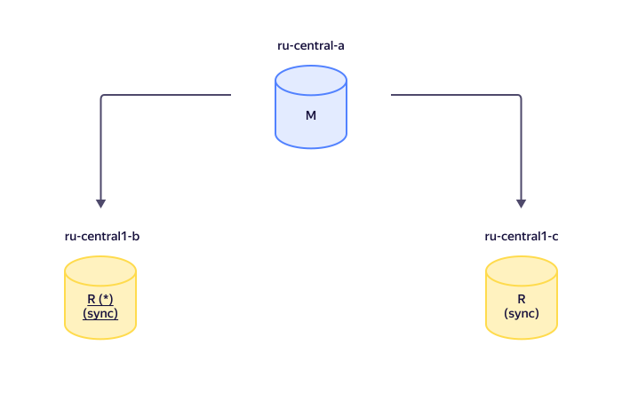
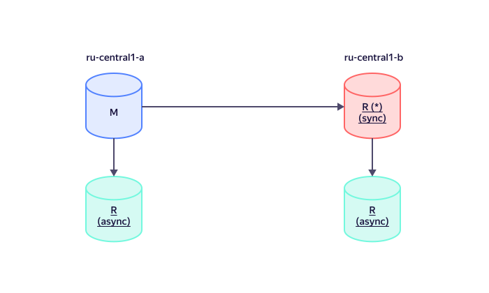

# Replication in {{ mmy-name }}

{{ mmy-name }} clusters use [semi-sync replication](https://dev.mysql.com/doc/refman/5.7/en/replication-semisync.html): by default, the master waits for a transaction to be completed in at least one replica.



You can change the number of replicas required for a transaction to complete in the [Rpl semi sync master wait for slave count](settings-list.md#setting-rpl-wait-slave-count) setting.



## Managing replication procedures {#replication}

### Recommended cluster configuration {#replication-auto}

Once you create a {{ MY }} cluster with multiple hosts, it contains one master host and replicas. Replicas use the master host as a replication source.

Here is an example of an auto replicated cluster configuration:

In this example, a master and two replicas are located in different availability zones. In which case:

* Each transaction is saved to a minimum of two hosts.
* The cluster is fault-tolerant to a host disconnecting in one availability zone and to two successive disconnections.

If a replica and the master are located in different availability zones, the transaction commit latency cannot be less than the round-trip time (RTT) between data centers located in these availability zones. As a result, for single-thread writes with [AUTOCOMMIT](https://dev.mysql.com/doc/refman/8.0/en/server-system-variables.html#sysvar_autocommit) enabled, the cluster performance may drop considerably. For maximum performance, we recommend using multiple threads for write operations where possible, as well as disabling [AUTOCOMMIT](https://dev.mysql.com/doc/refman/8.0/en/commit.html) and grouping queries into transactions.

Specifics of automatic replication in {{ mmy-name }}:

* If the master host fails, its replica becomes a new master.
* When the master changes, the replication source for all replica hosts automatically switches to the new master host.

For more information on master host selection, see [Selecting a master if the primary master fails](#master-failover).

### Manual cluster configuration management {#manual-source}

With manual management, other cluster hosts may serve as replication sources for any cluster replica. Replicas that have their [replication sources set](../operations/hosts.md#update) manually are referred to as _cascading_ replicas. Cascading replicas use asynchronous replication from a source host. Therefore, a cascading replica cannot become the master if the master host fails or is switched over manually.

A cluster of two hosts, including one cascading replica, is not fault tolerant.

Here is an example of cluster configuration with cascading replication and hosts in two availability zones:

Assigning a replication source for the cluster hosts allows you to:

- Fully manage the replication process in the cluster without using automatic replication.
- Configure cascading replication for a {{ MY }} cluster with a tree topology, in which some replicas are managed automatically using {{ mmy-name }} tools and others manually. This will reduce the load on the master host's network.
- Allocate some replicas for analytical load, since they will not become a master under any condition.

## Selecting a master if the primary master fails {#master-failover}

If the master host fails, any of the cluster hosts available for replication may become a new master. To influence master selection in a {{ MY }} cluster, [set your preferred priority values](../operations/hosts.md#update) for the cluster hosts. The highest priority host will become the master. Or, in a cluster with multiple replicas of equal priority, the one lagging the least behind the master will be selected. Replicas lagging more than the value of the [Mdb priority choice max lag](settings-list.md#setting-mdb-priority-choice-max-lag) setting (60 seconds by default) will be excluded from the selection.

You can set host priority:

* When [creating a cluster](../operations/cluster-create.md) with the YC CLI, API, or {{ TF }}.
* When [changing the host settings](../operations/hosts.md#update).

The lowest priority is `0` (default), while the highest one is `100`.
