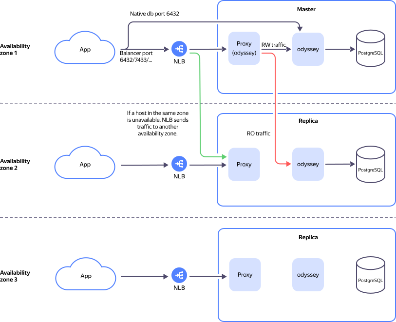

# Load balancer for hosts

{{ mpg-name }} allows you to use an internal network balancer to distribute load between hosts. This load balancer operates at layer 4 of the OSI network model, but uses layer 3 technologies to speed up packet processing.



This feature is at the [Preview](../../overview/concepts/launch-stages.md) stage. Contact support for access.





The network traffic regulation schema for the cluster using a load balancer is shown below:





When using a load balancer, client connections remain under the control of the [Odyssey connection manager](pooling.md).


