# Connecting to a {{ PG }} cluster from {{ datalens-name }}



To use an existing cluster as a data source for {{ datalens-full-name }}:
1. [Activate {{ datalens-name }}](#activate-datalens).
1. [Enable access to the cluster from {{ datalens-name }}](#allow-access).
1. [Create a cluster connection in {{ datalens-name }}](#create-connector).

## Activating {{ datalens-name }} {#activate-datalens}



## Allowing access to a cluster from {{ datalens-name }} {#allow-access}

To enable {{ datalens-name }} to connect to your cluster and work with its data, activate the **{{ ui-key.yacloud.mdb.forms.additional-field-datalens }}** option when [creating a cluster](cluster-create.md) or [updating its settings](update.md#change-additional-settings).

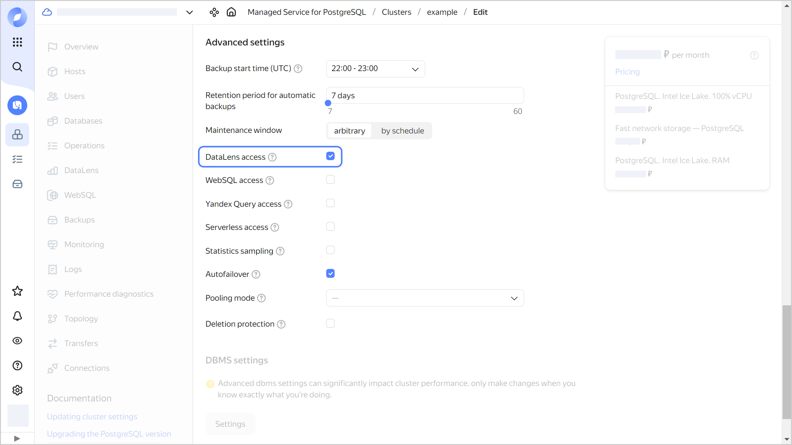

## Creating a connection to a cluster {#create-connector}



- Management console {#console}

  1. Make sure that {{ datalens-name }} is [activated](#activate-datalens) in the appropriate folder and you [can access](#allow-access) the cluster from it.
  1. Go to the folder page and select **{{ ui-key.yacloud.iam.folder.dashboard.label_managed-postgresql }}**.

     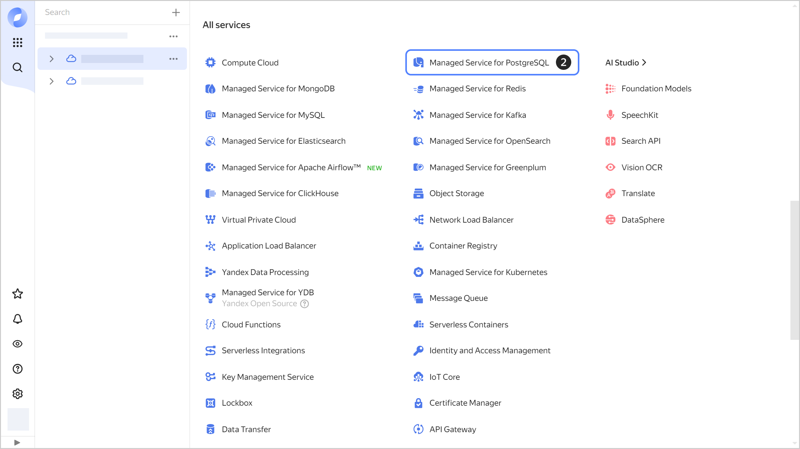

  1. Click the cluster name and open the **{{ ui-key.yacloud.postgresql.cluster.switch_datalens }}** tab.
  1. Click **{{ ui-key.yacloud.mdb.datalens.button-action_new-connection }}**.

     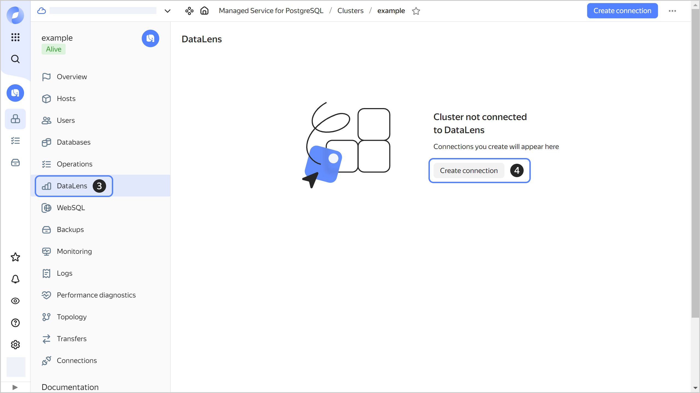

     

     If you see a message saying "{{ ui-key.yacloud.mdb.datalens.label_activate-datalens-title }}" instead of the **{{ ui-key.yacloud.mdb.datalens.button-action_new-connection }}** button, it means that you either did not activate {{ datalens-name }} or connected it in a different folder. To connect your cluster to a {{ datalens-name }} instance from another folder, follow the [guide](../../datalens/operations/connection/create-postgresql.md) in the {{ datalens-name }} documentation.

     

  1. Specify the [connection settings](#connector-settings).
  1. Check that the settings are correct by clicking **Check connection**.
  1. After successfully checking the connection, click **Create connection**.

     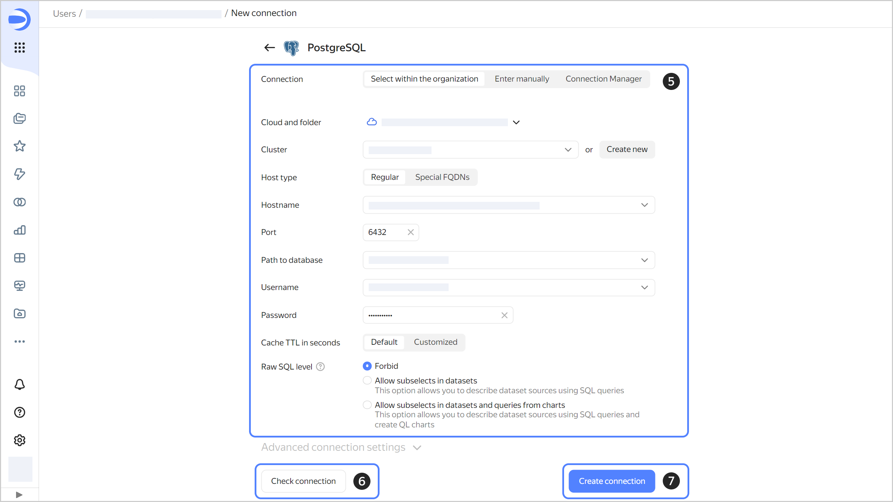

  1. In the resulting window, enter a name for the connection and click **Create**.

     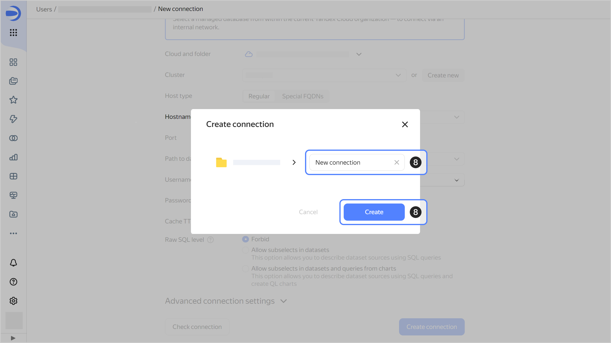



Once the connection is created, you can:
* [Update](#update-connector) or [delete](#delete-connector) the connection.
* [Create datasets](../../datalens/dataset/index.md) with cluster data using the connection.
* Visualize the datasets using [charts](../../datalens/concepts/chart/index.md) and [dashboards](../../datalens/concepts/dashboard.md).

## Viewing a list of cluster connections {#connectors-list}



- Management console {#console}

  1. Go to the folder page and select **{{ ui-key.yacloud.iam.folder.dashboard.label_managed-postgresql }}**.
  1. Click the cluster name and open the **{{ ui-key.yacloud.postgresql.cluster.switch_datalens }}** tab.

     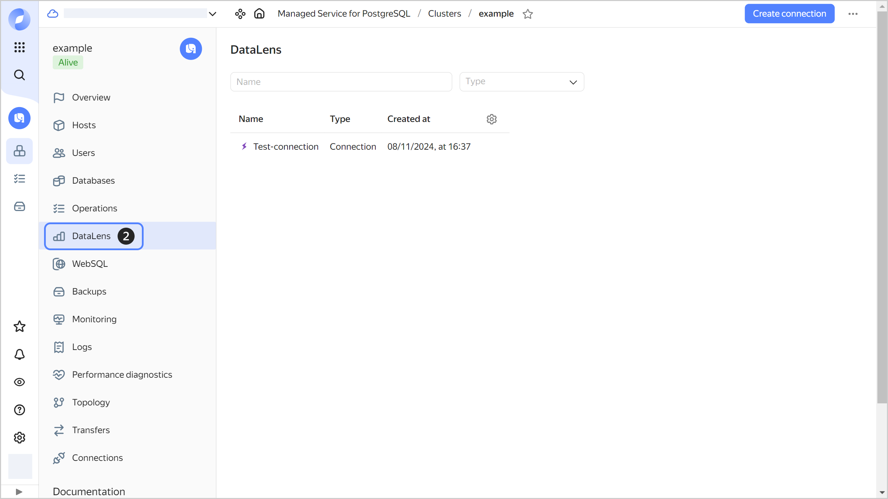



## Updating a cluster connection {#update-connector}



- Management console {#console}

  1. Go to the folder page and select **{{ ui-key.yacloud.iam.folder.dashboard.label_managed-postgresql }}**.
  1. Click the cluster name and open the **{{ ui-key.yacloud.postgresql.cluster.switch_datalens }}** tab.
  1. Select a connection from the list.

     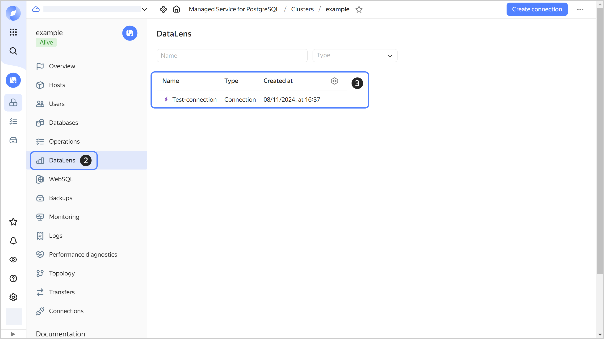

  1. Change the [settings](#connector-settings).
  1. Check that the settings are correct by clicking **Check connection**.
  1. After successfully checking the connection, click **Save changes**.

     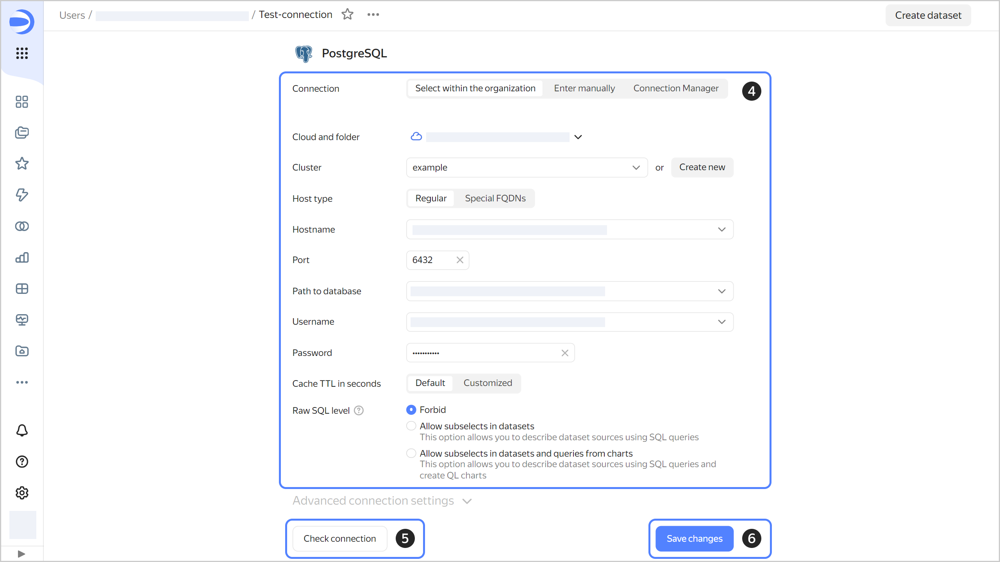



## Deleting a cluster connection {#delete-connector}



- Management console {#console}

  1. Go to the folder page and select **{{ ui-key.yacloud.iam.folder.dashboard.label_managed-postgresql }}**.
  1. Click the cluster name and open the **{{ ui-key.yacloud.postgresql.cluster.switch_datalens }}** tab.
  1. Select a connection from the list.
  1. Click  at the top of the page and select **Delete**.

     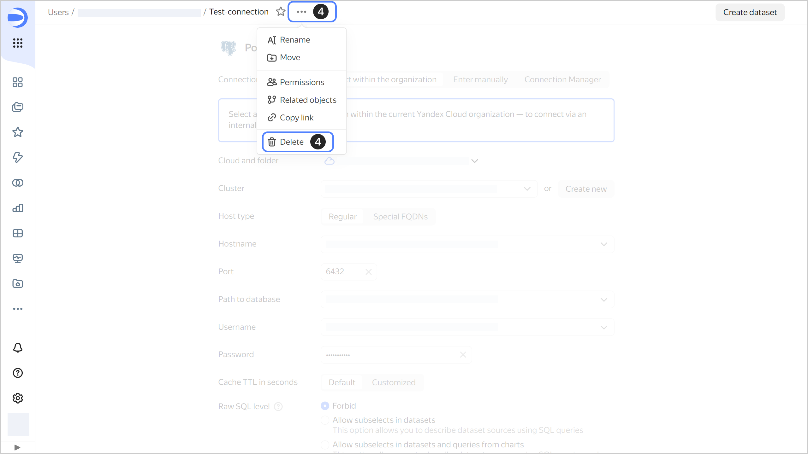

  1. In the window that opens, click **Delete**.

     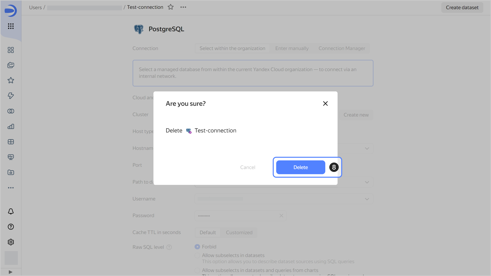



## Connection settings {#connector-settings}



- Management console {#console}

  1. If the cluster and {{ datalens-name }} are in the same organization:
     1. Go to the **Select in organization** tab.
     1. Select the cloud and folder where the cluster is located.
     1. Select the cluster and its host from the drop-down lists or [create a new cluster](cluster-create.md) in the folder with {{ datalens-name }} by clicking **Create new**.
     1. Leave the **Port** setting value unchanged.
     1. In the drop-down list, select **Path to database**.
     1. Select a user from the drop-down list.
     1. Enter this user's password.
     1. Specify the cache time-to-live or leave the default value. The recommended value is 300 seconds (5 minutes).
     1. Configure a **Raw SQL level**.

        

     1. To explicitly define a collation for DB queries, go to **Advanced connection settings**. Select a mode to configure **Setting collate in a query**:
        * **Auto**: Default setting is used, {{ datalens-name }} decides whether to enable the `en_US` locale.
        * **On**: {{ datalens-name }} setting is used, the `en_US` locale is specified for individual expressions in a query. This makes the server use the appropriate sorting logic, regardless of the server settings and specific tables. Use the {{ datalens-name }} setting if the DB locale is incompatible with {{ datalens-name }} performance. For more information on the locale and `LC_COLLATE`, see [Creating a cluster](./cluster-create.md#create-cluster).
        * **Off**: Default setting is used, {{ datalens-name }} only uses the existing parameters of the DB locale.

        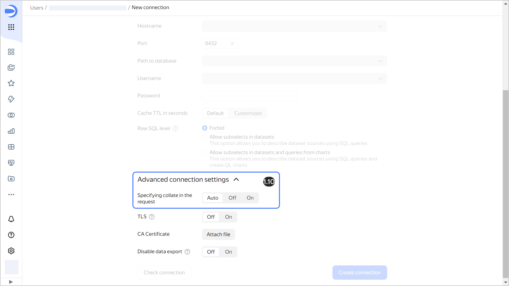

   1. If the cluster and {{ datalens-name }} are in different organizations, use the settings from this {{ datalens-name }} [tutorial](../../datalens/operations/connection/create-postgresql.md).

