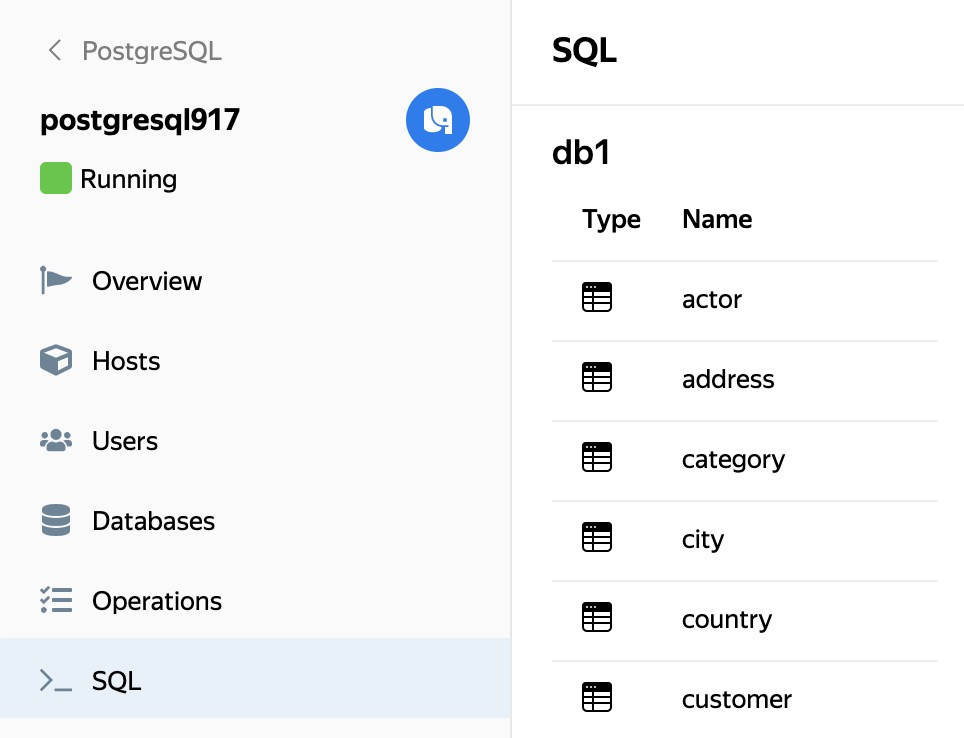
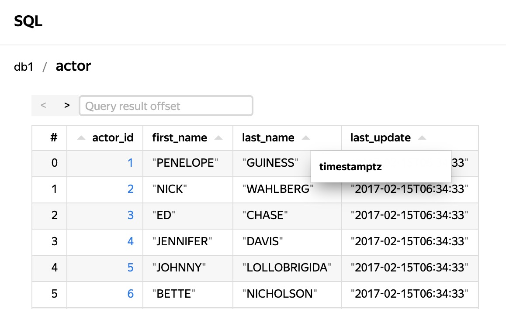
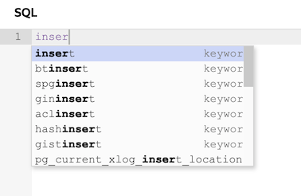
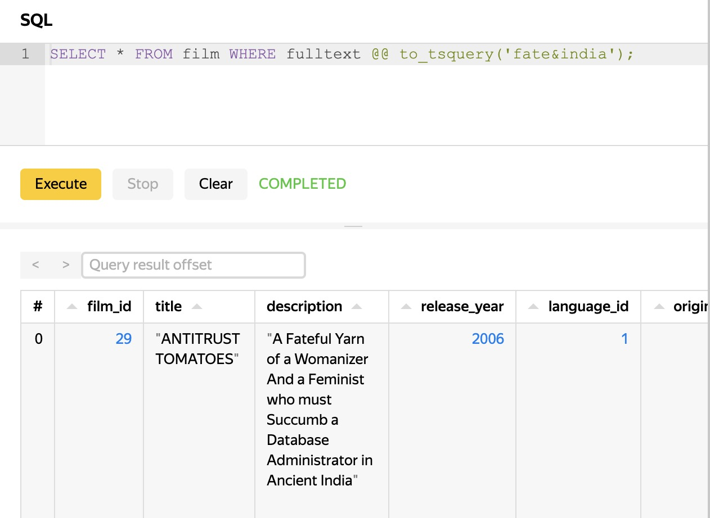

# SQL queries in the management console

{{ mpg-name }} allows you to:

* Visualize the structure of the data and the query execution plans in your {{ PG }} cluster.
* Run SQL queries against databases from the {{ yandex-cloud }} management console.



You cannot use SQL commands to do anything that requires superuser access.

To connect to a {{ mpg-name }} cluster and manipulate its data from the management console:

1. Go to the folder page and select **{{ ui-key.yacloud.iam.folder.dashboard.label_managed-postgresql }}**.
1. Click the cluster name.
1. [Enable the **{{ ui-key.yacloud.mdb.forms.additional-field-websql }}** option](../operations/update.md#change-additional-settings) if it is not enabled yet.
1. Select the **{{ ui-key.yacloud.postgresql.cluster.switch_explore }}** tab.



See a reference list of supported queries in the [{{ PG }} documentation](https://www.postgresql.org/docs/current/sql.html).

## Data structure visualization {#data-structure-visualization}

Once you have logged in, you can see the structure of the selected database and its tables:

Click the table to see the first 1,000 rows of the `SELECT *` query result for this table, 20 rows per page (the management console does not support full navigation through all the DB data). In the **{{ ui-key.yacloud.clickhouse.cluster.explore.label_offset }}** field, you can set the offset for showing the results table.

Hover over the column header to see the type of column data:

## SQL queries {#sql-queries}

The query input window is open on the right. Start typing your query to see suggested keyword options:

Enter a query and click **{{ ui-key.yacloud.clickhouse.cluster.explore.button_execute }}**. The results table or error message is shown in the results panel that is under the editor control buttons.

## Query analysis {#sql-analyze}

To display a visualization of a SQL query execution plan:

1. Enter your query.
1. Click the drop-down menu button next to **{{ ui-key.yacloud.clickhouse.cluster.explore.button_execute }}**.
1. Choose the visualization method:

   * **{{ ui-key.yacloud.clickhouse.cluster.explore.button_explain-analyze }}**: A query is executed using `EXPLAIN ANALYZE`. The query plan is based on the data received during the execution. The tabs will display accurate information about the query properties:
      * **{{ ui-key.yacloud.mdb.cluster.explain.value_cost }}**: Cost of parts of a query (in relative units).
      * **{{ ui-key.yacloud.mdb.cluster.explain.value_time }}**: Time to execute an entire query and its component parts.
      * **{{ ui-key.yacloud.mdb.cluster.explain.value_buffers }}**: Information about I/O operations and RAM usage for each part of a query.
   * **{{ ui-key.yacloud.clickhouse.cluster.explore.button_explain }}**: A query does not execute, and its plan is built using the `EXPLAIN` command based on the statistics collected by {{ PG }}. The **{{ ui-key.yacloud.mdb.cluster.explain.value_cost }}** tab displays a rough estimate of the cost of the entire query and its parts (in relative units).

   In both cases, slow and resource-consuming parts of the query will be highlighted.

   For more information, see the {{ PG }} documentation:

   * [Cost units for parts of a request](https://www.postgresql.org/docs/current/runtime-config-query.html#RUNTIME-CONFIG-QUERY-CONSTANTS).
   * [Using `EXPLAIN` and `EXPLAIN ANALYZE`](https://www.postgresql.org/docs/current/using-explain.html).

1. To view a detailed query execution plan as a tree, click . To exit this mode, press **Esc**.

   Each part of a query displays as a box showing the absolute and relative execution times. If one part of a query takes much longer to execute than the others or uses resource-heavy operations, the box will be marked with labels showing the reason.

   To get more detailed information about a part of a query, click the required box, and it will display a panel with the following tabs:

   * **Stats**: Execution cost (in relative units).
   * **I/O & Buffers**: Information on I/O operations and RAM usage.
   * **Misc**: General information regarding a query, such as a list of the fields involved.
   * **Info**: Supplemental information, such as the names of the tables and indexes queried.

## Query restrictions in the management console {#query-restrictions-in-the-management-console}

* If you close or reload the page, the query text and its results are lost. In this case, each query that you run from the management console will be executed regardless of the browser state.
* The management console outputs only the first 1,000 rows of the result.
* If a cluster query takes more than 10 minutes, the management console reports an error instead of outputing the result, even if the query eventually finishes processing.
* If your cluster has multiple {{ PG }} hosts, queries from the management console are sent to the current master host.
* The list of tables is taken from the _public_ schema. You can make queries to tables from other schemas by explicitly specifying the schema, for example: `SELECT * from information_schema.column_udt_usage`.
