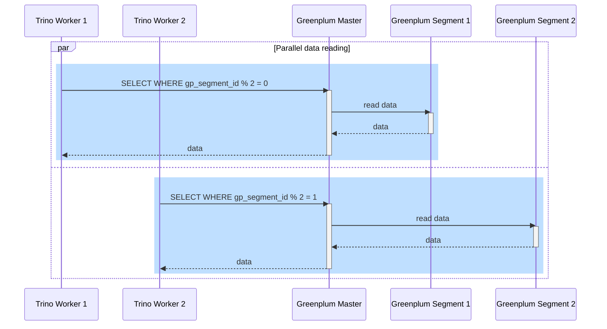
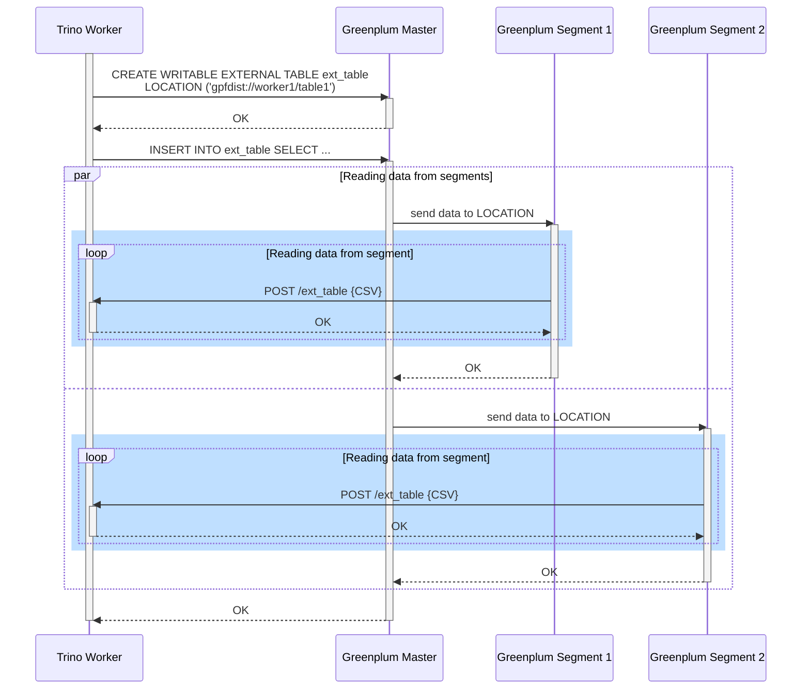

# {{ GP }}/Cloudberry connector

The {{ GP }}/Cloudberry [connector](index.md#connector) developed by Yandex based on the [{{ PG }} connector]({{ tr.docs }}/connector/postgresql.html) allows {{ mtr-name }} to read and write data to a {{ GP }}/Cloudberry cluster.

The connector supports [parallel data reading](#parallel-reading) from SEVERAL {{ GP }} segments at the same time and [direct segment reading](#gpfdist-reading) over the GPFDIST protocol, which greatly improves query performance for large-scale data reads. You can use both data reading methods at the same time to optimize the use of resources in {{ TR }} and {{ GP }} clusters.

The {{ GP }}/Cloudberry connector is available in {{ TR }} `476` or higher.

## Parallel data reading {#parallel-reading}

During parallel reading from a table, data is parallelized based on the `gp_segment_id` metadata column value.

The level of parallelism depends on the number of segments in the {{ GP }} cluster. The maximum parallelism level is limited by the `greenplum.max-read-parallelism` [connector setting](#settings) and the relevant `max_read_parallelism` session property.

Parallel reading is illustrated on the following diagram:



When parallel reading is used, the connector performs only partial row filtering during [`LIMIT` pushdown]({{ tr.docs }}/optimizer/pushdown.html#limit-pushdown). This does not affect the validity of the query results.

## Reading data over the GPFDIST protocol {#gpfdist-reading}

The connector allows reading data directly from {{ GP }} segments via [GPFDIST servers]({{ gp.docs.broadcom }}/7/greenplum-database/utility_guide-ref-gpfdist.html) created on {{ TR }} workers. GPFDIST server activation is controlled by the `greenplum.gpfdist.server.enabled` [connector setting](#settings).

In a {{ TR }} cluster, you can create not more than eight catalogs with active GPFDIST servers.

Direct reading from {{ GP }} segments follow these steps:

1. The connector creates an external table giving the address of the {{ TR }} worker to read data:

    ```sql
    CREATE WRITABLE EXTERNAL TEMPORARY TABLE <external_table_name>
           ...
           LOCATION('gpfdist://<{{ TR }}_worker_address>');
    ```

1. The connector runs the following query:

    ```sql
    INSERT INTO <external_table_name>
    SELECT ... FROM <table_name_in_{{ GP }}>;
    ```

1. The {{ GP }} segments send data to the {{ TR }} worker at the specified address.

Data reading from segments is illustrated on the following diagram:



The use of the GPFDIST protocol for data reads introduces the following limitations for the connector:

* No support for reading multidimensional arrays.
* No support for reading string type arrays.
* No support for [AS_JSON]({{ tr.docs }}/connector/postgresql.html#array-type-handling) array processing mode.
* When `LIMIT` and `ORDER BY` are pushed down at the same time ([Top-N pushdown]({{ tr.docs }}/optimizer/pushdown.html#top-n-pushdown)), the connector sorts data only partially. This does not affect the validity of the query results.

## Connector settings {#settings}

The connector's basic settings and their corresponding session properties match those of the [{{ PG }} connector]({{ tr.docs }}/connector/postgresql.html) of the same version. In addition, the following settings are available:

| Configuration                                  | Description                                                                                                                                                                                                                                                                                                                                                                                                            | Default<br/>value     |
|--------------------------------------------|---------------------------------------------------------------------------------------------------------------------------------------------------------------------------------------------------------------------------------------------------------------------------------------------------------------------------------------------------------------------------------------------------------------------|-------------------------------|
| `greenplum.gpfdist.server.enabled`         | Enables GPFDIST servers on {{ TR }} workers                                                                                                                                                                                                                                                                                                                                                                       | `false`                       |
| `greenplum.gpfdist.max-processing-threads` | Maximum size of thread pool for asynchronous GPFDIST query processing                                                                                                                                                                                                                                                                                                                               | `32`                          |
| `greenplum.gpfdist.max-query-threads`      | Maximum size of thread pool creating external {{ GP }} tables and initiating data writes to an external table                                                                                                                                                                                                                                                                                                | `32`                          |
| `greenplum.gpfdist.read.enabled`           | Enables reading data directly from {{ GP }} segments over the GPFDIST protocol                                                                                                                                                                                                                                                                                                                                           | `false`                       |
| `greenplum.gpfdist.read.buffer-size`       | <p>Buffer size for GPFDIST data reads in [data size]({{ tr.docs }}/admin/properties.html#data-size) format. If the buffer overflows, the connector suspends data reception from {{ GP }} segments.</p><p>Matches the `gpfdist_read_buffer_size` session property</p>                                                                                                                        | `32MB`                        |
| `greenplum.gpfdist.retry-timeout`          | <p>Maximum time a {{ GP }} segment will wait for a response to a GPFDIST query, in [duration]({{ tr.docs }}/admin/properties.html#duration) format.</p><p>If the value is other than `null`, this setting overrides the {{ GP }} [gpfdist_retry_timeout]({{ gp.docs.broadcom }}/7/greenplum-database/ref_guide-config_params-guc-list.html#gpfdist_retry_timeout) property (300 seconds by default)</p> | `null`                        |
| `greenplum.max-read-parallelism`           | <p>Maximum parallelism for data reads from {{ GP }}.</p><p>Matches the `max_read_parallelism` session property</p>                                                                                                                                                                                                                                                                                  | `1` (no parallelism) |
| `greenplum.segment-fetch-required`         | <p>Decides the connector's behavior if it fails to get informed about the number of {{ GP }} segments:</p><p><ul><li>If `true`, the {{ TR }} query will fail.</li><li>If `false`, the level of parallelism will be equal to the `max_read_parallelism` session property value.</li></ul></p><p>Matches the `segment_fetch_required` session property</p>                             | `true`                        |

#### See also {#see-also}

* [{#T}](../operations/catalog-create.md)
