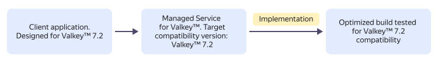
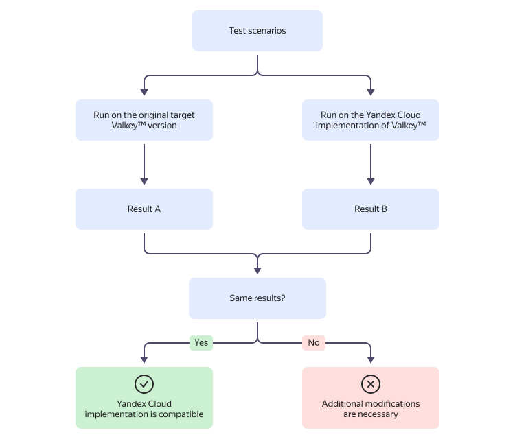

# Resource relationships in {{ mrd-name }}

{{ VLK }} is a high-performance in-memory DBMS for storing key-value data. {{ mrd-name }} allows you to easily create {{ VLK }} host clusters with a high level of fault tolerance.

{{ yandex-cloud }} is an active contributor to both the core {{ VLK }} project and its [custom implementations](./update-policy.md#compatibility-table). Such deep involvement allows the {{ mrd-name }} team to:

* Ensure high compatibility through a deep understanding of {{ VLK }}‘s internal structure.
* Continuously improve performance, reliability, and security of custom implementations.
* Where applicable, leverage a more recent codebase for target version compatibility, thus delivering the benefits of latest releases without a target version upgrade.

{{ mrd-name }} provides extended [support](./update-policy.md) for {{ VLK }} versions backed by the DBMS version [compatibility guarantee](#compatibility-warranty).

## {{ mrd-name }} resources {#resources}

The main entity in {{ mrd-name }} is a _database cluster_.

Each cluster consists of one or multiple _database hosts_, which are virtual machines with deployed DBMS servers. Cluster hosts may reside in different availability zones and even different availability regions. You can learn more about the {{ yandex-cloud }} availability zones in [Platform overview](../../overview/concepts/geo-scope.md).

* A cluster with three or more hosts is natively fault-tolerant because its hosts can step in for one another as the cluster’s primary replica.

* A cluster of one or two hosts is cheaper, but it does not guarantee fault tolerance.

When creating a cluster, specify:
* _Host class_: VM template for deploying cluster hosts. For a list of available host classes and their specs, see [Host classes](instance-types.md).

* _Environment_: Environment where the cluster will be deployed:
   * `PRODUCTION`: For stable versions of your applications.
   * `PRESTABLE`: For testing purposes. The prestable environment is similar to the production environment and likewise covered by an SLA, but it is the first to get new features, improvements, and bug fixes. In the prestable environment, you can test new versions for compatibility with your application.



The amount of memory allocated to a host also depends on the `maxmemory` configuration parameter for {{ VLK }} hosts: the maximum amount of data equals 75% of available memory. For example, for a host class with 8 GB RAM, the `maxmemory` value will be 6 GB.



You can access a cluster created in a folder from any VM in the same cloud network. For more information about networking, see [this {{ vpc-name }} guide](../../vpc/).





## Version compatibility guarantee {#compatibility-warranty}

{{ mrd-full-name }} does not provide its users with a particular {{ VLK }} version, but rather a service with _guaranteed compatibility_ for specific {{ VLK }} versions. For each [{{ yandex-cloud }} implementation](./update-policy.md#compatibility-table) compatible with a certain {{ VLK }} version, {{ mrd-name }} guarantees:

* Full backward compatibility with the target version’s API and features.
* Support for all commands and protocols of the original version.
* Correct operation of existing user applications without the need to implement any changes.
* Extended support periods that match or exceed the official lifecycle of the original {{ VLK }} version.

For example, a DBMS version **compatible with {{ VLK }} 7.2** delivers:

* **Modern {{ VLK }} version** (`8.1`) with all its benefits in terms of performance, security, and features.
* **Compatibility mode** with settings for full backward compatibility and **guaranteed compatibility** with applications built for version `7.2`.

For more information on {{ VLK }} version compatibility, see [{#T}](./update-policy.md#compatibility-table).

### Version compatibility testing {#compatibility-testing}

To verify version compatibility, we use comparative testing where the same test scenarios are executed simultaneously on both the {{ VLK }} target version and the {{ yandex-cloud }} implementation. If the results are identical, the {{ yandex-cloud }} implementation is considered compatible.

Our test scenarios cover critical {{ VLK }} behaviors:

* Commands and protocol: Correct command execution and [RESP](https://valkey.io/topics/protocol/) compliance.
* Data structures: Behavior of all data types, including `strings`, `hashes`, `lists`, `sets`, `sorted sets`, `streams`, etc.
* Error handling: Identical responses to invalid requests.
* Configuration: Support for target version configuration options.
* [Pub/Sub](https://valkey.io/topics/pubsub/), transactions, and scripts: Reliable performance in complex interactions.

Before deployment, every new {{ yandex-cloud }} implementation of a {{ VLK }} version must undergo a full suite of compatibility tests with the target version. Clusters are [updated](./update-policy.md#update-policy) and migrated to the new implementation only after all tests have been completed successfully.



If specific {{ VLK }} use cases are critical to your application, [contact]({{ link-console-support }}) support to propose adding them to the {{ mrd-name }} compatibility test suite. Our team will review each request and expand the test suite with relevant use cases.

