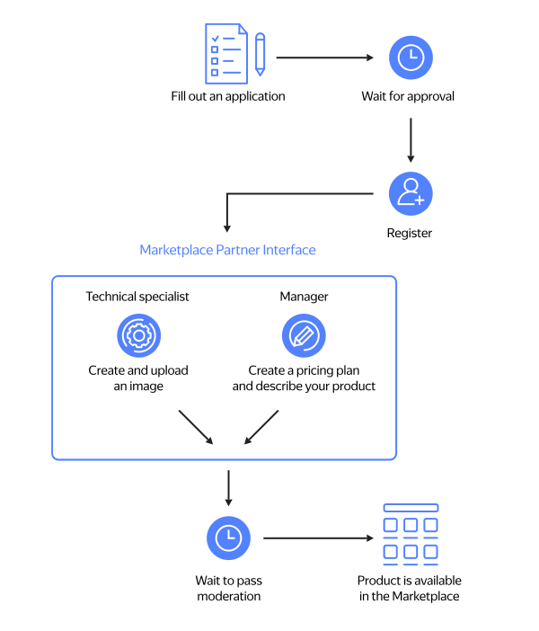

# How to add your image to {{ marketplace-name }}

{{ marketplace-name }} allows you to add your products to the catalog of ready-to-use {{ yandex-cloud }} solutions and earn a profit from them. You can only add ready-to-use, cloud-based images and solutions for {{ datalens-full-name }}.

## Submitting an application {#send-application}

Fill out the questionnaire on the [Marketplace page]({{ link-cloud-marketplace }}) and describe your product. A detailed description of useful product functions and features will help us review your application faster. By submitting the request, you accept the [Offer](https://yandex.ru/legal/marketplace_offer/) for Software Product Access on the Marketplace. If your business already has a billing account, specify it when submitting your application.

After it passes moderation, you'll receive confirmation at the email address specified in the questionnaire.

## Registering an account {#registration}

To access the {{ marketplace-name }} partner account, you need the billing account of a business that is a resident of Russia or Kazakhstan. If you don't have a billing account yet, [create one](operations/registration.md).

## Creating and uploading a product image {#create-image}

Product images to be uploaded to the Marketplace can be based on Linux or Windows Server and created from {{ yandex-cloud }} public images. Requirements for images and recommendations for creating images are described in the instructions:

* [{#T}](operations/create-image.md)
* [{#T}](operations/create-image-ms.md)

## Creating a service plan {#create-tariff}



The service plan determines the cost of running your product.

[Create a service plan](operations/create-tariff.md) to assign it to your product.

## Creating a product {#create-product}

Add information about your product to be displayed in the Marketplace public catalog. List the features and advantages of your product and examples of usage and scenarios. Describe how to get started and possible difficulties with deployment. Explain how users can contact you. For more information on creating a product, see [{#T}](operations/create-product.md).

## Creating the first version of the product {#create-version}

For more information on creating the first version of a product in a {{ marketplace-name }} partner account, see [{#T}](operations/create-new-version.md).

The product's first version will be sent for moderation to {{ yandex-cloud }}. After it passes moderation, you'll get an email confirming that your product is available to users in the Marketplace public catalog.
