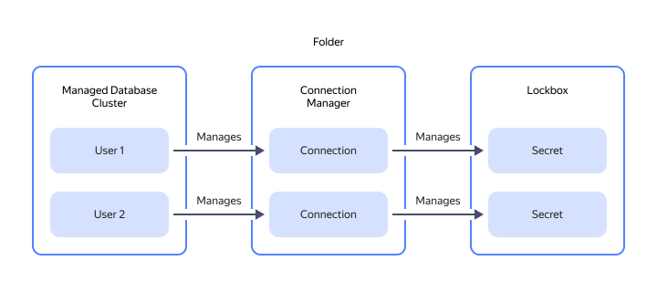

# Connection





You can also [create new connections](../../metadata-hub/operations/create-connection.md#on-premise-connection) with secure storage of custom database installation passwords and use them in {{ yandex-cloud }} services available to you.



When creating a connection to a custom database installation intended for [{{ datalens-full-name }}](../../datalens/concepts/index.md), specify the host's external address.



You can [configure access to connections](../security/index.md) using {{ connection-manager-full-name }} roles. You can assign roles for a [cloud](../../resource-manager/concepts/resources-hierarchy.md#cloud), [folder](../../resource-manager/concepts/resources-hierarchy.md#folder), or separate [connection](../operations/connection-access.md). They will also apply to nested resources.
