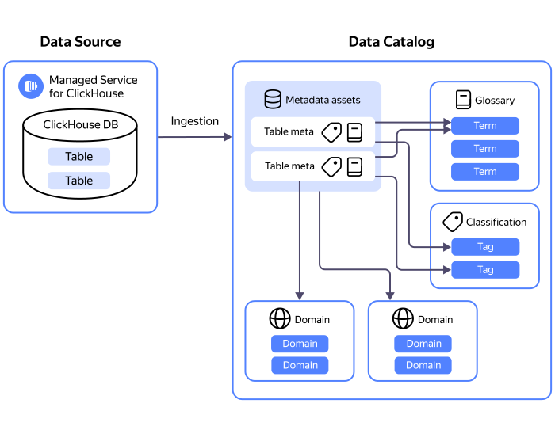

# Resource relationships in {{ data-catalog-full-name }}









The main entity in {{ data-catalog-name }} is a _metadata catalog_. A catalog serves as:

* Hub for collecting and storing metadata from various sources.
* Workspace for marking up metadata. 

You can upload metadata into a catalog using [sources and ingestions](#metadata-upload). Metadata resides in internal storage.

At the very basic level, you can use [domains and subdomains](#domains-and-subdomains), e.g., to arrange metadata by company departments. For a more complex markup, use these resources:

* [Classifications and tags](#classifications-and-tags)
* [Glossaries and terms](#glossaries-and-terms)

## Uploading metadata {#metadata-upload}

To upload metadata, use _sources_ and _ingestions_.

A source is a connection through which the metadata is uploaded. This connection stores information about the database or service metadata is ingested from as well as authentication data. [Learn more about available backends](../operations/data-catalog/create-source.md).

A source can connect to both clusters of managed databases in {{ yandex-cloud }} and to custom installations of these databases. It can also fetch object links based on ongoing data delivery in {{ data-transfer-full-name }}.

If you create multiple sources for the same DB instance or transfer in one catalog, the single `data store` object associated with this DB instance will be automatically created. This object aggregates all uploaded metadata across all sources of this DB instance or cluster.

An ingestion is a process that connects to the data storage or service specified in the source and uploads its metadata into the catalog. In an ingestion, you can configure:

* Filters to get only relevant metadata.
* Profiling to export the statistical data you need.

An ingestion is exclusively associated with a specific source. However, a source can have multiple associated ingestions. This means you can create multiple ingestions for one source, each with its own filters.

You can run an ingestion manually or configure it to run on a schedule. A scheduled ingestion always runs only once, even if the schedule specifies a period and not a specific hour.

{{ data-catalog-name }} has quotas for the maximum number of sources and ingestions in a catalog.

## Metadata markup {#metadata-markup}

### Domains and subdomains {#domains-and-subdomains}

A _domain_ represents a group of metadata. You can use domains to arrange metadata to meet your business process needs, e.g., by departments or business units. For each domain, you can create a subdomain for more granular grouping.

You can only assign one domain or subdomain to each metadata set or its individual element. At the same time, you can assign different domains or subdomains to separate elements within a single metadata set.

{{ data-catalog-name }} has quotas for the maximum number of domains in a catalog. The maximum domain nesting depth is 5.

### Classifications and tags {#classifications-and-tags}

A _classification_ comprises tags used to mark up metadata.

{{ data-catalog-name }} has quotas for the maximum number of classifications in a catalog.

_Tags_ are labels used to mark up data based on its type, e.g., sensitive data, table specifications, etc. You can assign multiple tags from a single or different classifications to the same set of metadata or its individual element. If **Mutually exclusive** is enabled in a classification, you can only assign one tag from this classification to a metadata set or its element.

In addition to metadata sets and their elements, you can assign tags to:

* Domains and subdomains
* Glossaries
* Individual terms in a glossary

{{ data-catalog-name }} has quotas for the maximum number of tags in a classification. 

### Glossaries and terms {#glossaries-and-terms}

A _glossary_ is a dictionary of domain-specific terms and their definitions. Glossaries act as a single source of truth for terminology used within a company. Depending on how broadly a glossary is used, it may belong to one of these types:

* Domain-specific: Includes terms relevant to a specific industry or business domain.
* Project-related: Includes terms relevant to a particular project or multiple related projects.
* Corporate: Includes terms relevant to all company’s projects and business areas.

{{ data-catalog-name }} has quotas for the maximum number of glossaries in a catalog.

_Terms_ are used to label data based on how a business defines certain concepts, such as revenue, expenses, etc. For each term, you can specify a synonym or create a child term for more granular data markup. You can assign multiple terms to the same metadata set or its individual element. These may include:

* Terms from different glossaries
* Child terms of different parent terms

{{ data-catalog-name }} has quotas for the maximum number of terms in a glossary. The maximum nesting depth of a term is 5.

## Use cases {#examples}

* [{#T}](../operations/data-catalog/create-term.md) in a glossary.
* [{#T}](../operations/data-catalog/create-term-child.md).
* [{#T}](../operations/data-catalog/update-glossary.md).
* [{#T}](../operations/data-catalog/update-term.md).
* [{#T}](../operations/data-catalog/create-tag.md) in a classification.
* [{#T}](../operations/data-catalog/update-classification.md).
* [{#T}](../operations/data-catalog/update-tag.md) in a classification.