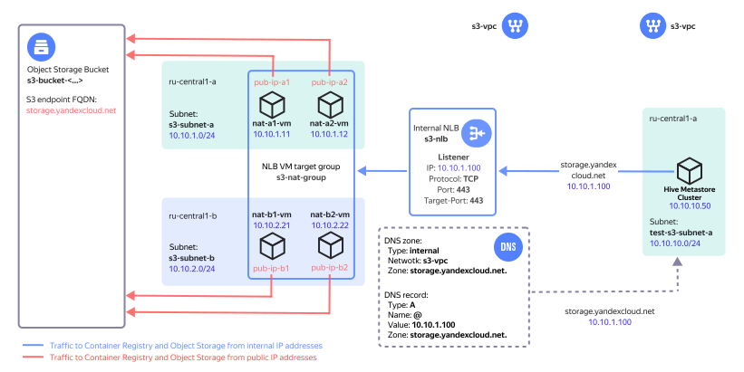

# Connecting to a {{ objstorage-full-name }} bucket with a bucket policy

In {{ metastore-full-name }}, you can work with an {{ objstorage-full-name }} bucket with [bucket policies](../../../storage/security/policy.md) configured. You access the bucket from a separate DNS zone through an internal load balancer used to distribute traffic among NAT instances. The described connection is shown below. A {{ metastore-name }} cluster will be used in place of the `test-s3-vm` VM.

## Getting started {#before-you-begin}

1. Create a network infrastructure to access the {{ objstorage-name }} bucket as shown on the picture above. For information on how to create such an infrastructure, see [this tutorial](../../../storage/tutorials/storage-vpc-access.md).
1. [Test the new infrastructure](../../../vpc/tutorials/storage-vpc-access.md#check). 

## Prepare the {{ metastore-name }} cluster {#prepare-metastore}

1. [Create a service account](../../../iam/operations/sa/create.md) named `my-account` with the `storage.uploader` and `managed-metastore.integrationProvider` roles.
1. [Grant](../../../storage/operations/buckets/edit-acl.md) the `READ and WRITE` permission to the `my-account` service account for the bucket you created earlier.
1. [Configure the network and create a {{ metastore-name }} cluster](cluster-create.md). When creating it, specify the `my-account` service account.

## Test the connection {#check-connection}

To test the {{ objstorage-name }} bucket connection, [export the {{ metastore-name }} cluster data to that bucket](export-and-import.md#export). 
