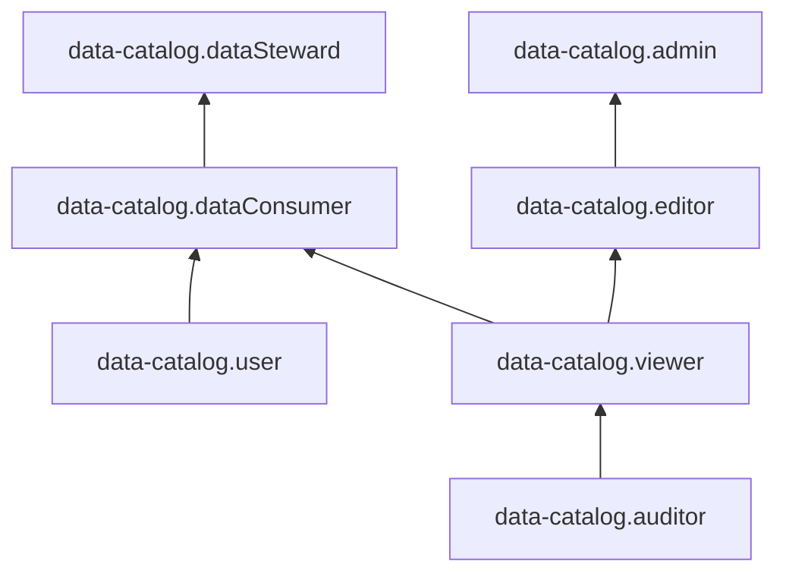

# Service roles to manage metadata in {{ data-catalog-full-name }}







To view information about metadata catalogs and manage their resources, you can use {{ data-catalog-full-name }} service roles at the following levels:

* [Service](#service-level-roles)
* [Catalog](#catalogs-roles)
* [Metadata set](#assets-roles)
* [Classification](#classifications-roles)
* [Classification tag](#tags-roles)
* [Domain](#domains-roles)
* [Glossary](#glossaries-roles)
* [Glossary term](#terms-roles)
* [Ingestion](#ingestions-roles)
* [Ingestion source](#ingestions-roles)
* [Metadata link](#lineages-roles)

## Top-level service roles {#service-level-roles}

### {{ roles.data-catalog.auditor }} {#data-catalog-auditor}



### {{ roles.data-catalog.viewer }} {#data-catalog-viewer}



### {{ roles.data-catalog.editor }} {#data-catalog-editor}



### {{ roles.data-catalog.admin }} {#data-catalog-admin}



### {{ roles.data-catalog.dataSteward }} {#data-catalog-dataSteward}



### {{ roles.data-catalog.dataConsumer }} {#data-catalog-dataConsumer}



### {{ roles.data-catalog.user }} {#data-catalog-user}



## Roles for catalog access management {#catalogs-roles}

### {{ roles.data-catalog.catalogs.auditor }} {#data-catalog-catalogs-auditor}



### {{ roles.data-catalog.catalogs.viewer }} {#data-catalog-catalogs-viewer}



### {{ roles.data-catalog.catalogs.editor }} {#data-catalog-catalogs-editor}



### {{ roles.data-catalog.catalogs.admin }} {#data-catalog-catalogs-admin}



## Roles for metadata set access management {#assets-roles}

### {{ roles.data-catalog.assets.auditor }} {#data-catalog-assets-auditor}



### {{ roles.data-catalog.assets.viewer }} {#data-catalog-assets-viewer}



### {{ roles.data-catalog.assets.editor }} {#data-catalog-assets-editor}



### {{ roles.data-catalog.assets.admin }} {#data-catalog-assets-admin}



## Roles for classification access management {#classifications-roles}

### {{ roles.data-catalog.classifications.auditor }} {#data-catalog-classifications-auditor}



### {{ roles.data-catalog.classifications.viewer }} {#data-catalog-classifications-viewer}



### {{ roles.data-catalog.classifications.editor }} {#data-catalog-classifications-editor}



### {{ roles.data-catalog.classifications.admin }} {#data-catalog-classifications-admin}



## Roles for classification tag access management {#tags-roles}

### {{ roles.data-catalog.classificationTags.auditor }} {#data-catalog-classificationTags-auditor}



### {{ roles.data-catalog.classificationTags.viewer }} {#data-catalog-classificationTags-viewer}



### {{ roles.data-catalog.classificationTags.user }} {#data-catalog-classificationTags-user}



### {{ roles.data-catalog.classificationTags.editor }} {#data-catalog-classificationTags-editor}



### {{ roles.data-catalog.classificationTags.admin }} {#data-catalog-classificationTags-admin}



## Roles for domain access management {#domains-roles}

### {{ roles.data-catalog.domains.auditor }} {#data-catalog-domains-auditor}



### {{ roles.data-catalog.domains.viewer }} {#data-catalog-domains-viewer}



### {{ roles.data-catalog.domains.user }} {#data-catalog-domains-user}



### {{ roles.data-catalog.domains.editor }} {#data-catalog-domains-editor}



### {{ roles.data-catalog.domains.admin }} {#data-catalog-domains-admin}



## Roles for dictionary access management {#glossaries-roles}

### {{ roles.data-catalog.glossaries.auditor }} {#data-catalog-glossaries-auditor}



### {{ roles.data-catalog.glossaries.viewer }} {#data-catalog-glossaries-viewer}



### {{ roles.data-catalog.glossaries.editor }} {#data-catalog-glossaries-editor}



### {{ roles.data-catalog.glossaries.admin }} {#data-catalog-glossaries-admin}



## Roles for glossary term access management {#terms-roles}

### {{ roles.data-catalog.glossaryTerms.auditor }} {#data-catalog-glossaryTerms-auditor}



### {{ roles.data-catalog.glossaryTerms.viewer }} {#data-catalog-glossaryTerms-viewer}



### {{ roles.data-catalog.glossaryTerms.user }} {#data-catalog-glossaryTerms-user}



### {{ roles.data-catalog.glossaryTerms.editor }} {#data-catalog-glossaryTerms-editor}



### {{ roles.data-catalog.glossaryTerms.admin }} {#data-catalog-glossaryTerms-admin}



## Roles for ingestion access management {#ingestions-roles}

### {{ roles.data-catalog.ingestions.auditor }} {#data-catalog-ingestions-auditor}



### {{ roles.data-catalog.ingestions.viewer }} {#data-catalog-ingestions-viewer}



### {{ roles.data-catalog.ingestions.editor }} {#data-catalog-ingestions-editor}



### {{ roles.data-catalog.ingestions.admin }} {#data-catalog-ingestions-admin}



## Roles for ingestion source access management {#ingestion-sources-roles}

### {{ roles.data-catalog.ingestionSources.auditor }} {#data-catalog-ingestionSources-auditor}



### {{ roles.data-catalog.ingestionSources.viewer }} {#data-catalog-ingestionSources-viewer}



### {{ roles.data-catalog.ingestionSources.editor }} {#data-catalog-ingestionSources-editor}



### {{ roles.data-catalog.ingestionSources.admin }} {#data-catalog-ingestionSources-admin}



## Roles for metadata link access management {#lineages-roles}

### {{ roles.data-catalog.lineages.auditor }} {#data-catalog-lineages-auditor}



### {{ roles.data-catalog.lineages.viewer }} {#data-catalog-lineages-viewer}



### {{ roles.data-catalog.lineages.editor }} {#data-catalog-lineages-editor}



### {{ roles.data-catalog.lineages.admin }} {#data-catalog-lineages-admin}



## What roles do I need {#choosing-roles}

The table below lists the roles required for specific actions. You can always assign a role with more permissions. For example, you can assign the `editor` role instead of `viewer`.

| Action                                                       | Required roles                                      |
|----------------------------------------------------------------|-------------------------------------------------------|
| View catalog metadata                             | `{{ roles.data-catalog.auditor }}`                    |
| View info on catalog access permissions and quotas | `{{ roles.data-catalog.viewer }}`                     |
| Create catalogs                                             | `{{ roles.data-catalog.editor }}`                     |
| Edit catalogs                                         | `{{ roles.data-catalog.editor }}`                     |
| Delete catalogs                                               | `{{ roles.data-catalog.editor }}`                     |
| Update catalog access permissions                             | `{{ roles.data-catalog.admin }}`                      |
| View and modify domains, tags, and terms                | `{{ roles.data-catalog.user }}`                       |
| View dataset information                      | `{{ roles.data-catalog.assets.auditor }}`             |
| Manage datasets: update, delete, or edit them | `{{ roles.data-catalog.assets.editor }}` |
| View classification information                       | `{{ roles.data-catalog.classifications.auditor }}`    |
| Edit classifications                                    | `{{ roles.data-catalog.classifications.editor }}`     |
| View tag information                               | `{{ roles.data-catalog.classificationTags.auditor }}` |
| Edit tags                                             | `{{ roles.data-catalog.classificationTags.editor }}`  |
| View glossary information                          | `{{ roles.data-catalog.glossaries.auditor }}`         |
| Edit glossaries                                        | `{{ roles.data-catalog.glossaries.editor }}`          |
| View term information                            | `{{ roles.data-catalog.glossaryTerms.auditor }}`      |
| Edit terms                                          | `{{ roles.data-catalog.glossaryTerms.editor }}`       |
| View ingestion settings                               | `{{ roles.data-catalog.ingestions.auditor }}`         |
| Edit ingestion settings                               | `{{ roles.data-catalog.ingestions.editor }}`          |
| View ingestion source settings                     | `{{ roles.data-catalog.ingestionSources.auditor }}`   |
| Edit ingestion source settings                     | `{{ roles.data-catalog.ingestionSources.editor }}`    |
| View information on data links                       | `{{ roles.data-catalog.lineages.auditor }}`           |
| Create, modify, and delete data links              | `{{ roles.data-catalog.lineages.editor }}`            |