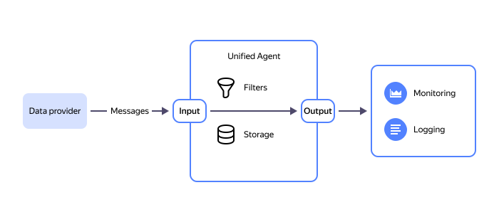
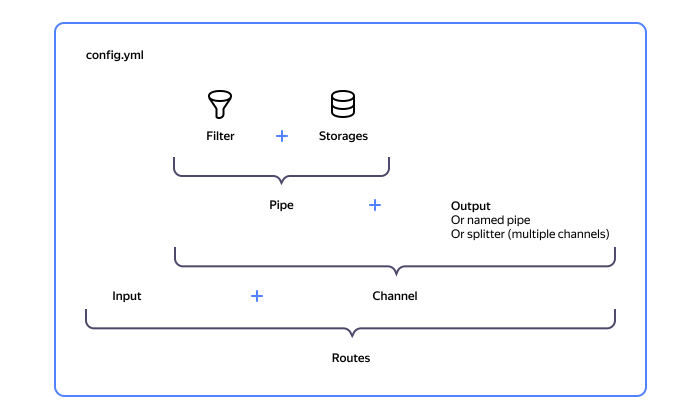

# Agent for delivering metrics

{{ unified-agent-full-name }} is the agent for delivering additional metrics of virtual machines and user applications to {{ monitoring-full-name }}.

The agent supports:

- [Collecting Linux system metrics](../../../operations/unified-agent/linux_metrics.md) (CPU, RAM, disk).
- Collecting metrics in [Prometheus](https://prometheus.io) format.
- Delivering metrics to {{ monitoring-full-name }}.
- File storage for reliable data delivery.

You can find the examples of using the agent in [{#T}](../../../operations/index.md#working-with-metrics). Learn more about {{ unified-agent-short-name }} installation methods in [{#T}](./installation.md). The syntax of the agent's configuration file is described in [{#T}](./configuration.md).

## Concepts {#basics}

{{ unified-agent-full-name }} transmits streaming data represented as messages, e.g., metrics or logs. A data stream in {{ unified-agent-short-name }} is called a session. Multiple sessions can be running at the same time.

The agent receives messages via the input and delivers them to one or more outputs. Intermediate processing of messages is done by filters; storages save messages to the disk. Inputs, outputs, filters, and storages are implemented using plugins.

Message routing is implemented with the help of delivery routes which consist of an input and a channel. A channel consist of a pipe and a node of one of the following types: output, channel, or splitter. A pipe may contain filters and links to storages. There can be no pipe in the configuration.

You can create named channels and pipes. This will help you avoid duplicate configurations and route messages from multiple inputs to the same output.

## How {{ unified-agent-short-name }} works {#scheme}

## Messages {#messages}

A message is the minimum atomic unit of user information that a system or application sends to {{ unified-agent-short-name }}.

A message consist of a body, a timestamp, user metadata in `key:value` format, and a serial number.



[Integral `COUNTER` metrics](../../../concepts/data-model.md#metric-types) are converted to `DGAUGE` when uploading to {{ monitoring-name }} for correct data aggregation in monitoring.



## Sessions {#sessions}

A session is an ordered stream of messages. A session has an ID that must be unique among all the ongoing sessions as well as user metadata in `key:value` format.

All messages sent during a session contain both message metadata and session metadata.

Types of information to collect (inputs), pipes (filters), interim storage spaces (storages), and outputs are specified in the {{ unified-agent-short-name }} configuration file.

## Inputs {#inputs}
An input is used by the agent to receive the messages transmitted during sessions. An input can contain the session infrastructure settings used to configure various limits.

See the [list of available inputs](inputs.md).

## Outputs {#outputs}

Outputs are used by the agent to send messages to third-party systems. The currently supported outputs are the `yc_metrics` output, which writes a metric to the {{ monitoring-full-name }} API, and several debug outputs.

See also the [list of available outputs](outputs.md).

## Filters {#filters}

Filters are designed to discard, convert, and aggregate messages.

Filter types:

- regular: Handle each message separately.
- cumulative: Transform a set of input messages into one output message.

See also the [list of available filters](filters.md).

## Storages {#storages}
Storages are intended to store messages from their receipt as an input until their transmission to the output.
Using a storage can help you avoid data loss if the agent fails to write the data to the specified output. This may happen due to network issues or destination API unavailability.

See also the [storage configuration guide](storage.md).

## Routing {#routing}

### Pipes {#pipes}
Pipes contain:
* Sequence of filters that messages pass through.
* Link to the storage where the messages will be stored before their transmission to the output.

Pipes can be named.

See also the [pipe configuration guide](routing.md#pipes).

### Channels {#channels}

Channels group a pipe with a node, one of an output, a named channel, or a splitter.

Splitters let you specify a set of channels, copying incoming messages to each of them. You can use splitters to duplicate streams to different outputs. By combining splitters and filters, you can send different messages to different channels based on particular attributes such as metadata.

Channels can be named.

See the [named channel configuration guide](routing.md#channels).

### Routes {#routes}

Routes combine an input and a channel.

Routes, channels, and pipes enable you to set up any message processing tree.

See the diagram for the relations between the items of the message processing tree.

