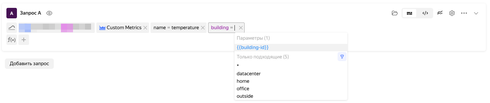

# Dashboards in {{ monitoring-name }}

*Dashboards* are sets of widgets: charts, text blocks, and titles. Metrics on dashboard charts are displayed for a specific interval that is shared by all charts.

The default interval is one day. The interval can be set using preset ranges (`1h 3h 1d 1w 1mo`). You can also set the beginning and the end interval.

To set the time interval more precisely, you can use the timeline located above the dashboard.

{{ yandex-cloud }} users can use service dashboards that contain preset widgets with metrics on the status of cloud resources. Service dashboards are created automatically.

 <!-- Big Yandex dashboards -->

## Dashboard parameters {#parameterization}

Parameters let you create interactive dashboards whose content changes depending on the user's choice. For example, a dashboard that shows aggregated information about the status of a VM can be parameterized using the VM ID.

Parameters are displayed as drop-down menus above dashboard widgets. When you select a parameter value, the dashboard is updated and the selected value is substituted in data queries.

The following types of dashboards are available:

* *{{ ui-key.yacloud_monitoring.component.parametrizer.type.query }}*: Parameter takes a set of values of the specified label.
* *{{ ui-key.yacloud_monitoring.component.parametrizer.type.custom }}*: Parameter takes a set of fixed comma-separated values.
* *{{ ui-key.yacloud_monitoring.component.parametrizer.type.text-field }}*: Parameter takes the only value specified in the text field.

 <!-- Big Yandex dashboards -->

For parameters of the *{{ ui-key.yacloud_monitoring.component.parametrizer.type.query }}* and *{{ ui-key.yacloud_monitoring.component.parametrizer.type.custom }}* type, the *{{ ui-key.yacloud_monitoring.component.parametrizer.dashboard.multivalue-key-value }}* setting is available. It lets you select multiple parameter values at the same time.

For all parameter types, you can set the *{{ ui-key.yacloud_monitoring.component.parametrizer.default-value }}* that will be used when loading a dashboard in the {{ monitoring-full-name }} web interface.

 <!-- Big Yandex dashboards -->

 <!-- Cloud dashboards -->

### Parameter substitution {#templates}

Dashboard parameter values are used in widget headings and queries to metrics to filter label values. Parameter values are substituted using [mustache template](https://mustache.github.io/).



You can only use parameter value substitution in label values when making queries to metrics.



#### Examples of parameter value substitution {#templates-examples}

* Substituting values in widget headings.
   > In the `CPU usage on not_var{{host}}` widget heading, the `host` parameter value is substituted.
* Substituting label values in queries.
   > In the `"cpu.iowait"{folderId="aoe6mk1r3b47lu994prn", service="not_var{{myparm}}", host="*"}` query, the `service` label value is substituted with the `myparm` parameter value.

Substituting parameter values in query strings looks like this:

 <!-- Cloud dashboards -->

### Label value filter {#common-labels-filter}

The label value filter lets you limit the list of possible parameter values with the *{{ ui-key.yacloud_monitoring.component.parametrizer.type.query }}* type. The filter specifies labels and their values. The filter is applied to all parameters of the *{{ ui-key.yacloud_monitoring.component.parametrizer.type.query }}* type at the same time.

#### Examples of filtering label values {#common-labels-filter-example}

Let's assume a dashboard has a *{{ ui-key.yacloud_monitoring.component.parametrizer.type.query }}* type parameter set for a `cluster` label that takes the values `prod`, `preprod-1`, `preprod-2`, and `testing`.

Filtering settings and result:

* The `cluster=*prod*` filter limits parameter values to the list of `prod` and `preprod-1` values.
* The `cluster=preprod-1|preprod-2` filter limits the values with the list of `preprod-1` and `preprod-2`.
* The `cluster=testing` filter limits the values to a single `testing` value.

Below is a more complex example. Let's say the system has the following metrics:

* `usage{cluster="prod", account="prodaccount"}`;
* `usage{cluster="preprod", account="preprodaccount"}`;
* `usage{cluster="testing", account="testingaccount"}`;
* `usage{cluster="prod", account="multiaccount"}`;
* `usage={cluster="testing", account="multiaccount"}`.

Filtering settings:

* The filter contains the `cluster=*prod*` value.
* A dashboard has *{{ ui-key.yacloud_monitoring.component.parametrizer.type.query }}* type parameters set for the `cluster` and `account` labels.

Result:

* Possible values of the `cluster` parameter are limited to `prod` and `preprod`. The `testing` value is excluded as not matching the `cluster=*prod*` rule.
* Possible values of the `account` parameter will be limited to `prodaccount`, `preprodaccount`, and `multiaccount`. The `testingaccount` value is excluded as there is no metric with a combination of `account="testingaccount"` and `cluster` labels matching the `cluster=*prod*` rule (while this combination exists for `multiaccount`).

 <!-- Big Yandex dashboards -->
