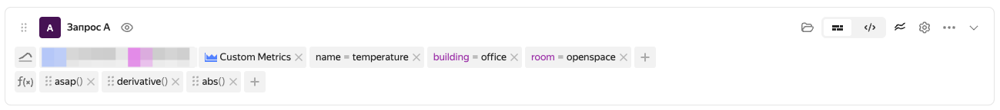
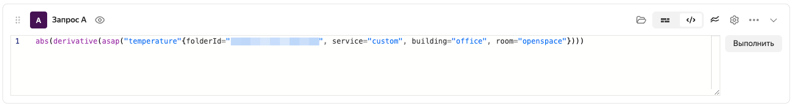

# Query string

[The query language](../querying.md) of {{monitoring-full-name}} is used to configure [dashboards](./dashboard.md) and [alerts](../alerting.md). In the query string, you enter an expression written in the query language in tokenized or text mode. The query string allows you to apply functions to a set of metrics uploaded from a specific service. To display metrics from different services on a dashboard's chart, create multiple query strings.

In tokenized mode, the query string consists of two parts:
1. [Selectors](../querying.md#selectors) used to upload metrics.
1. A set of functions from the [query language](../querying.md). Functions are applied to metrics sequentially from left to right.

The query string in tokenized mode looks like this:

In text mode:
* In the query string, you enter functions which, for an argument, get a query to metrics or a result returned by another function.
* Syntax highlighting is enabled with function names and selector label values highlighted in different colors.

To switch to text mode, click .

The query string in text mode looks like this:

