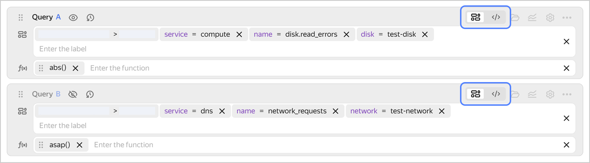
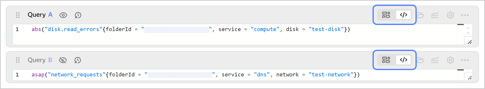

# Query string

Query string is located in **{{ ui-key.yacloud_monitoring.aside-navigation.menu-item.dashboards.title }}**, **{{ ui-key.yacloud_monitoring.aside-navigation.menu-item.alerts.title }}**, and **{{ ui-key.yacloud_monitoring.aside-navigation.menu-item.explorer.title }}**. It allows you to specify parameters for charts.

You can enter a query in tokenized or text mode.

## Tokenized query {#query-token}

This is the default mode. A query string in tokenized mode looks like this:

In this mode, the query string consists of two parts:

* **Tokens**, i.e., metrics and labels that are going to be selected as a result of the query. The first token is always a folder in your cloud. Next, you select a service and individual metrics.
* **Functions** from the [query language](../querying.md) for metric conversion. Functions are applied to metrics sequentially from left to right.

When selecting a token, you are offered a list of possible metrics and labels to build a chart with. For every value that follows, only the options available for the selected metric will be displayed. If the value you need is not on the list, you can enter it manually.

You can select tokens using the cursor or by entering their names. Use the following key combinations to manage tokens:

* **Cmd/Ctrl + →** and **Cmd/Ctrl + ←** to switch between tokens.
* **Option/Alt + →** and **Option/Alt + ←** to switch between token fields.
* **Cmd/Ctrl + Delete** to delete the current token.
* **Cmd/Ctrl + Z** to cancel an action.
* **Cmd + Shift + Z** or **Ctrl + Y** to repeat an action.
* **Shift + Space** to go to the label value.
* **Cmd/Ctrl + I** to open the suggestion menu.
* **Escape** to close the suggestion menu. Press again to remove focus.
* **Enter** to select a suggestion. If the suggestion menu is closed, press it to finish entering the current token and go to the next one.
* **|**: Pipe mode; only used in label value.

## Text query {#query-text}

To switch to text mode, click . If you are new to text mode, first enter your query in the form of tokens and functions. Then, enable text mode; your query will be written as a string. In text mode, you can use the [query language](../querying.md) more flexibly. Also, in text mode, your query is transmitted when [reading data via the API](../../api-ref/MetricsData/read.md).

A query string in text mode looks like this:

In text mode, queries to monitoring are written as functions. Function arguments are tokens, outputs of other functions, and other queries. Syntax highlighting is supported: function names, key words, and label values are highlighted in different colors.

## Working with a query string {#query-working}

The following features are available when working with a query string:

* Displaying metrics from different services or for different resources on the chart.

    To do this, add multiple query strings and specify queries to get data for each resource.

* Using a value from one query in another one.

    Let's assume you have described two queries, `A` and `B`, and you need to display `B` as a share of `A` on the chart. Then, enter this formula in the `C` query: `100 * B / A`. Similarly, you can describe queries and build charts based not only on pure metric values, but also on their sum, ratio, and other derivative values.

* Hiding auxiliary queries from the chart.

    If you need some of your queries solely for other queries, click  to hide the auxiliary lines from the chart.

* Viewing recent queries.

    To open the query history, click . The maximum number of queries in the history is `100`. To add a query to favorites, click . Your favorite queries will appear at the top of the list.

* Viewing all token values for selected service or resource.

    Click  to open the list of values. Select metrics and selectors on the list panel. You will see the tokens available for each set of values.
