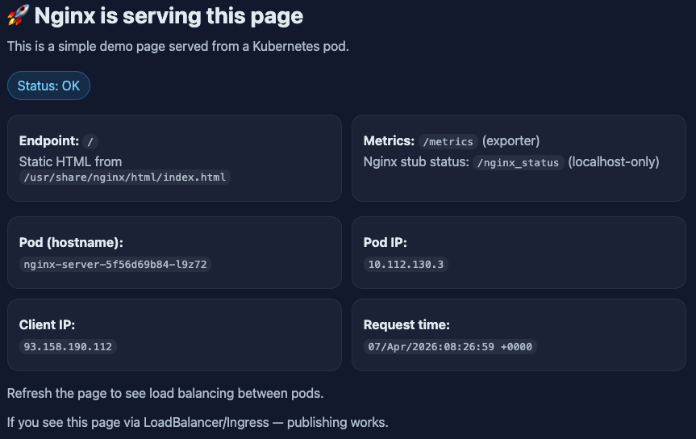
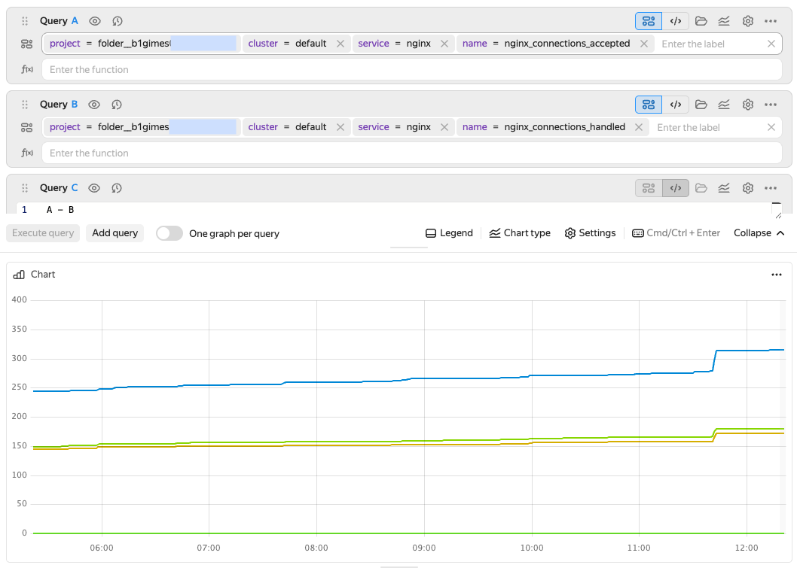
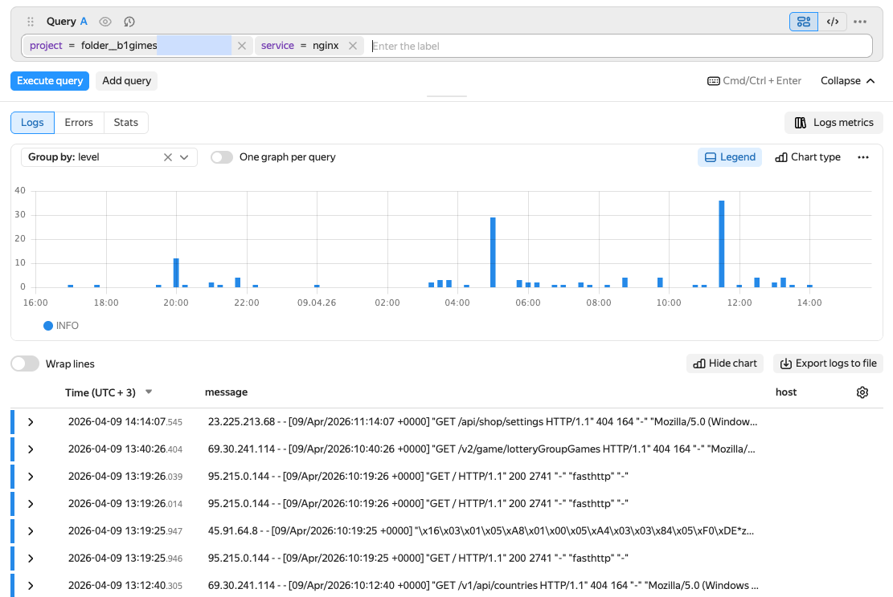
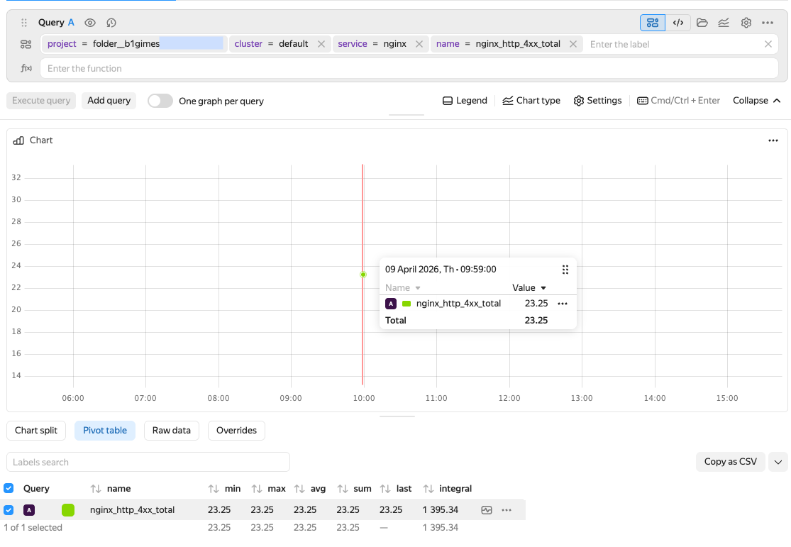

# Setting up Nginx telemetry collection in {{ k8s }}

You will set up an Nginx server in a {{ k8s }} cluster and send its metrics and logs to {{ monium-name }}. This guide uses {{ managed-k8s-name }} to deploy a cluster, but you can any of your {{ k8s }} clusters.

To set up web server telemetry collection in a cluster:

1. [Configure the {{ k8s }}](#cluster-settings) cluster.
1. [Set up authentication](#auth-settings): Create a service account and API key to send data to {{ monium-name }}.
1. [Install and configure Nginx](#nginx-install): Deploy a web server with a metric exporter.
1. [Install OpenTelemetry Collector](#install-otel-collector): Set up metric collection and sending.
1. [View metrics in {{ monium-name }}](#view-metrics).
1. [Configure log collection](#logs-settings).
1. [View logs in {{ monium-name }}](#view-logs).
1. [Configure additional metrics based on logs](#metrics-from-logs).
1. [Create a dashboard and alerts](#dashboard-alerts).

## Getting started {#before-you-begin}



### Required paid resources {#paid-resources}

The cost of resources you need for {{ monium-name }} includes:
* Fee for using a [{{ managed-k8s-name }}](../../managed-kubernetes/concepts/index.md#master) master (see [{{ managed-k8s-name }} pricing](../../managed-kubernetes/pricing.md)).
* Fee for the [{{ managed-k8s-name }}](../../managed-kubernetes/concepts/index.md#node-group) node group's [computing resources](../../compute/concepts/vm-platforms.md) and [disks](../../compute/concepts/disk.md) (see [{{ compute-full-name }} pricing](../../compute/pricing.md)).
* Fee for using {{ monium-name }} (see [{{ monium-name }} pricing](../pricing.md)).

## Setting up a cluster {#cluster-settings}



- Management console {#console}

  1. Create an [{{ k8s }} cluster](../../managed-kubernetes/quickstart.md).

  1. 




## Setting up authentication {#auth}

In this step, you need to get and save the API key and folder ID to use them to [configure OpenTelemetry Collector](#install-otel-collector).



- Management console {#console}

  1. Create a [service account](../../iam/operations/sa/create.md) with the `monium.telemetry.writer` role.
     1. Navigate to **{{ ui-key.yacloud.iam.folder.dashboard.label_iam }}**.
     1. Click **{{ ui-key.yacloud.iam.folder.service-accounts.button_add }}**.
     1. Name your service account, e.g., `monium-ca`.
     1. Click  **{{ ui-key.yacloud_components.acl.button.add-role }}** and select `monium.telemetry.writer`.
     1. Click **{{ ui-key.yacloud.iam.folder.service-account.popup-robot_button_add }}**.
  
  1. Create an [API key](../../iam/operations/authentication/manage-api-keys.md) with the `yc.monium.telemetry.write` scope:
     1. Select the service account you created from the list.
     1. Click  **{{ ui-key.yacloud.iam.folder.service-account.overview.button_create-key-popup }}** and select **{{ ui-key.yacloud.iam.folder.service-account.overview.button_create_api_key }}**.
     1. In the **{{ ui-key.yacloud.iam.folder.service-account.overview.field_key-scope }}** field, select `yc.monium.telemetry.write`.
     1. Click **{{ ui-key.yacloud.iam.folder.service-account.overview.popup-key_button_create }}**.
  
  1. Copy the API key and save it to a secure location as you will need it later.
  1. Copy the ID of the folder the cluster and service account were created in. To do this, click the folder name at the top and click  →  **Copy ID** next to the folder in the list.
  



## Installing and configuring Nginx {#nginx-install}

1. Create a file with the web server configuration and Nginx HTML page:
  
     

     
     
      

1. Create a file to manage the running and scaling of Nginx pods.

     

     
     
     
   
   To monitor Nginx in {{ k8s }}, you will need `nginx-exporter` to convert Nginx internal statistics into OpenTelemetry Collector format.

   In the `deployment.yaml` file, the exporter is added as a sidecar:

   ```yaml
   - name: nginx-exporter
     image: nginx/nginx-prometheus-exporter:0.10.0
     args:
       - -nginx.scrape-uri=http://localhost/nginx_status
     ports:
       - name: metrics
         containerPort: 9113
     resources:
       limits:
         memory: 128Mi
         cpu: 500m
   ```

   Each Nginx app pod will have two containers, `nginx` and `nginx-exporter`.
  
     
1. Create a file with Nginx access credentials:
  
     

     
     
     

1. Deploy Nginx:

    ```bash
    kubectl create namespace nginx-demo
    kubectl apply -f configmap.yaml
    kubectl apply -f deployment.yaml
    kubectl apply -f services.yaml
    ```

1. Make sure the application is running:

    ```bash
    kubectl get service -n nginx-demo nginx-web
    ```

    Result:
    ```bash
    NAME        TYPE           CLUSTER-IP      EXTERNAL-IP     PORT(S)        AGE
    nginx-web   LoadBalancer   10.96.238.139   158.260.329.4   80:32761/TCP   104s
    ```

1. In your browser, open the address from the `EXTERNAL-IP` column, e.g., `http://158.260.329.4`. You should see the HTML page from `configmap.yaml`.

   
        
   
        
   

## Installing and configuring OpenTelemetry Collector {#install-otel-collector}

In this step, you will install [OpenTelemetry Collector Contrib](https://github.com/open-telemetry/opentelemetry-collector-contrib), an extended collector version with additional components for log collection, parsing, and other tasks. The [OpenTelemetry Collector](https://github.com/open-telemetry/opentelemetry-collector) basic version is enough for metric collection, but to work with logs, you need the Contrib version, which is why we will use it from the beginning.

1. Create a file to install OpenTelemetry Collector and send metrics to {{ monium-name }}:
  
     

     
     
     

    In this file, provide the `<API_key>` and `<folder_ID>` values you saved when [setting up authentication](#auth-settings).

1. Install OTel Collector and start sending metrics:

    ```bash
    kubectl apply -f otel-config.yaml
    ```

1. Make sure there is a new pod named `otel-collector`:

    ```bash
    kubectl get pods --namespace nginx-demo
    ```

    Result:
    ```bash
    NAME                              READY   STATUS    RESTARTS   AGE
    nginx-server-949d9f98b-kzlrd      2/2     Running   0          2d2h
    nginx-server-949d9f98b-ngtsp      2/2     Running   0          2d2h
    nginx-server-949d9f98b-tclvh      2/2     Running   0          2d2h
    otel-collector-6cd848c59d-k6g2p   1/1     Running   0          12s
    ```

## Viewing metrics in {{ monium-name }} {#view-metrics}



- {{ monium-name }} UI {#console}

  1. On the [{{ monium-name }}]({{ link-monium }}) home page, select **{{ ui-key.yacloud_monitoring.aside-navigation.menu-item.explorer.title }}** on the left.
       
  1. In the query string, select the following one by one
     * `project=folder__<folder_ID>`
     * `cluster=default`
     * `service=nginx`
     * `name=nginx_up`
     
     You can use [text mode](../concepts/visualization/query-string#query-text) for the query. To do this, click  and enter your query as text:

     ```text
     `project=folder__<folder_ID>; cluster=default; service=nginx; name=nginx_up`.
     ```
     
     This metric shows the Nginx availability status: `1` for available, `0` for unavailable. The aggregate value of `3` indicates the number of pods.

  1. Click **{{ ui-key.yacloud_monitoring.querystring.action.execute-query }}**.



More on [metrics](../metrics/metric-explorer.md).

If there is no data in {{ monium-name }}, see [{#T}](../collector/troubleshooting.md).

By combining various metrics in queries, you can check if the web server is handling the current load effectively, detect connection drops caused by insufficient resources, and estimate query processing speeds.

### Number of active connections {#active-connections}

To estimate the number of active connections, specify the following value for the `name` metric:
* `nginx_connections_accepted`: Number of accepted connections since Nginx startup. It is used to monitor the general load.
* `nginx_connections_reading`: Number of connections Nginx reads client requests from. Shows how active incoming requests are.
* `nginx_connections_writing`: Number of connections where Nginx sends responses to clients. Shows how active outgoing requests are.

### Number of unprocessed connections {#unprocessed-connections}

To estimate the number of connections unprocessed by Nginx, use these metrics:
* `nginx_connections_accepted`: Number of accepted connections.
* `nginx_connections_handled`: Number of processed connections.

The difference between processed and accepted connections will be the number of connections that were accepted but not correctly processed by Nginx.

Create three queries: `Query A` for `nginx_connections_accepted`, `Query B` for `nginx_connections_handled`, and `Query C` to calculate the difference between these metrics. To create an extra query, click **{{ ui-key.yacloud_monitoring.querystring.action.add-query }}**.

* Query A:
  ```text
  `project=folder__<folder_ID>; cluster=default; service=nginx; name=nginx_connections_accepted`.
  ```

* Query B:
  ```text
  `project=folder__<folder_ID>; cluster=default; service=nginx; name=nginx_connections_handled`.
  ```
* Query C: enter `A - B` in the query string.


       

       


To display only the final result, click  next to queries `A` and `B` to hide them from the chart. To show the hidden charts, click .

In the test example, there are no unprocessed connections, so all query `C` values are null. In real systems, you can visualize these values as the `(A - B) / A` ratio, i.e., the share of connections accepted by Nginx but not processed. You can create an [alert](../concepts/alerting/alert.md) for this indicator to notify you, e.g., when the share of dropped connections exceeds `5%`.

## Configuring log collection {#logs-settings}

1. Create a new configuration file for log collection:
  
    

    
        
    
    
    This file contains a receiver section:

    ```yaml
    filelog:
      include:
        - /var/log/pods/nginx-demo_nginx-server-*/nginx/*.log
      operators:
        - type: container
          id: container-parser
    ```

    As well as the log collection pipeline (`pipeline`) and mount parameters (`volumeMounts`, `volumes`) for accessing the pod logs.

1. Delete the previous configuration file and apply the new one:

   ```bash
   kubectl delete -f otel-config.yaml
   kubectl apply -f otel-config-logs.yaml
   ```

## Viewing logs in {{ monium-name }} {#view-logs}



- {{ monium-name }} UI {#console}

  1. On the [{{ monium-name }}]({{ link-monium }}) home page, select **{{ ui-key.yacloud_monitoring.aside-navigation.menu-item.logs.title }}** on the left.
       
  1. In the query string, specify the following:
     * `project=folder__<folder_ID>`
     * `service=nginx`

  1. Click **{{ ui-key.yacloud_monitoring.querystring.action.execute-query }}**.

   
        
   
        
   



More on [logs](../logs/logs-explorer.md).

## Setting up metric collection from logs {#metrics-from-logs}

Apart from the standard metrics provided by Nginx via the {{ prometheus-name }} exporter, OTel Collector enables you to retrieve additional metrics from application logs. For example, you can track the numbers of HTTP responses with different status codes.

To get these metrics, create and apply a new configuration file:




        


This configuration is updated with the following components:

1. Retrieving log data.

   The `filelog` section includes the `regex_parser` statement to retrieve the relevant fields, e.g., the request method, URL, HTTP response code, etc., from the Nginx access log lines:

   ```yaml
   filelog:
     include:
       - /var/log/pods/nginx-demo_nginx-server-*/nginx/*.log
     operators:
       - type: container
         id: container-parser

       - type: regex_parser
         id: nginx-access
         parse_from: body
         regex: '^(?P<remote_addr>\S+) - (?P<remote_user>\S+) \[(?P<time_local>[^\]]+)\] "(?P<method>\S+) (?P<target>\S+) (?P<protocol>[^"]+)" (?P<status>\d{3}) (?P<body_bytes_sent>\d+)'
   ```

   This statement will get the `status` field (HTTP response code) from each log line. We will use this value to generate metrics.

1. Creating metrics from logs.

   Added the `count` connector to monitor the number of log entries based on specific conditions. The example below counts responses with `2xx`, `4xx`, and `5xx` codes:

   ```yaml
   connectors:
     count/nginx:
       logs:
         nginx_http_2xx_total:
           description: Number of successful responses (2xx)
           conditions:
             - 'IsMatch(attributes["status"], "^2..$")'

         nginx_http_4xx_total:
           description: Number of client errors (4xx)
           conditions:
             - 'IsMatch(attributes["status"], "^4..$")'

         nginx_http_5xx_total:
           description: Number of server errors (5xx)
           conditions:
             - 'IsMatch(attributes["status"], "^5..$")'
   ```

1. Setting up pipelines.

   Added the `metrics/logs` pipeline to receive metrics from the `count/nginx` connector and send them to {{ monium-name }} together with other metrics:

   ```yaml
   service:
     extensions: [zpages]
     pipelines:
       metrics:
         receivers: [prometheus]
         processors: [memory_limiter, resource, batch]
         exporters: [otlp/monium, debug]
       
       logs:
         receivers: [filelog]
         processors: [memory_limiter, resource, batch]
         exporters: [count/nginx, otlp/monium, debug]
       
       metrics/logs:
         receivers: [count/nginx]
         processors: [memory_limiter, resource, batch]
         exporters: [otlp/monium, debug]
   ```

Once you apply the configuration, new metrics will be available in {{ monium-name }}:
* `nginx_http_2xx_total`: Number of successful responses.
* `nginx_http_4xx_total`: Number of client errors.
* `nginx_http_5xx_total`: Number of server errors.


        

        


These metrics can be used for quality-of-service monitoring and troubleshooting. For example, a spike in `5xx` errors may indicate an application failure.

## Creating a dashboard and alerts {#dashboard-alerts}

For continuous Nginx health monitoring, [create a dashboard](../operations/dashboard/create.md) with key metrics and [set up alerts](../operations/alert/create-alert.md) to get notifications about issues.

For Nginx, we recommend adding charts with the following metrics to the dashboard:

* `nginx_connections_accepted`: Number of accepted connections since startup.
* `nginx_connections_active`: Number of current active connections.
* `nginx_connections_handled`: Number of processed connections.
* `nginx_connections_reading`: Number of connections Nginx reads requests from.
* `nginx_connections_waiting`: Number of idle connections.
* `nginx_connections_writing`: Number of connections Nginx sends responses to.
* `nginx_requests_total`: Total number of processed requests.
* `nginx_http_2xx_total`: Number of successful responses (code 2xx).
* `nginx_http_4xx_total`: Number of client errors (code 4xx).
* `nginx_http_5xx_total`: Number of server errors (code 5xx).

To receive notifications about critical situations, set the following alerts:

* **High server error rate**: Increase in `nginx_http_5xx_total`.
   
   Trigger condition: Value greater than `10` over a five-minute window.

* **High client error rate**: Increase in `nginx_http_4xx_total`.
   
   Trigger condition: Value greater than `50` over a five-minute window.   

* [Unprocessed connections](#unprocessed-connections): Difference between accepted and processed connections.

   Trigger condition: Value greater than `0` over a five-minute window.

Adjust these the thresholds and time intervals based on your application’s specific requirements.
