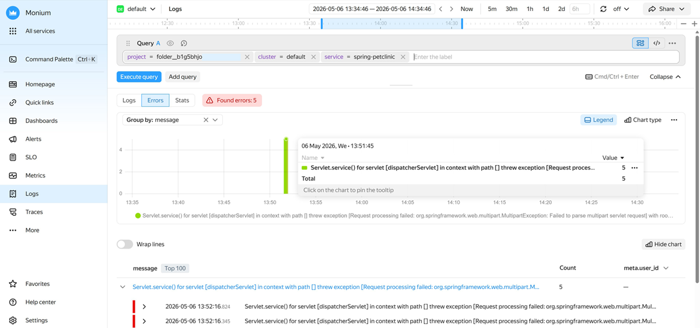
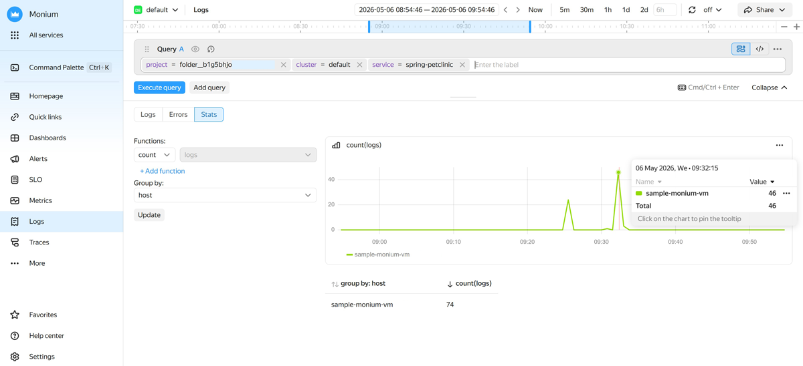

# Working with errors and statistics

The log interface features additional sections **[{{ ui-key.yacloud_monitoring.aside-navigation.menu-item.logs-analytics.title }}](#view-errors)** and **[Statistics](#view-stats)**, which make it easier to navigate logs with errors and to generate and analyze log volume and distribution statistics.

## Viewing errors {#view-errors}

The **{{ ui-key.yacloud_monitoring.aside-navigation.menu-item.logs-analytics.title }}** tab shows a separate graph and log records containing the `level="ERROR"` field.

This section can be useful if you need to quickly highlight errors in the general log stream without creating a separate query manually, or to track an error trend over time. For example, you can quickly detect a spike in the number of errors after a release.





- {{ monium-name }} UI {#console}

  1. On the [{{ monium-name }}]({{ link-monium }}) home page, select **{{ ui-key.yacloud_monitoring.aside-navigation.menu-item.logs.title }}** in the left-hand menu.
  1. Select the **{{ ui-key.yacloud_monitoring.aside-navigation.menu-item.logs-analytics.title }}** tab in the center of the screen.
  1. At the top of the screen, specify the data search interval using one of the following methods:

      * Select an interval: `5m`, `30m`, etc., to search for data for the last 5, 30 minutes, etc.
      * Enter a time interval manually.
      * Use the exact time interval field to set the **From** and **To** boundaries.
      * Drag the interval boundaries on the timeline.
  1. In the query string, select labels for log search.

      In {{ monium-name }}, telemetry has this hierarchy: project → cluster → service. Therefore, in the query line, you should select the `project`, `cluster`, and `service` parameters.

      * To search for application error logs, specify:

          

      * To search for {{ yandex-cloud }} resource error logs, specify:

          

      You can enter your query in token mode by selecting labels from a list or in text mode. To switch to text mode, click  and enter your query in this format:

      ```json
      { <key>="<value>", <key>="<value>", ... }
      ```

      For more information about making queries, see [{#T}](../concepts/data-model.md) and [{#T}](../concepts/querying.md).

      Example of an application log search query:

      ```json
      {project = "market", cluster = "production", service = "basket"}
      ```

  1. Click **{{ ui-key.yacloud_monitoring.querystring.action.execute-query }}**.



As a result, the service will display information about error logs found within the specified time interval:

* Total number of recorded errors.
* [Error data visualization](#error-visualization).
* [Detailed info about error records](#error-records).

### Error record visualization {#error-visualization}

The graph shows the number of error log records over time. The graph automatically updates if you change the query or time range.

Features available when using the graph:

* **Information window**:

    * To open an information window for errors received at a particular point in time, hover your cursor over that part of the graph.
    * To pin the information window, click the relevant part of the graph.
    * To navigate to log records, click  → **Go to logs** next to the line of interest.
* **Legend**: Shows the values of the labels for each data series on the graph.
* **Chart type**: Selects the type of the graph with the number of logs:

    * **Line**: Lines.
    * **Area**: Shaded areas.
    * **Column** (default): Columns.
* **Log grouping**: Select a grouping parameter from the **Group by** list. For example, grouping by `host` will show the distribution of errors across hosts.
* When working with multiple queries, you can create a separate graph for each one. Do it by enabling **One graph per query** or selecting the number of graphs per row.
* To examine a graph in detail or share it, click  in the top-right corner of the graph and select:

    * **Show chart fullscreen**.
    * **Copy screenshot link**.
    * **Copy screenshot to content**.
    * **Hide infa events** or **Show infra events**.

If you need no visualization, click **Hide graph**. To display the graph again, click **Show graph**.

### Detailed info about error records {#error-records}

Under the visualization graph, there is a list containing information about the `top 100` most frequently logged errors for the selected time period:

* If log descriptions do not fit into the screen width, enable **Line breaks**.
* To analyze a particular error log entry, expand it and select one of the following actions next to the correct log line:

    * **=**: Add the line’s key label to the query.
    * **!=**: Exclude the line’s key label from the query.
    * : Hide the log line.
    * : Copy the log line.

    Optionally, click  **Go to logs** to open the current error group in the general log interface.

Below the list of the most frequent error texts, there is the **Labels** section, where you can view the `top 5` labels of each type in error logs for the selected time period.

## Analyzing statistics {#view-stats}

On the **Stats** tab, you can process large volumes of logs and employ aggregate functions to get aggregated results.

This section can be useful if you need to:

* Assess log volume and identify peak loads on the application or infrastructure over time.
* Analyze numeric fields, e.g., response time, to detect the moment of potential service degradation.
* Build metrics by labels without switching to the metrics section.
* Compare log distribution across hosts or resource types.
* Obtain generalized log data for any other tasks.





- {{ monium-name }} UI {#console}

  1. On the [{{ monium-name }}]({{ link-monium }}) home page, select **{{ ui-key.yacloud_monitoring.aside-navigation.menu-item.logs.title }}** in the left-hand menu.
  1. Select the **Stats** tab in the center of the screen.
  1. At the top of the screen, specify the data search interval using one of the following methods:

      * Select an interval: `5m`, `30m`, etc., to search for data for the last 5, 30 minutes, etc.
      * Enter a time interval manually.
      * Use the exact time interval field to set the **From** and **To** boundaries.
      * Drag the interval boundaries on the timeline.
  1. In the query string, select labels for log search.

      In {{ monium-name }}, telemetry has this hierarchy: project → cluster → service. Therefore, in the query line, you should select the `project`, `cluster`, and `service` parameters.

      * To analyze application logs, specify:

          

      * To analyze {{ yandex-cloud }} resource logs, specify:

          

      You can enter your query in token mode by selecting labels from a list or in text mode. To switch to text mode, click  and enter your query in this format:

      ```json
      { <key>="<value>", <key>="<value>", ... }
      ```

      For more information about making queries, see [{#T}](../concepts/data-model.md) and [{#T}](../concepts/querying.md).

      Example of an application log search query:

      ```json
      {project = "market", cluster = "production", service = "basket"}
      ```

  1. Click **{{ ui-key.yacloud_monitoring.querystring.action.execute-query }}**.

      As a result, {{ monium-name }} will graph the number of logs recorded over the specified period. The graph automatically updates if you change the query or time range.
  1. To graph log data aggregated using a different method:

      1. In the **Functions** field, select the aggregate function you want to apply to the logs for the selected period:

          * `count`: Default value. The graph shows the total number of log records for the period.
          * `uniq`: The graph shows the number of unique field values for the period. Select the field for which to count unique values from the list on the right.
          * `uniq`: The graph shows the sum of field values for the period. Select the field for which to calculate the sum from the list on the right.
          * `min`: The graph shows the minimum field value for the period. Select the field for which to calculate the minimum value from the list on the right.
          * `max`: The graph shows the maximum field value for the period. Select the field for which to calculate the maximum value from the list on the right.
          * `avg`: The graph shows the average field value for the period. Select the field for which to calculate the average value from the list on the right.
          * `p50`: The graph shows the 50th percentile for the field value for the period. Select the field for which to calculate the percentile from the list on the right.
          * `p75`: The graph shows the 75th percentile for the field value for the period. Select the field for which to calculate the percentile from the list on the right.
          * `p90`: The graph shows the 90th percentile for the field value for the period. Select the field for which to calculate the percentile from the list on the right.
          * `p95`: The graph shows the 95th percentile for the field value for the period. Select the field for which to calculate the percentile from the list on the right.
          * `p99`: The graph shows the 99th percentile for the field value for the period. Select the field for which to calculate the percentile from the list on the right.
      1. In the **Group by** field, select a parameter by which to group the results. For example, grouping by `host` will show log distribution across hosts.
      1. Click **Update**.

      {{ monium-name }} will now display an updated graph with the new aggregated data.

