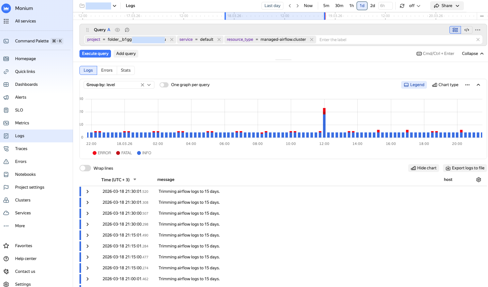
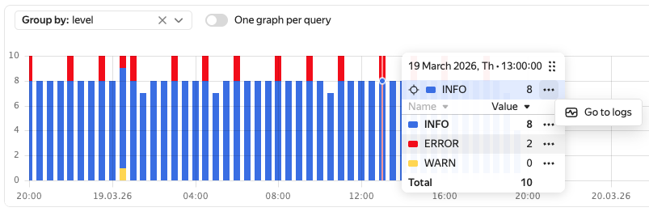

# Log search and analysis

The log UI allows you to:

* Create queries for log search and filtering.
* View charts on logs with different query statuses.
* View the content of log lines.
* Navigate from logs to analysis of associated traces and spans using their IDs (if trace delivery is configured).

To view logs, configure their delivery:

* Set up data transfer in OpenTelemetry format for your application or service, e.g., with the help of [OTel Collector](../collector/opentelemetry.md) or [Fluent Bit](../collector/fluentbit.md).
* Turn on logging for {{ yandex-cloud }} resources. As a general rule, you can set up logging when creating or updating a resource. For more information, see the relevant documentation.

  For the list of services that support automated logging, see [{#T}](../../overview/concepts/monitoring-logging-tools.md).

## Log search {#logs-search}



- {{ monium-name }} UI {#console}

  1. On the [{{ monium-name }}]({{ link-monium }}) home page, select **{{ ui-key.yacloud_monitoring.aside-navigation.menu-item.logs.title }}** on the left.
  1. At the top, specify the data search interval using one of the following methods:
     * Select an interval: `5m`, `30m`, etc., to search for data for the last 5, 30 minutes, etc.
     * Enter a time interval manually.
     * Use the exact time interval field to set the **From** and **To** boundaries.
     * Drag the interval boundaries on the timeline.
  
  1. In the query string, select labels for log search.

     In {{ monium-name }}, telemetry has this hierarchy: project → cluster → service. Therefore, select the `project`, `cluster`, and `service` parameters in the query string first.

      * To search for application logs, specify:

        

      * To search for {{ yandex-cloud }} resource logs, specify:

        
      
     You can enter your query in token mode by selecting labels from a list or in text mode. To switch to text mode, click  and enter your query in this format:
       
     ```
     { <key>="<value>", <key>="<value>", ... }
     ```
      
     For more information about making queries, see [{#T}](../concepts/data-model.md) and [{#T}](../concepts/querying.md).

     Example of an application log search query:

     ```
     {project = "market", cluster = "production", service = "basket"}
     ```
     
     Example of an L7 {{ alb-name }} error log search query:

     ```
     {project = "folder__{{ folder-id-example }}", service = "default", resource_type = "alb.loadBalancer", level = "ERROR"}
     ```

  1. Click **{{ ui-key.yacloud_monitoring.querystring.action.execute-query }}**.




       





       




## Analyzing {#logs-analysis} logs

For log analysis, you can use log filtering in the query line, log records, and log visualization.

### Filtering and grouping {#filtering}

* To locate a specific portion of the logs, select the labels of interest from the list. For example, the label `level = WARN` will display all WARNING level logs.

  For more on how to make queries, see [{#T}](../concepts/data-model.md) and [{#T}](../concepts/querying.md).

* To view the logs of different applications or resources at the same time, click **Add query** and specify another query's parameters.

### Visualization {#visualization}

The graph shows the number of log records over time. The graph automatically updates if you change the query or time range.

Features available when using the graph:

* **Information window**:
  * To open a window with info on logs received at a specific point in time, hover your cursor over that part of the graph.
  * To pin the information window, click the relevant part of the graph.
  * To navigate to log records, click  → **Go to logs** next to the line of interest.

  

* **Legend**: Shows the values of the labels for each data series on the graph.

* **Graph type**: Selects the type of the graph with the number of logs:
  * **Line**: Lines.
  * **Area**: Shaded areas.
  * **Column** (default): Columns.

* **Log grouping**: Select a grouping parameter from the **Group by** list. For example, grouping by `level` will show log distribution by level of importance.

* **Errors**: A separate graph and log records with the `level="ERROR"` field.

* **Statistics**: Aggregated metrics for log volume and distribution assessment:
  * `count(logs)`: Number of records over time to identify peak loads.
  * `min`, `max`, and `avg`: Analysis of numeric fields, e.g., response time, to track service degradation.
  * Grouping by labels (resource_id, resource_type, level, host) to build metrics.
  
  The data updates automatically if you change the query or time range.

* When working with multiple queries, you can create a separate graph for each one. Do it by enabling **One graph per query** or selecting the number of graphs per row.

* To examine a graph in detail or share it, click  to the right of the graph and select:
  * **Show graph full screen**
  * **Copy screenshot link**
  * **Copy screenshot to clipboard**

* **Export logs to file**: Saves logs in `CSV`, `JSON`, or `TXT` format. You can save no more than 1,000 log lines. If there are more, shorten the time range.

If you need no visualization, click **Hide graph**. To display the graph again, click **Show graph**.

### Working with log records {#log-records}

* To analyze a particular log entry, expand it and select one of the following actions next to the log line of interest:
  * **=**: Add the line’s key label to the query.
  * **!=**: Exclude the line’s key label from the query.
  * : Hide the log line.
  * **Copy**: Copy the log line.

  If you work with [traces](../traces/index.md), you can use the `trace.id` and `span.id` fields to navigate to relevant trace data.

* If log descriptions do not fit into one screen, enable **Line breaks**.

* To configure the log lines table, click  at the top-right corner of the table and select the columns and context.

## Service dashboard for logs {#logs-service-dashboard}


