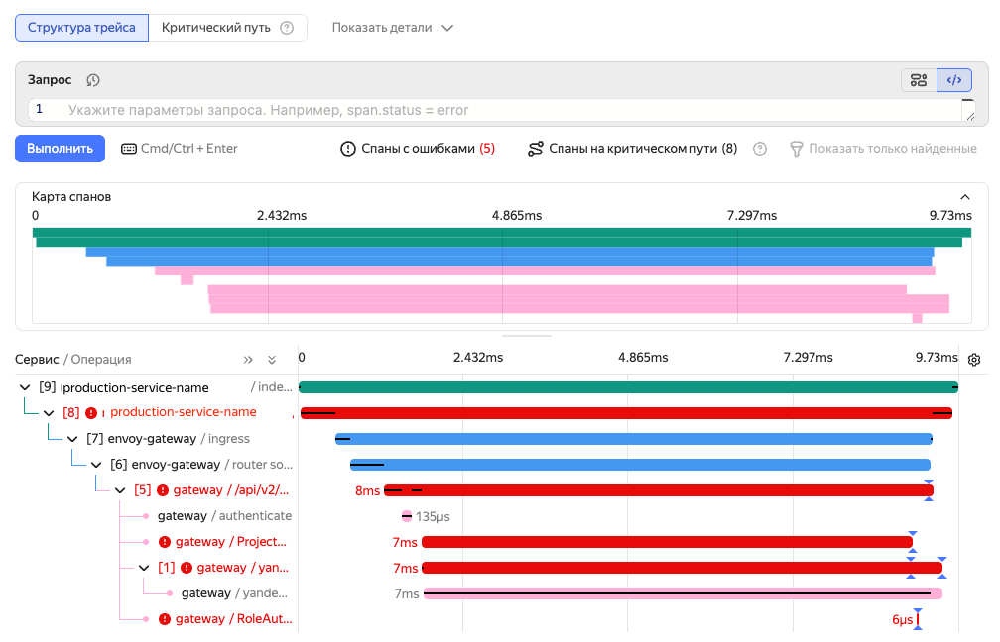

# {{ traces-name }}

{{ traces-name }} is a distributed tracing system in {{ monium-name }}. It enables you to track requests as they move through services and components of your infrastructure: find the causes of errors, identify bottlenecks, and analyze performance.

{{ traces-name }} receives data over the [OpenTelemetry](https://opentelemetry.io/) protocol (OTLP). To send traces, you can use any compatible tool: OpenTelemetry Collector, SDK, or other agents.

## Problems addressed by tracing {#use-cases}

In **microservice architectures**, tracing helps you to:

* **Localize errors**: Determine which of the many services caused the failure.
* **Analyze performance**: Identify the service or component that is slowing down the request.
* **Track the request path**: Observe which services and databases the request flowed through.
* **Investigate rare events**: Understand the causes behind anomalous system behavior.

In **monolithic architectures**, tracing enables you to:

* **Analyze the internal request structure**: Track execution through layers of logic (controllers, business logic, repositories) and find bottlenecks.
* **Diagnose recurring failures**: Find the root cause of unstable behavior that is difficult to reproduce.

## Connection setup {#connection-setup}

To send traces to {{ traces-name }}, use any tool compatible with the OpenTelemetry protocol (OTLP), e.g., OpenTelemetry Collector or OpenTelemetry SDK.

If you are a {{ yandex-cloud }} user already familiar with OpenTelemetry, simply use the parameters below for the connection.

If you are just getting started with tracing, use [this data delivery setup guide](../collector/index.md). It explains how to install the agent and configure sending telemetry to {{ monium-name }}, with examples.

### Connection settings {#connection}

* 

* Endpoint: `{{ api-host-monium }}:443`.

* Authorization: [Service account](../../iam/operations/sa/create.md) with the `monium.traces.writer` role and [API key](../../iam/operations/iam-token/create-for-sa.md) with the `yc.monium.traces.write` scope.

* Project title: `x-monium-project=folder__<folder_ID>`.

* Resource attributes: `service.name` (application name) and `cluster` (environment, the default value is `default`).

## Viewing traces {#view-traces}

1. On the [{{ monium-name }} home page]({{ link-monium }}), select **{{ ui-key.yacloud_monitoring.aside-navigation.menu-item.traces.title }}** on the left.
1. At the top, set the search interval using the timeline, a preset interval, or by entering the time value directly.
1. Select **{{ ui-key.yacloud_monitoring.traces.traces-search.mode.traces }}** or **{{ ui-key.yacloud_monitoring.traces.traces-search.mode.spans }}**.
1. Enter a date search [query](../concepts/querying.md).

   By default, the search will take place in the current project: `folder__<folder_ID>`, you can choose another one.

1. Click **Execute**.

1. To open a separate trace, specify its ID in the **{{ ui-key.yacloud_monitoring.traces.trace-id-input.placeholder }}** field at the top right.

For more on trace viewing and searching, see [{#T}](operations/traces-explorer.md).
