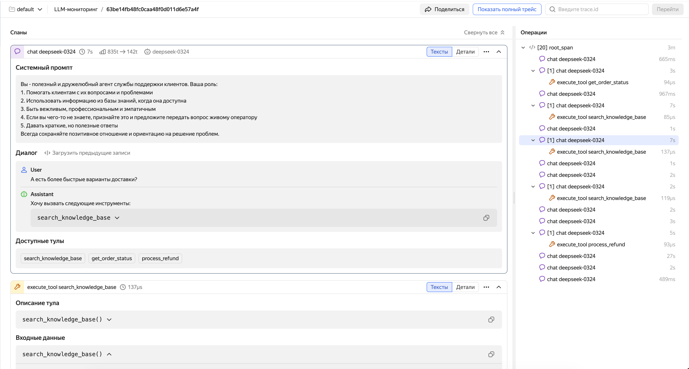

# Manual instrumentation of LLM applications

Manual instrumentation of LLM applications gives you complete control over trace data. You decide which operations to create spans for, which attributes to add, and how to organize the call hierarchy. This is especially useful when:

- Your framework is not supported by [auto-instrumentation](auto_instrumentation.md).
- You need to add business context: user ID, session ID, prompt version, A/B test parameters.
- You need to mark up complex agent logic: cross-LLM routing, data preprocessing, response post-processing.
- You need to manually instrument custom tools that lack auto-instrumentation support.

Manual instrumentation uses the [OpenTelemetry SDK](https://opentelemetry.io/docs/languages/) and [OpenTelemetry semantic conventions for GenAI](https://opentelemetry.io/docs/specs/semconv/gen-ai/). The examples are in Python.

## Main conventions {#conventions}

Follow these conventions to make sure traces are displayed correctly:

1. **OpenTelemetry standard.** Use attributes from the [OpenTelemetry standard for GenAI](https://opentelemetry.io/docs/specs/semconv/gen-ai/).
1. **Service isolation.** Each LLM agent must send spans with a unique `service.name` attribute value. This is important for correct data filtering in the monitoring system.
1. **Required attributes.** Some attributes are required to correctly visualize traces in the interface; see the [table below](#required-attributes).

## Required attributes of generation spans {#required-attributes}

To ensure traces are correctly displayed in the {{ traces-name }} LLM monitoring interface, specify the attributes listed below. This table shows the data required to display each interface element.

#|
|| **Data** | **Attribute** | **Type** | **Comment** ||
|| Number of input data tokens | `gen_ai.usage.input_tokens` | int | ||
|| Number of tokens per response | `gen_ai.usage.output_tokens` | int | ||
|| Input messages (prompts, dialog history, tool calling results) | `gen_ai.input.messages` | JSON array | Format: see [Message format](#messages-format) ||
|| System prompt | `gen_ai.system_instructions` or an element with `role == system` in `gen_ai.input.messages` | JSON / string | System message separate from chat history. When using `gen_ai.input.messages`, provide it in an element with `role == system` and the `parts` field ||
|| Model response | `gen_ai.output.messages` | JSON array | Format: see [Message format](#messages-format) ||
|| Operation type | `gen_ai.operation.name` | string | Determines span display. The valid values are `chat`, `text_completion`, `create_agent`, `invoke_agent`, `execute_tool`, `embeddings`, and `generate_content`. ||
|| Responding model name | `gen_ai.response.model` | string | ||
|| List of available tools | `gen_ai.tool.definitions` | JSON array | LLM tool signatures. The interface displays the **Available tools** section. ||
|#

In addition to the specified attributes, the OpenTelemetry standard also describes other useful attributes for GenAI spans, such as `gen_ai.system`, `gen_ai.request.model`, `gen_ai.tool.definitions`, etc. For a full list and description, see the [OpenTelemetry convention for GenAI](https://opentelemetry.io/docs/specs/semconv/gen-ai/gen-ai-spans/).

### Message format {#messages-format}

The `gen_ai.input.messages` and `gen_ai.output.messages` attributes contain JSON serialized into a string. Avoid the simplified `{role, content}` format; instead, use the `parts` field indicating `type`.

You can provide the **system prompt** in two ways: as an element with `role == system` inside `gen_ai.input.messages` (see examples below) or as a separate `gen_ai.system_instructions` attribute (a JSON array with `{ "type": "text", "content": "..." }` objects).

**Input messages** (`gen_ai.input.messages`):

```
[{
    "role": "user",
    "parts": [
      {
        "type": "text",
        "content": "Weather in Paris?"
      }
    ]
  },
  {
    "role": "assistant",
    "parts": [
      {
        "type": "tool_call",
        "id": "call_VSPygqKTWdrhaFErNvMV18Yl",
        "name": "get_weather",
        "arguments": {
          "location": "Paris"
        }
      }
    ]
  },
  {
    "role": "tool",
    "parts": [
      {
        "type": "tool_call_response",
        "id": " call_VSPygqKTWdrhaFErNvMV18Yl",
        "result": "rainy, 57°F"
      }
    ]
  }
]
```
For a detailed input message JSON schema, see [this OpenTelemetry guide](https://opentelemetry.io/docs/specs/semconv/gen-ai/gen-ai-input-messages.json).

**Output messages** (`gen_ai.output.messages`):

```json
[
  {
    "role": "assistant",
    "parts": [
      {
        "type": "text",
        "content": "The weather in Paris is currently rainy with a temperature of 57°F."
      }
    ],
    "finish_reason": "stop"
  }
]
OR
[
  {
    "role": "assistant",
    "parts": [
      {
        "type": "tool_call",
        "id": "call_VSPygqKTWdrhaFErNvMV18Yl",
        "name": "get_weather",
        "arguments": {
          "location": "Paris"
        }
      }
    ],
    "finish_reason": "tool_call"
  }
]
```
For a detailed output message JSON schema, see [this OpenTelemetry guide](https://opentelemetry.io/docs/specs/semconv/gen-ai/gen-ai-output-messages.json).

If the model is calling a tool, the output message must contain `parts` with the `tool_call` type:

```json
[
  {
    "role": "assistant",
    "parts": [
      {
        "type": "tool_call",
        "id": "call_abc123",
        "name": "get_weather",
        "arguments": {
          "location": "Paris"
        }
      }
    ],
    "finish_reason": "tool_call"
  }
]
```

The result returned by the tool is provided in the following request to the model in `gen_ai.input.messages` with `role == tool`:

```json
[
  {
    "role": "tool",
    "parts": [
      {
        "type": "tool_call_response",
        "id": "call_abc123",
        "response": "rainy, 18°C"
      }
    ]
  }
]
```


       

       



## Tool call spans {#tool-spans}

For each tool call, create a child span with `gen_ai.operation.name="execute_tool"`. This allows the interface to display the end-to-end chain: request → model decides to call tool → tool executes → model receives result → final response.

Recommended attributes for a tool call span:

#|
|| **Attribute** | **Description** | **Example** ||
|| `gen_ai.operation.name` | Type of operation. For tool spans, set to `execute_tool`. | `execute_tool` ||
|| `gen_ai.tool.name` | Name of the tool to call | `get_weather` ||
|| `gen_ai.tool.description` | Tool description | `Get current weather for a city` ||
|| `gen_ai.tool.definitions` | JSON array with tool description in JSON schema format (serialized into a string) | See the code below for an example. ||
|| `gen_ai.tool.call.arguments` | Call arguments (serialized into a string via `json.dumps()`) | `{"location": "Paris"}` ||
|| `gen_ai.tool.call.result` | Execution result (serialized into a string via `json.dumps()`) | `{"temperature": 18, "condition": "cloudy"}` ||
|#

For more examples of proper instrumentation across various scenarios (tool calls, streaming, multimodality), see the [Examples: LLM Calls](https://opentelemetry.io/docs/specs/semconv/gen-ai/non-normative/examples-llm-calls/) section in the OpenTelemetry docs.


       

       



## Code example {#example}

Below is the simplest manual instrumentation example for an agent based on the [OpenAI API](https://platform.openai.com/docs/api-reference) with a single tool (weather). The model and tool call loop is implemented explicitly so the code includes all [generation span](#required-attributes) and [tool span](#tool-spans) attrubutes from the above tables.

### Install the dependencies

```bash
pip install opentelemetry-sdk opentelemetry-exporter-otlp-proto-grpc openai
```

### Configure the environment variables

Set the variables for connecting to {{ traces-name }} and the OpenAI key. Run the commands one by one, substituting your values:

```bash
export OTEL_EXPORTER_OTLP_ENDPOINT="{{ api-host-monium }}:443"
```

```bash
export OTEL_EXPORTER_OTLP_HEADERS="Authorization=Api-Key <your_API_key>,x-monium-project=<project_name>,x-monium-service=my-ai-agent"
```

```bash
export OTEL_SERVICE_NAME="my-ai-agent"
```

```bash
export OPENAI_API_KEY="<your_OpenAI_key>"
```

Where:
- `<your_API_key>`: API key of the service account with the `monium.traces.writer` role.
- `<project_name>`: Project name in `folder__<folder_ID>` format, e.g., `folder__b1g2e3abc4def5ghij6k`.

For more information on special {{ monium-name }} headers, see [{#T}](../../collector/otlp-protocol.md#headers).


### Agent code

Save the code to the `agent.py` file. This step-by-step example demonstrates which attributes to set for a generation span (conversation) and tool call span.

```python
import json
from openai import OpenAI
from opentelemetry import trace
from opentelemetry.trace import Status, StatusCode
from opentelemetry.sdk.trace import TracerProvider
from opentelemetry.sdk.trace.export import BatchSpanProcessor
from opentelemetry.exporter.otlp.proto.grpc.trace_exporter import OTLPSpanExporter

provider = TracerProvider()
provider.add_span_processor(BatchSpanProcessor(OTLPSpanExporter()))
trace.set_tracer_provider(provider)
tracer = trace.get_tracer("my_ai_agent")

TOOL_DEF = {
    "type": "function",
    "name": "get_weather",
    "description": "Get current weather for a city",
    "parameters": {"type": "object", "properties": {"city": {"type": "string"}}, "required": ["city"]},
}


def get_weather(city: str) -> dict:
    return {"temperature": 18, "condition": "cloudy", "city": city}


def to_otel_messages(messages: list) -> list:
    """Format: gen_ai.input.messages / output: parts with type text | tool_call | tool_call_response."""
    out = []
    for m in messages:
        role, content = m["role"], m.get("content") or ""
        if role in ("system", "user"):
            out.append({"role": role, "parts": [{"type": "text", "content": content}]})
        elif role == "assistant":
            parts = [{"type": "text", "content": content}] if content else []
            for tc in m.get("tool_calls", []):
                fn = tc["function"]
                args = json.loads(fn["arguments"]) if isinstance(fn["arguments"], str) else fn["arguments"]
                parts.append({"type": "tool_call", "id": tc["id"], "name": fn["name"], "arguments": args})
            out.append({"role": "assistant", "parts": parts})
        elif role == "tool":
            out.append({"role": "tool", "parts": [{"type": "tool_call_response", "id": m["tool_call_id"], "response": m["content"]}]})
    return out


def run_agent(user_query: str, messages: list | None = None) -> str:
    client = OpenAI()
    model = "gpt-4o-mini"
    tools_spec = [{"type": "function", "function": {"name": "get_weather", "description": TOOL_DEF["description"], "parameters": TOOL_DEF["parameters"]}}]
    if messages is None:
        messages = [
            {"role": "system", "content": "You are a helpful assistant. Use get_weather for weather questions."},
            {"role": "user", "content": user_query},
        ]
    else:
        messages.append({"role": "user", "content": user_query})

    while True:
        with tracer.start_as_current_span("gen_ai.chat") as span:
            span.set_attribute("gen_ai.operation.name", "chat")
            span.set_attribute("gen_ai.system", "openai")
            span.set_attribute("gen_ai.request.model", model)
            span.set_attribute("gen_ai.input.messages", json.dumps(to_otel_messages(messages)))
            span.set_attribute("gen_ai.tool.definitions", json.dumps([TOOL_DEF]))
            try:
                resp = client.chat.completions.create(model=model, messages=messages, tools=tools_spec)
            except Exception as e:
                span.record_exception(e)
                span.set_status(Status(StatusCode.ERROR, str(e)))
                return ""

            msg = resp.choices[0].message
            usage = resp.usage
            span.set_attribute("gen_ai.response.model", resp.model)
            span.set_attribute("gen_ai.usage.input_tokens", usage.prompt_tokens)
            span.set_attribute("gen_ai.usage.output_tokens", usage.completion_tokens)
            out_msg = [{"role": "assistant", "parts": [], "finish_reason": "stop"}]
            if msg.content:
                out_msg[0]["parts"].append({"type": "text", "content": msg.content})
            for tc in msg.tool_calls or []:
                args = json.loads(tc.function.arguments) if isinstance(tc.function.arguments, str) else tc.function.arguments
                out_msg[0]["parts"].append({"type": "tool_call", "id": tc.id, "name": tc.function.name, "arguments": args})
            if out_msg[0]["parts"] and out_msg[0]["parts"][-1].get("type") == "tool_call":
                out_msg[0]["finish_reason"] = "tool_call"
            span.set_attribute("gen_ai.output.messages", json.dumps(out_msg))

            if not msg.tool_calls:
                messages.append({"role": "assistant", "content": msg.content or ""})
                return (msg.content or "").strip()

            # The next API request is the model response and tool results
            messages.append({
                "role": "assistant",
                "content": msg.content or "",
                "tool_calls": [{"id": t.id, "type": "function", "function": {"name": t.function.name, "arguments": t.function.arguments}} for t in msg.tool_calls],
            })
            for tc in msg.tool_calls:
                args = json.loads(tc.function.arguments) if isinstance(tc.function.arguments, str) else tc.function.arguments
                with tracer.start_as_current_span("gen_ai.execute_tool") as tool_span:
                    tool_span.set_attribute("gen_ai.operation.name", "execute_tool")
                    tool_span.set_attribute("gen_ai.tool.name", tc.function.name)
                    tool_span.set_attribute("gen_ai.tool.description", TOOL_DEF["description"])
                    tool_span.set_attribute("gen_ai.tool.definitions", json.dumps([TOOL_DEF]))
                    tool_span.set_attribute("gen_ai.tool.call.arguments", json.dumps(args))
                    try:
                        result = get_weather(args.get("city", ""))
                        tool_span.set_attribute("gen_ai.tool.call.result", json.dumps(result))
                    except Exception as e:
                        tool_span.record_exception(e)
                        tool_span.set_status(Status(StatusCode.ERROR, str(e)))
                        raise
                messages.append({"role": "tool", "tool_call_id": tc.id, "content": json.dumps(result)})


if __name__ == "__main__":
    history = [
        {"role": "system", "content": "You are a helpful assistant. Use get_weather for weather questions."},
    ]
    with tracer.start_as_current_span("agent.demo"):
        print("Response:", run_agent("Hello! Who are you?", history))
        print("Weather:", run_agent("What is the weather like in Paris?", history))
```

### Run the agent

```bash
python agent.py
```

After the agent finishes running, the {{ traces-name }} interface will display a trace with the `agent.demo` root span: it includes the generation spans (conversation) and, when requesting weather, the child spans of the tool call. The `gen_ai.input.messages` attribute of the last generation span will contain the full conversation history (system prompt, both user requests, and model responses). For more information on how to use the interface, see [{#T}](./traces.md).

## Compatibility with auto-instrumentation {#compatibility}

Manual and auto-instrumented spans integrate seamlessly within a single trace. This enables you to implement a hybrid approach: use auto-instrumentation for baseline coverage and add manual spans to provide more context as needed.

For example, if your agent uses the OpenAI SDK with auto-instrumentation, you can manually create a root span for the entire agent operation, and LLM calls will be automatically captured as child spans. This ensures end-to-end visibility of the agent’s wirkflow, from the user request to the final response.