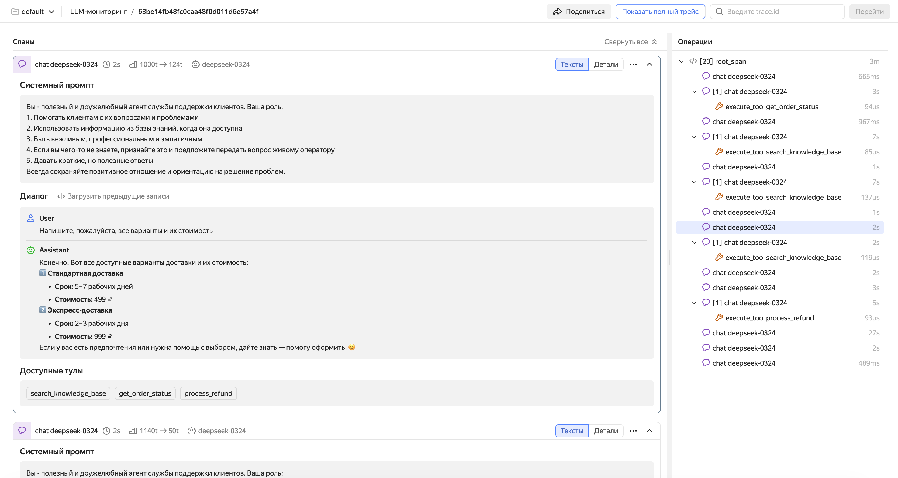

# Getting started with LLM traces

## What is LLM monitoring

When an AI agent acts unexpectedly, e.g., returns a weird response, calls a wrong tool, or does not call anything at all, it is difficult to figure out the issue through standard logs and traces. The key information gets lost among the attributes. Thousands of characters worth of prompts, several model calls, chains of tools – everything is mixed up.

{{ traces-name }} LLM monitoring is a special trace viewing mode adapted for AI agent diagnostics. The interface is optimized for large texts, including prompts, system instructions, and model responses: this is the kind of data you usually need to understand why your agent has decided a certain way.

LLM monitoring runs on top of standard OpenTelemetry traces, so no dedicated infrastructure is required. If you have not configured the sending of traces in {{ traces-name }} yet, start from [{#T}](../index.md#connection-setup).

## How it works

LLM monitoring is based on [OpenTelemetry Semantic Conventions for GenAI](https://opentelemetry.io/docs/specs/semconv/gen-ai/). According to this standard, all the model conversation data, including prompts, responses, system instructions, and tool descriptions, is delivered in special span attributes. Thanks to these attributes, {{ traces-name }} highlights LLM-specific data and structures it for easy analysis.

There are two types of spans essential for LLM monitoring:

**Generation span.** Wraps a call to the model. This span's attributes store the following: conversation history with prompts (`gen_ai.input.messages`), model response (`gen_ai.output.messages`), model name (`gen_ai.request.model`), number of input and output tokens. The interface uses exactly these attributes to build a readable conversation feed.

**Tool call span.** Child generation span which wraps a call to an external tool selected by the agent. Contains the tool description, call parameters, and the execution result.



If you are new to tracing, refer to [{#T}](../concepts.md) for descriptions of its basic entities: traces, spans, and attributes.



For a description of the LLM trace viewing interface, see [{#T}](./traces.md).

## How to activate LLM monitoring

Activate using the standard trace sending mechanism in {{ traces-name }}. Follow the instructions in [{#T}](../index.md#connection-setup). As an additional requirement, send traces with GenAI attributes: without them, the interface will not be able to correctly recognize LLM spans and present conversations in a user-friendly format.

There are two ways to add GenAI attributes to traces:

**Automatically**, if using the OpenAI SDK, OpenAI Agents SDK, LangChain, or another supported framework. Hook up the OpenTelemetry auto-instrumentation library for your framework. It will automatically create spans and add GenAI attributes with almost no changes to the code. This is the quickest way to get started, especially if you have already configured the sending of traces.

To learn more about auto-instrumentation of LLM applications, see [{#T}](./auto_instrumentation.md).

**Manually**, if you need full control over the trace data, or your framework is not supported by auto-instrumentation. Add GenAI attributes to spans manually as per the OpenTelemetry Semantic Conventions standard. This requires minor changes to the code but provides maximum flexibility.

To learn more about manual instrumentation of LLM applications, see [{#T}](./manual_instrumentation.md).
