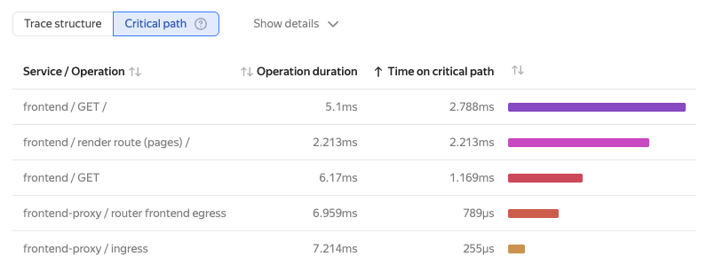

# Critical path analysis

In a distributed system, a request goes through a chain of operations (spans) across different services. Tracing renders this path as a graph, where each operation adds to the total execution time.

The critical path is the span sequence that drives the total request execution time. Streamlining operations on the critical path can reduce the overall system response time.

For the critical path to be calculated correctly, the trace structure must meet the following conditions:
* The parent span initiates its child spans.
* The parent span waits for all child spans to finish.

If these conditions are violated, such as in asynchronous calls, the critical path may be calculated incorrectly.

On the Gantt chart, segments of the critical path are highlighted in black. When hovering over a span, you can see its duration and the total time it spent on the critical path.

## Calculation algorithm {#critical-path-algorithm}

The algorithm finds the critical path by traversing the span tree from the root. At each level, the algorithm picks the last finishing child (LFC), since it is the one that completes its work last. This span is considered part of the critical path. The algorithm then recursively applies itself to the found LFC and looks for the next child span that finished earlier than the previous LFC started, but is the latest among the remaining ones.

## Limitations {#critical-path-limitations}

The critical path is only calculated for traces with a single root span. If the trace has no root span or multiple root spans, no calculation is performed.

## Viewing the critical path {#critical-path-view}

1. Navigate to [{{ monium-name }}]({{ link-monium }}) → **{{ ui-key.yacloud_monitoring.aside-navigation.menu-item.traces.title }}**.
1. Enter your query and select a trace.
1. At the top, click **{{ ui-key.yacloud_monitoring.traces.trace-tabs.crit-path }}**.

