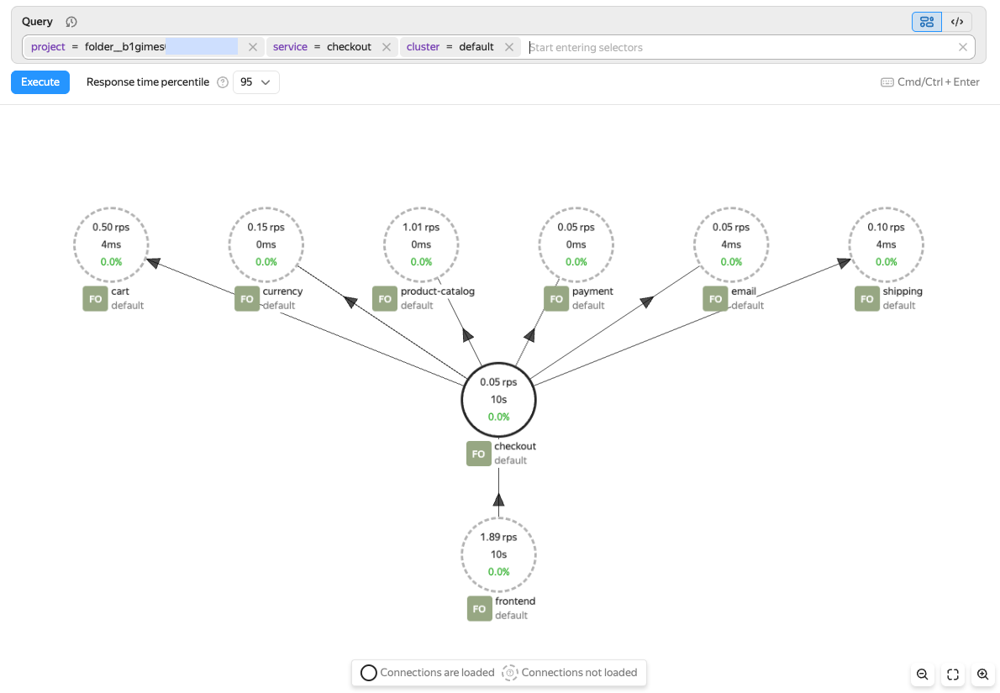

# Service map in traces

The service map helps you understand how services interact within a distributed system. It shows which services handle requests, how calls move between them, and how application components work together.

The service map enables you to:

* Understand the request path between services.
* Locate adjacent services that affect the selected component.
* Decide whether to continue the analysis in logs, traces, or connected services.
* Evaluate service load, latency, and percentage of errors.

Here are the possible use cases of a service map:

* Finding the error source to identify which service causes the failure.
* Analyzing latency to identify the service that slows down the call chain.
* Studying the architecture to quickly understand relationships between services.

## Service map description {#overview}

The map shows each service as a node and each service call as a connection between nodes. A service node displays the number of requests per second, response time for the selected percentile, and the percentage of requests with errors. A solid outline means the service has been loaded on the map. A dashed outline means the service was found through connections, but its surrounding context has not yet been loaded.

## Working with a service map {#work-with-service-map}



- {{ monium-name }} UI {#console}

  1. On the [{{ monium-name }}]({{ link-monium }}) home page, select **{{ ui-key.yacloud_monitoring.aside-navigation.menu-item.services-map.title }}** on the left.
  1. At the top, set the data search period on the timeline.
  1. Enter the following query in the search bar:
          
     
     
  1. Click **{{ ui-key.yacloud_monitoring.querystring.action.execute-query }}**.

     This will open a service map with the found service and its immediate connections.

  1. To explore a service, click its node. This will open a card with metrics and actions:

     * **Navigate to logs**: Open [service logs](../../logs/logs-explorer.md).
     * **Navigate to traces**: Open service traces.
     * **Explore**: Set this service as the focus of the analysis.
     * **Load connections**: Load neighboring services for the selected node.

  1. To focus the map on the selected service, click **Explore**.

     This way, you can move step by step from an external service to an internal one and locate where latency or errors start to rise.

  1. To display additional service connections, both incoming and outgoing, click **Load connections**.



## Using a service map for analysis {#use-cases}

1. Find the service you need using a query.

   Start your analysis from the first service that triggered an alert or showed increased latency or percentage of errors.

1. Check its metrics on the map.
1. Load its connections or select **Explore**.
1. Navigate to logs or traces for detailed analysis.

When working with the map, factor in the following:

* The map is built from tracing data. If your service does not send traces, it will not appear on the map.
* The map content depends on the selected time range and query.
* If you see a dashed node on the map, load its connections to expand the graph.
* For a detailed analysis of a specific request, navigate from the map to [searching for traces and spans](traces-explorer.md) or [viewing and analyzing traces](trace-view.md).

#### See also {#see-also}

* [Searching for traces and spans](traces-explorer.md)
* [Viewing and analyzing traces](trace-view.md)
* [Critical path analysis](critical-path.md)
* [Trace-to-log correlation](traces-logs.md)
