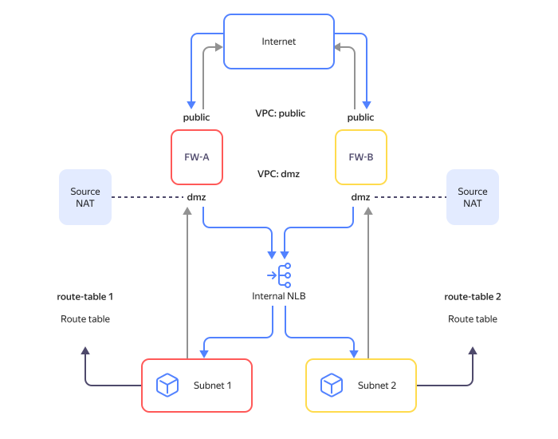
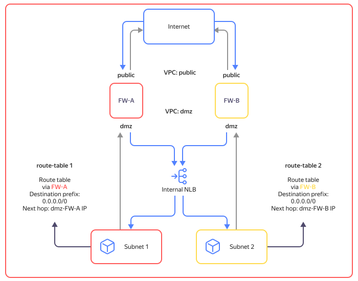

# Internal load balancer features

An internal network load balancer uses routes of all subnets in the selected {{ vpc-name }} network. These include dynamic routes from [{{ interconnect-name }}](../../interconnect/) and [static routes](../../vpc/concepts/static-routes.md) from route tables.

If routes have the same destination prefixes but different [next hop](https://en.wikipedia.org/wiki/Hop_(networking)#Next_hop) IPs, load balancing for traffic from targets will be based on next hop IPs. Be sure to consider this when traffic to the load balancer passes through network VMs (such as firewalls) that track its incoming and outgoing streams.

If traffic to the load balancer did not pass through a network VM, it may discard response traffic received from target resources. To avoid this, set up routing depending on your individual use case:

* [Route tables contain static routes with identical prefixes](#same-prefixes).
* [Source NAT configured on network VMs](#source-nat).
* [Route tables contain static routes with identical prefixes and different next hop IPs of network VMs](#divergent-next-hop).

### Route tables contain static routes with identical prefixes {#same-prefixes}

Routes must have the next hop IP of one of the network VMs. Network VMs run in `Active/Standby` mode. To ensure fault tolerance of outgoing traffic, set up traffic forwarding, e.g., using [route-switcher](https://github.com/yandex-cloud/yc-architect-solution-library/tree/main/yc-route-switcher-v2).

### Source NAT configured on network VMs {#source-nat}

Make sure you set up [Source NAT](https://en.wikipedia.org/wiki/Network_address_translation#SNAT) to network VM addresses. Network VMs run in `Active/Active` mode. To set up Source NAT, refer to the documentation for software deployed on your network VM.

### Route tables contain static routes with identical prefixes and different next hop IPs of network VMs {#divergent-next-hop}



This use case is not supported. Use one of the options described above.



