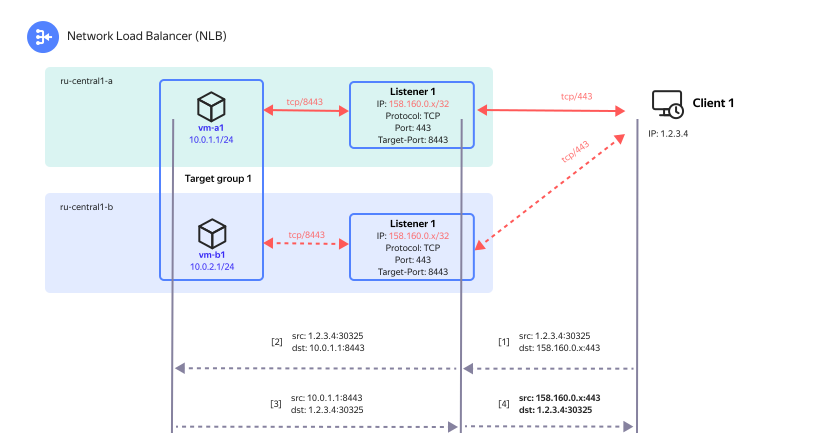
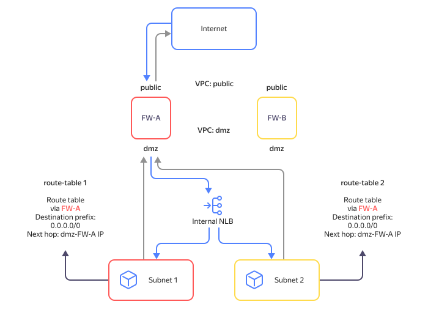
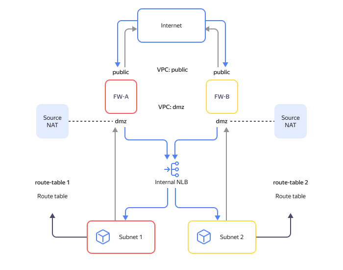
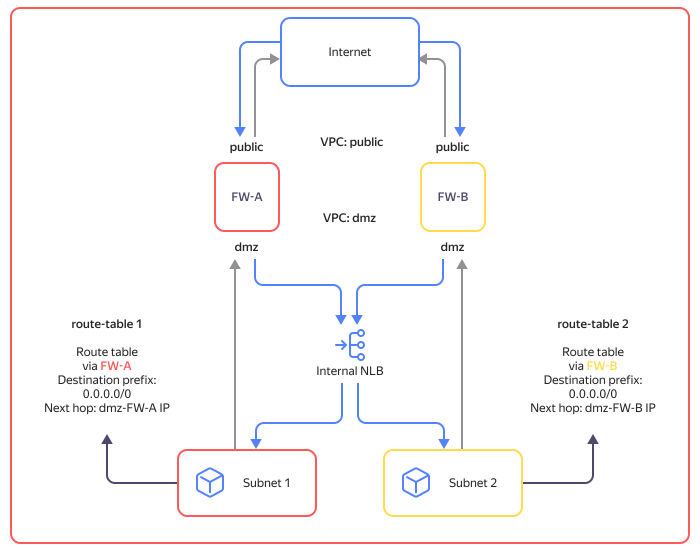

# Implementation specifics

## Listener in all availability zones {#nlb-vip}

The [traffic listener](listener.md) IP address will be externally announced as a `/32` prefix from all {{ yandex-cloud }} [availability zones](../../overview/concepts/geo-scope.md). If one of the availability zones goes down, the network equipment redirects incoming traffic to the listener's IP address in the running availability zones.

## Traffic flows {#nlb-flows}

The operation algorithm of the `external` load balancer:

1. The listener receives the traffic from the {{ yandex-cloud }} border router for the IP address and port it is configured for.
1. The listener calculates the `5-tuple` hash function from the parameters of the received IP packet. Data delivered to the hash function:
   * Transmission protocol (TCP or UDP).
   * Sender public IP address
   * Sender's port (TCP or UDP).
   * Load balancer listener public IP address
   * Load balancer's traffic listener's port (TCP or UDP).
1. The listener routes traffic to one of the operational resources in the target group based on the result of the hash function calculation.
1. The resource in the target group processes the received traffic and sends the result back to the network load balancer.

Below is a diagram showing an example of an external client application using a web service in {{ yandex-cloud }}.

Traffic path from a client application to the web service:

1. Traffic from the `1.2.3.4:30325` client application (any socket/port number can be used) is sent as a sequence of IP packets to the load balancer, and the `158.160.0.x:443` traffic listener receives it.
1. The listener calculates the hash function with `5-tuple` addressing from the parameters of the received IP packet and directs the traffic to the `vm-a1` VM in the target group. At the same time, the virtual network retains the information that traffic bound for the `158.160.0.x:443` listener was sent to the `10.0.1.1:8443` resource.
1. The `vm-a1` VM processes the received request and sends the response back to the client application using its IP `10.0.1.1`.
1. The virtual network is aware that the traffic from the client application was previously received by the load balancer's listener and sent for processing to the `vm-a1` VM (see 2). This information enables a virtual network to change the sender's address and port (perform [Source NAT](https://en.wikipedia.org/wiki/Network_address_translation)) for all outgoing packets from `10.0.1.1:8443` to `158.160.0.x:443`. The traffic is then sent to the destination address according to routing policies and reaches the client application.
1. Traffic goes to the destination address according to routing policies and reaches the client application.



The dashed line in the diagram above shows the backup path to the `vm-b1` VM, which the listener would have chosen if the availability check for the `vm-a1` VM had failed.



## Processing UDP traffic {#nlb-udp}

Processing of UDP traffic for the network load balancer is disabled by default because it is impossible to ensure consistent distribution of UDP packets with the same `5-tuple` hash function to the same resource in the target group. However, the network load balancer can be used, for example, for processing DNS traffic that does not require maintaining the connection state.

To enable UDP traffic processing on the network load balancer, contact [support](../../support/overview.md).

## Ensuring locality in traffic processing by the internal load balancer {#nlb-int-locality}

If a client located inside {{ vpc-short-name }} sends traffic to the internal network load balancer, the listener will distribute this traffic only to those resources in target groups that are in the same availability zone as the client.

If there are no target resources running in the availability zone where the client is located, traffic will be evenly distributed among target resources in other zones.

## Achieving routing convergence in the availability zone {#nlb-zone-converge}

If the last target resource in the availability zone is disabled (or its health check fails), this zone is excluded from traffic routing via the load balancer. The process of routing protocol convergence can take up to two minutes. During this convergence interval, the traffic bound for this target resource will be dropped.

If the first target resource in the availability zone becomes available after a successful health check, the actual return of the resource to traffic processing will also occur after a convergence interval required to announce the resource prefix from this availability zone.

## Network load balancer and {{ interconnect-name }} {#nlb-cic}

The internal network load balancer enables interaction between the balancer's listener IP address and the on-premises resources.

You cannot use On-Prem resources as part of load balancer groups because the network balancer and the resources in target groups behind it must be in the same network.

## Routing traffic via the internal balancer {#nlb-int-routing}

An internal network load balancer uses routes of all subnets in the selected {{ vpc-name }} network. These include dynamic routes from [{{ interconnect-name }}](../../interconnect/) and [static routes](../../vpc/concepts/routing.md) from VPC routing tables.

If multiple routes have the same destination prefix but different [next hop](https://en.wikipedia.org/wiki/Hop_(networking)#Next_hop) addresses in the routing table, outgoing traffic from the balancer's target resources will be distributed among these next hop addresses. Keep this in mind when traffic reaches the balancer through network instances (e.g., firewalls) that can track incoming and outgoing traffic streams and do not allow traffic asymmetry.

If the traffic to the load balancer did not pass through a network VM, it may discard the response traffic received from target resources. To avoid traffic loss, configure routing based on your situation:

* [Route tables contain static routes with identical prefixes](#same-prefixes).
* [Source NAT configured on network VMs](#source-nat).

The scenario where [routing tables have static routes with identical prefixes and different next hop addresses of network VMs](#divergent-next-hop) is not supported.

#### Route tables contain static routes with identical prefixes {#same-prefixes}

Routes must have the next hop IP of one of the network VMs. Network VMs run in `Active/Standby` mode. To ensure fault tolerance of outgoing traffic, set up traffic forwarding, e.g., using [route-switcher](https://github.com/yandex-cloud-examples/yc-route-switcher/tree/main).

#### Source NAT configured on network VMs {#source-nat}

Make sure you set up [Source NAT](https://en.wikipedia.org/wiki/Network_address_translation#SNAT) to network VM addresses. Network VMs run in `Active/Active` mode. To set up Source NAT, refer to the documentation for software deployed on your network VM. View an [example of how to set up Source NAT](../../tutorials/routing/high-accessible-dmz.md#setup-static-nat) on a Check Point NGFW.

#### Route tables contain static routes with identical prefixes and different next hop IPs of network VMs {#divergent-next-hop}



This use case is not supported. Use one of the options described above.



