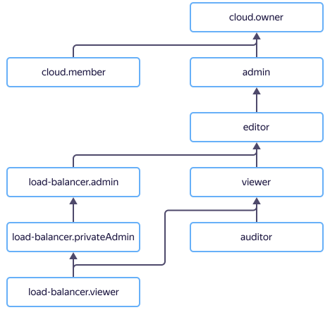

# Access management in {{ network-load-balancer-name }}

In this section, you will learn:
* [What resources support role assignment](#resources).
* [What roles this service has](#roles-list).
* [What roles are required](#choosing-roles) for specific actions.





## Resources supporting role assignment {#resources}



## Roles this service has {#roles-list}



### Service roles {#service-roles}

#### load-balancer.auditor {#load-balancer-auditor}



#### load-balancer.viewer {#load-balancer-viewer}



#### load-balancer.privateAdmin {#load-balancer-private-admin}



#### load-balancer.editor {#load-balancer-editor}



#### load-balancer.admin {#load-balancer-admin}



### Primitive roles {#primitive-roles}





## What roles do I need {#choosing-roles}

The table below lists the roles required for specific actions. You can always assign a role with more permissions. For example, you can assign the `editor` role instead of `viewer`.

Any operations with a network load balancer that has a public IP address require the `load-balancer.admin` role. In networks hosting target groups, you may have the `vpc.publicAdmin` role instead. To manage the internal network load balancer, you need the `load-balancer.privateAdmin` role and to manage its target groups, the `load-balancer.privateAdmin` or `compute.admin` role.

To manage target groups in subnets lacking the specified administrative roles, you need the `vpc.user` role for those subnets.

Action | Methods | Required roles
----- | ----- | -----
**Viewing data** | |
Viewing resource details | `get`, `list`, `listOperations` | `viewer` for the resource
**Managing network load balancers** | |
[Creating](../operations/load-balancer-create.md) and updating load balancers in a folder | `create` | `load-balancer.privateAdmin` / `load-balancer.admin` or `editor` for the folder and, if the load balancer is public, networks hosting the target groups.
[Deleting load balancers](../operations/load-balancer-delete.md) | `update`, `delete` | `load-balancer.privateAdmin` / `load-balancer.admin` or `editor` for the load balancer
[Attaching target groups](../operations/target-group-attach.md) | `attachTargetGroup`| `load-balancer.privateAdmin` / `load-balancer.admin` or `editor` for the folder and, if the load balancer is public, networks hosting the target groups.
[Detaching target groups](../operations/target-group-detach.md) | `detachTargetGroup` | `load-balancer.privateAdmin` / `load-balancer.admin` or `editor` for the load balancer
[Getting the target group status](../operations/check-resource-health.md) | `getTargetStates` | `load-balancer.viewer` or `viewer` for the load balancer and specified target groups
[Adding](../operations/listener-add.md) and [removing](../operations/listener-remove.md) listeners | `addListener`, `removeListener` | `load-balancer.privateAdmin` / `load-balancer.admin` or `editor` for the load balancer
[Stopping and starting](../operations/load-balancer-start-and-stop.md) a load balancer | `stop`, `start` | `load-balancer.privateAdmin` / `load-balancer.admin` or `editor` for the load balancer
**Managing target groups** | |
[Creating](../operations/target-group-create.md) and updating target groups in a folder | `create` | `load-balancer.privateAdmin` / `load-balancer.admin` or `editor` for the folder and subnets hosting the target groups
[Deleting target groups](../operations/target-group-delete.md) | `update`, `delete` | `load-balancer.privateAdmin` / `load-balancer.admin` or `editor` for the target group and the load balancer
Adding targets to a target group | `addTargets` | `load-balancer.privateAdmin` / `load-balancer.admin` or `editor` for the target group, load balancer, and subnets hosting the target groups
Removing targets from a target group | `removeTargets` | `load-balancer.privateAdmin` / `load-balancer.admin` or `editor` for the target group
**Resource access management** | |
[Granting](../../iam/operations/roles/grant.md), [revoking](../../iam/operations/roles/revoke.md), and viewing roles for a resource | `setAccessBindings`, `updateAccessBindings`, `listAccessBindings` | `admin` for the resource

#### What's next {what-is-next}

* [How to assign a role](../../iam/operations/roles/grant.md).
* [How to revoke a role](../../iam/operations/roles/revoke.md).
* [Learn more about access management in {{ yandex-cloud }}](../../iam/concepts/access-control/index.md).
* [Learn more about role inheritance](../../resource-manager/concepts/resources-hierarchy.md#access-rights-inheritance).
