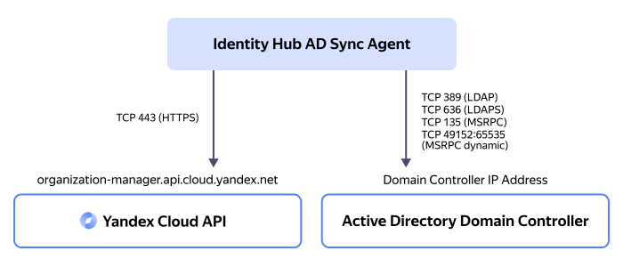

# Syncing users and groups with {{ microsoft-idp.ad-full }}



If your company uses [{{ microsoft-idp.ad-full }}](https://learn.microsoft.com/en-us/windows-server/identity/ad-ds/get-started/virtual-dc/active-directory-domain-services-overview) for user management and you want your users to be able to access {{ yandex-cloud }}, you do not need to create {{ yandex-cloud }} accounts for your users manually. Instead, you can [sync](../operations/sync-ad.md) the users and groups created in your {{ microsoft-idp.ad-short }} folder with {{ org-full-name }}.



User and group synchronization is performed by the {{ ad-sync-agent }}, which can be run on any [Linux](https://en.wikipedia.org/wiki/Linux) or [Windows](https://en.wikipedia.org/wiki/Microsoft_Windows) server.

How synchronization works:

On the server the synchronization agent is [running](../operations/sync-ad.md) on, the following [TCP](https://en.wikipedia.org/wiki/Transmission_Control_Protocol) ports must be open for incoming and outgoing traffic:

* To access the {{ yandex-cloud }} API:

    * `443`: For [HTTPS](https://en.wikipedia.org/wiki/HTTPS).

* To access the {{ microsoft-idp.ad-short }} domain controller:

    

## Synchronization objects {#sync-objects}

The {{ ad-sync-agent }} syncs the following objects with the {{ microsoft-idp.ad-short }} folder:

* **Users**.
* **User attributes**.

    User attribute mapping table:

    Attribute name  in [agent configuration](#agent-config) | Attribute name in {{ microsoft-idp.ad-short }}  (default) | Attribute name  in {{ org-name }}
    --- | --- | ---
    `FullName` | `displayName` | `full_name`
    `GivenName` | `givenName` | `given_name`
    `FamilyName` | `sn` | `family_name`
    `Email` | `mail` | `email`
    `PhoneNumber` | `telephoneNumber` | `phone_number`
    `Username` | `userPrincipalName` | `username`
    no data | `ObjectGUID` | `external_id`

    In the `user_attribute_mapping` [agent configuration](#agent-config) parameter, you can map user attribute names different from the {{ microsoft-idp.ad-short }} default ones or disable synchronization of individual attributes.
* **User groups**.
* **User group attributes**.

    User group attribute mapping table:

    Attribute name  in [agent configuration](#agent-config) | Attribute name in {{ microsoft-idp.ad-short }}  (default) | Attribute name  in {{ org-name }}
    --- | --- | ---
    `Name` | `name` | `name`
    `Description` | `description` | `description`
    no data | `ObjectGUID` | `external_id`

    In the `group_attribute_mapping` [agent configuration](#agent-config) parameter, you can map user group attribute names different from the {{ microsoft-idp.ad-short }} default ones or disable synchronization of individual attributes.
* **User memberships in groups**.
* **[User password hashes](https://en.wikipedia.org/wiki/Hash_function)**.

    {{ microsoft-idp.ad-short }} stores user passwords as hashes, not plaintext. {{ yandex-cloud }} collects the user password hash from the {{ microsoft-idp.ad-short }} folder and generates its own one based on it using the modern hack-proof [Argon2](https://en.wikipedia.org/wiki/Argon2) algorithm.

    

    {{ yandex-cloud }} does not store user passwords as plaintext in its databases.

    

## Setting up synchronization {#sync-setup}

To implement {{ org-name }} user and group synchronization with {{ microsoft-idp.ad-short }}, you need to do the presetting both on the [domain controller](https://en.wikipedia.org/wiki/Domain_controller_(Windows)) side with {{ microsoft-idp.ad-short }} services deployed and on the {{ yandex-cloud }} side.

## {{ microsoft-idp.ad-short }} domain controller side setup {#dc-setup}

For the synchronization [agent](#sync-agent) to work correctly on the {{ microsoft-idp.ad-short }} side, do the following:



## {{ yandex-cloud }} side setup {#yc-setup}

For the synchronization [agent](#sync-agent) to work correctly on the {{ yandex-cloud }} side, do the following:

* [Create](../../iam/operations/sa/create.md) a service account for synchronization on the {{ org-name }} side.
* [Create](../../iam/operations/authentication/manage-authorized-keys.md#create-authorized-key) and save an [authorized key](../../iam/concepts/authorization/key.md) for the service account.
* [Assign](../../iam/operations/sa/assign-role-for-sa.md#binding-role-organization) the following [roles](../../iam/concepts/access-control/roles.md) to the service account for the [organization](./organization.md) the user pool is in:

    

## {{ ad-sync-agent }} agent {#sync-agent}

{{ ad-sync-agent }} reads user and user group data in the [selected](#agent-config) Organization Units (OU) in the {{ microsoft-idp.ad-short }} folder and syncs it with user and user group data in the {{ org-name }} [pool](./user-pools.md).

On the {{ microsoft-idp.ad-short }} side, the synchronization agent gets user and group data as the user [created](#dc-setup) in the {{ microsoft-idp.ad-short }} domain. To get this data, the agent uses the [LDAP](https://learn.microsoft.com/en-us/windows/win32/api/_ldap/) and [DRSR](https://learn.microsoft.com/en-us/openspecs/windows_protocols/ms-drsr/) protocols. The requests go to the {{ microsoft-idp.ad-short }} domain controller address specified in the agent [configuration](#agent-config).

On the {{ yandex-cloud }} side, the synchronization agent manages users and user groups as a [service account](../../iam/concepts/users/service-accounts.md) with [permissions](#yc-setup) for syncing. Requests to {{ yandex-cloud }} go to public endpoint `https://organization-manager.{{ api-host }}` over [HTTPS](https://en.wikipedia.org/wiki/HTTPS).

The synchronization agent installation script is available for the following operation systems:

* [Linux]({{ ad-sync-agent-linuxlink }})
* [Windows]({{ ad-sync-agent-windowslink }})

### Synchronization process {#sync-process}

During the synchronization process, {{ ad-sync-agent }} can create, update, or delete users and user groups in {{ org-name }}. {{ org-name }} users and groups are synced with {{ microsoft-idp.ad-short }} users and groups in to stages: [primary synchronization](#full-sync) and [incremental synchronization](#incremental-sync).

#### Full (primary) synchronization {#full-sync}

When performing a full synchronization, the agent reads the data of all users, groups, and their attributes in the [selected](#agent-config) Organization Units in the {{ microsoft-idp.ad-short }} folder and creates the same users and groups with the same attributes in the {{ org-name }} user pool.

The primary synchronization process for a large number of [objects](#sync-objects) may take a long time. If the full synchronization process is interrupted due to an error, you can restart the agent to resume synchronization from where the previous attempt was interrupted. The agent tracks the progress of full synchronization using process token files in the running agent's directory:

* `main_sync_replication_token.json`
* `password_hash_replication_token.json`
* `user_control_replication_token.json`

After full synchronization is successfully completed, the agent, run as a standalone service or OS service, proceeds to continuously execute a partial (incremental) synchronization.



You can restart the full synchronization process. Do it by deleting the mentioned process token files and restarting the agent.



#### Partial (incremental) synchronization {#incremental-sync}

The running agent performs incremental synchronization continuously with the following frequency:

* _Syncing user passwords and states_: The agent tracks the lock/unlock status of users in the {{ microsoft-idp.ad-short }} domain and user password changes and transfers these updates to {{ org-name }} at an interval of several seconds. You cannot change the frequency for this synchronization type.
* _Syncing other values_: The agent tracks other changes in properties, attributes, and parameters of users and groups at an interval [set](#agent-config) in the agent's configuration file.

During syncing, the user pool may be found to contain a user or user group with names identical to those of the user or user group that need to be synced. In which case, depending on [current settings](#agent-config), the agent will either overwrite the data from {{ microsoft-idp.ad-short }} into the existing {{ org-name }} user or group or return an error message.

### Tracked changes {#tracked-changes}

During continuous synchronization, the agent tracks the following changes in {{ microsoft-idp.ad-short }} and transfers them to {{ org-name }}:

* Creating, editing, locking, unlocking, and deleting users.
* Creating, editing, and deleting user groups.
* Changing user and user group attributes.
* Adding users to groups and removing them from groups.
* Changing user passwords.

### Synchronization logging {#logging}

{{ ad-sync-agent }} logs the events taking place during synchronization.

By default, the event and error info is fed into the [standard stream](https://en.wikipedia.org/wiki/Standard_streams) named `stdout`. As an alternative, you can configure saving logs to files in the agent's [configuration](#agent-config).

By default, the event info is output in text format, but you can change it to [JSON](https://en.wikipedia.org/wiki/JSON) in the agent's configuration.

Additionally, you can set the following logging conditions in the agent's configuration:



### Agent configuration {#agent-config}

The synchronization agent's configuration is set in a [YAML](https://yaml.org/) file in the following format:





#### See also {#see-also}

* [{#T}](../operations/sync-ad.md)