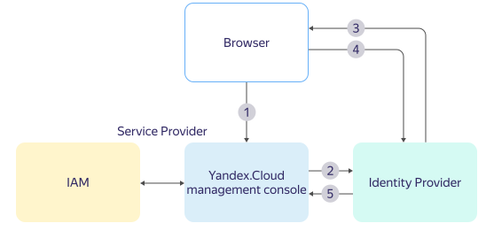

# SAML-compatible identity federations

{{ yandex-cloud }} supports [SAML 2.0](https://wiki.oasis-open.org/security)-based identity federations. This is a popular markup language to enable Single Sign-On (SSO), a technology that allows users to access multiple apps without having to enter their username and password every time. For example, whenever you visit a website and see the _Sign in with Yandex_, _Google_ or _Facebook_ buttons, these are examples of the single sign-on system at work.

The technology is called _identity federation_ — it is when all the usernames and passwords information is stored with a trusted _Identity Provider (IdP)_. While a service provider (SP), e.g., {{ yandex-cloud }}, refers users to the identity provider's (IdP's) server for authentication.

If your company has a user and access management system (e.g., Active Directory or Google Workspace), you can use it to authenticate employees in {{ org-full-name }}. In this case, you do not need to create a new Yandex account for every employee. They can get access to {{ yandex-cloud }} services using their corporate accounts.

## Configuring federations in {{ org-full-name }} {#federation-usage}

Using identity federations, you can configure a single sign-on (SSO) system and use corporate accounts for authentication in {{ org-name }}. In this case, your corporate account management system acts as an identity provider (IdP).

In {{ org-name }}, you can create an identity federation with any credential management service (identity provider) that supports the [SAML]({{ link-saml }}) protocol.

Information about user logins and passwords is stored by the identity provider. When a user logs in to {{ org-name }}, they are directed to the identity provider (IdP) server for authentication. If authentication is successful, the user gets access to {{ yandex-cloud }} services.

Since authentication takes place on the IdP server side, you can configure a more secure user data verification, such as two-factor authentication or USB tokens.

You can set up identity federations for different identity providers:

* [Active Directory](../tutorials/federations/integration-adfs.md)
* [Google Workspace](../tutorials/federations/integration-gworkspace.md)
* [{{ microsoft-idp.entra-id-full }}](../tutorials/federations/integration-azure.md)​
* [Keycloak](../tutorials/federations/integration-keycloak.md)
* [Other SAML-compatible identity providers](../operations/setup-federation.md)

### User group mapping {#group-mapping}



For organizations with a lot of employees, multiple users may need to be granted the same access rights to {{ yandex-cloud }} resources. In this case, it is more convenient to grant roles and permissions to a group rather than individually.

If you employ user groups in your identity provider or intend to do so, [configure user group mapping](../operations/federation-group-mapping) between the identity provider and {{ org-name }}. Users in the identity provider's groups will be granted the same access rights to {{ yandex-cloud }} resources as the corresponding groups in {{ org-name }}.

## Authenticating in a federation {#saml-authentication}



The authentication process is shown in the diagram:

1. The user opens a console login link in the browser.

1. If this is the first time the user authenticates, the console redirects them to the IdP server for authentication.

   If the user was already authenticated, this information is saved in the browser cookie. If the cookie is still valid, the management console authenticates the user immediately and redirects them to the home page. The cookie lifetime is specified when the federation is created.

   If the cookie expires, the console forwards the user to the IdP server for re-authentication.

   You can also require re-authentication in the federation settings. When this option is enabled, the IdP will reauthenticate the user when the session expires in {{ yandex-cloud }}.

1. The IdP server shows the authentication page to the user. For example, it prompts them to enter their username and password.

1. The user enters the data required for authentication on the IdP server.

1. If authentication is successful, the IdP server sends the user's browser back to the management console login page.

1. The management console asks IAM whether this user is added to the cloud. If the user is added, the management console authenticates the user and redirects them to the home page.



In an identity federation, the user interacts both with the IdP and the {{ yandex-cloud }} management console. This does not require network access between the IdP and {{ yandex-cloud }}.


