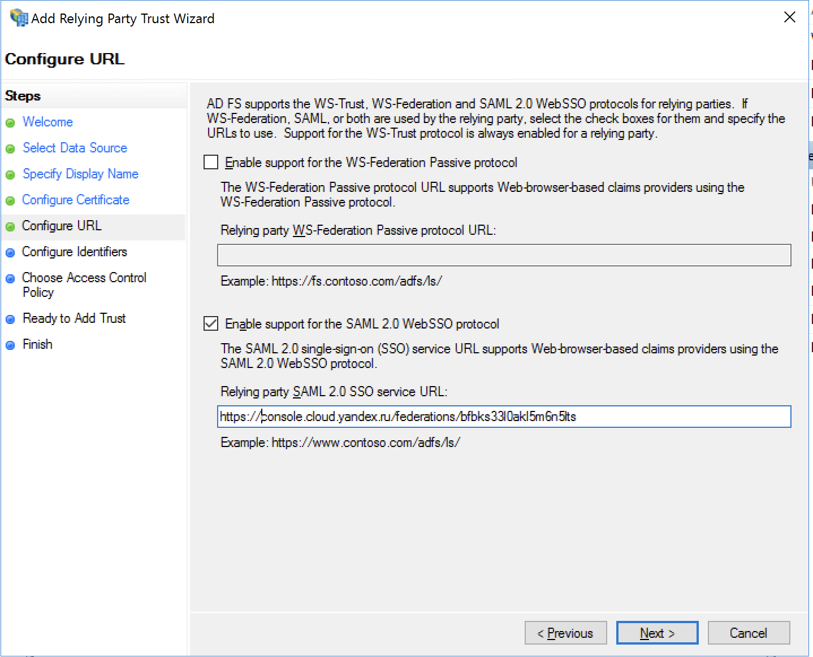
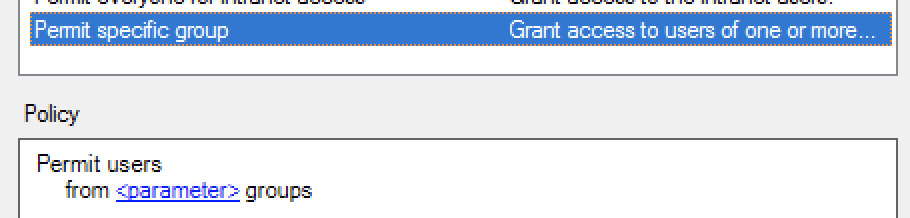
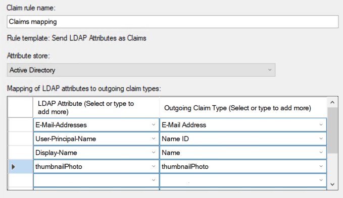
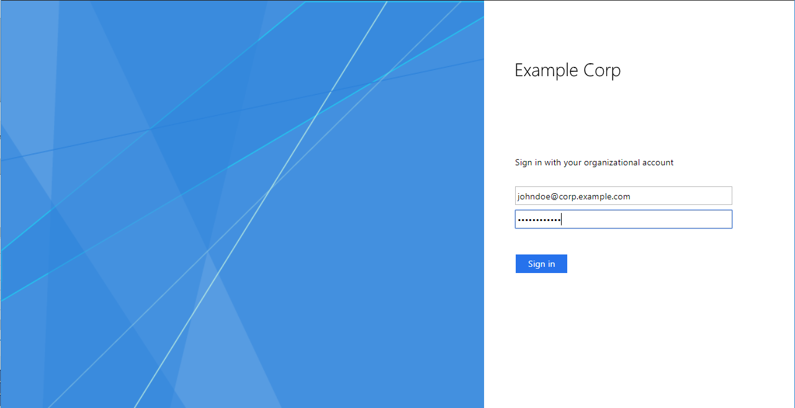

# Authentication using Active Directory

With an [identity federation](../../add-federation.md), you can use [Active Directory Federation Services]({{ link-adfs }}) (ADFS) to authenticate in the cloud.

To set up authentication:

1. [Create a federation in your organization](#create-federation).

1. [Add certificates to a federation](#add-certificate).

1. [Get a console login link](#get-link).

1. [Configure authentication on the ADFS server](#configure-sso).

1. [Add users to your organization](#add-users).

1. [Test the authentication process](#test-auth).

## Before you start {#before-you-begin}

To use the instructions in this section, you will need:​

1. A working AD FS farm. If you didn't configure AD FS on your server, [install and configure it now](https://docs.microsoft.com/en-us/windows-server/identity/ad-fs/deployment/deploying-a-federation-server-farm). To deploy ADFS, you also need to install and configure Active Directory Domain Services (AD DS).

   

   If you don't have a Windows machine to deploy an ADFS server, you can [create a VM](../../../compute/quickstart/quick-create-windows.md) in {{ yandex-cloud }}.

   

   

   We recommend that you include more than one server in the farm to ensure more reliable authentication.

   

1. A valid certificate that is used for signing in the ADFS service. If you don't have a valid SSL certificate, get one.

   The subject name in the certificate must contain the FQDN of the Identity Provider (IdP) server, for example, `fs.contoso.com`, to prevent the browser from blocking the authentication page.

## Create a federation in your organization {#create-federation}



- Management console

   To create a federation:

   1. Go to [{{ org-full-name }}]({{ link-org-main }}).

   1. In the left panel, select [Federations]({{ link-org-federations }}) .

   1. Click **Create federation**.

   1. Enter a name for the federation. The name must be unique within the folder.

   1. Add a description if necessary.

   1. In the **Cookie lifetime** field, specify the period of time that must elapse before the browser asks the user to re-authenticate.

   1. In the **IdP Issuer** field, enter a link in `http://<ADFS>/adfs/services/trust` format, where `<ADFS>` is the FQDN of your ADFS server.

   1. In the **SSO method** field, choose **POST**.

   1. In the **Link to the IdP login page** field, enter a link in `https://<ADFS>/adfs/ls/`, format where `<ADFS>` is the FQDN of your ADFS server.

   1. Enable **Automatically create users** to add authenticated users to your organization automatically. If you don't enable this option, you will need to [manually add](../../add-account.md#add-user-sso) your federated users.

- CLI

   

   

   1. See the description of the create federation command:

      ```
      yc organization-manager federation saml create --help
      ```

   1. Create a federation:

      ```bash
      yc organization-manager federation saml create --name my-federation \
          --organization-id <organization ID> \
          --auto-create-account-on-login \
          --cookie-max-age 12h \
          --issuer "http://example.com/adfs/services/trust" \
          --sso-binding POST \
          --sso-url "https://example.com/adfs/ls/"
      ```

      Where:

      * `name`: Federation name. The name must be unique within the folder.
      * `organization-id`: Your organization ID.
      * `auto-create-account-on-login`: A flag to enable the automatic creation of new cloud users following authentication on the IdP server.

         This option makes it easier to create users, but users created this way won't be able to do anything with cloud resources. Exceptions are the resources that the `allUsers` or `allAuthenticatedUsers` [system group](../../../iam/concepts/access-control/system-group.md) roles are assigned to.

         If this option is disabled, users who aren't added to the organization can't log in to the management console, even if they authenticate with your server. In this case, you can manage a list of users allowed to use {{ yandex-cloud }}resources.

      * `cookie-max-age`: Time that must elapse before the browser asks the user to re-authenticate.
      * `issuer`: IdP server ID to be used for authentication.

         Enter a link in `http://<ADFS>/adfs/services/trust` format, where `<ADFS>` is the FQDN of your ADFS server.

      * `sso-url`: URL of the page that the browser redirects the user to for authentication.

         Enter a link in `https://<ADFS>/adfs/ls/` format, where `<ADFS>` is the FQDN of your ADFS server.

      * `sso-binding`: Specify the Single Sign-on binding type. Most Identity Providers support the `POST` binding type.

- API

   1. [Get the ID of the folder](../../../resource-manager/operations/folder/get-id.md) to create a federation in.

   1. Create a file with the request body (for example, `body.json`).

      ```json
      {
        "folderId": "<folder ID>",
        "name": "my-federation",
        "organizationId": "<organization ID>",
        "autoCreateAccountOnLogin": true,
        "cookieMaxAge":"43200s",
        "issuer": "http://example.com/adfs/services/trust",
        "ssoUrl": "https://example.com/adfs/ls/",
        "ssoBinding": "POST"
      }
      ```

      Where:

      * `folderId`: ID of the folder.
      * `name`: Federation name. The name must be unique within the folder.
      * `organizationId`: Organization ID.
      * `autoCreateAccountOnLogin`: A flag to activate the automatic creation of new cloud users after authenticating on the IdP server.
         This option makes it easier to create users, but users created this way won't be able to do anything with cloud resources. Exceptions are the resources that the `allUsers` or `allAuthenticatedUsers` [system group](../../../iam/concepts/access-control/system-group.md) roles are assigned to.

         If this option is disabled, users who aren't added to the organization can't log in to the management console, even if they authenticate with your server. In this case, you can manage a list of users allowed to use {{ yandex-cloud }}resources.

      * `cookieMaxAge`: Time that must elapse before the browser asks the user to re-authenticate.
      * `issuer`: IdP server ID to be used for authentication.

         Enter a link in `http://<ADFS>/adfs/services/trust` format, where `<ADFS>` is the FQDN of your ADFS server.

      * `sso-url`: URL of the page that the browser redirects the user to for authentication.

         Enter a link in `https://<ADFS>/adfs/ls/` format, where `<ADFS>` is the FQDN of your ADFS server.

      * `ssoBinding`: Specify the Single Sign-on binding type. Most Identity Providers support the `POST` binding type.

   1. 

- {{ TF }}

   If you don't have {{ TF }}, [install it and configure the {{ yandex-cloud }} provider](../../../tutorials/infrastructure-management/terraform-quickstart.md#install-terraform).

   1. Specify the federation parameters in the configuration file:

      * `name`: Federation name. The name must be unique within the folder.
      * `description`: Federation description.
      * `organization_id`: Organization ID.
      * `labels`: A set of key/value label pairs assigned to the federation.
      * `issuer`: IdP server ID to be used for authentication.

         Enter a link in `http://<ADFS>/adfs/services/trust` format, where `<ADFS>` is the FQDN of your ADFS server.

      * `sso_binding`: Specify the Single Sign-on binding type. Most Identity Providers support the `POST` binding type.
      * `sso_url`: URL of the page that the browser redirects the user to for authentication.

         Enter a link in `https://<ADFS>/adfs/ls/` format, where `<ADFS>` is the FQDN of your ADFS server.

      * `cookie_max_age`: Time, in seconds, before the browser asks the user to re-authenticate. The default value is `8 hours`.
      * `auto_create_account_on_login`: A flag to activate the automatic creation of new cloud users after authenticating on the IdP server.
         This option makes it easier to create users, but users created this way won't be able to do anything with cloud resources. Exceptions are the resources that the `allUsers` or `allAuthenticatedUsers` [system group](../../../iam/concepts/access-control/system-group.md) roles are assigned to.

         If this option is disabled, users who aren't added to the organization can't log in to the management console, even if they authenticate with your server. In this case, you can manage a list of users allowed to use {{ yandex-cloud }} resources.
      * `case_insensitive_name_ids`: A flag that indicates if usernames are case-insensitive.
         If the option is enabled, the IDs of federated users' names are case-insensitive.
      * `security_settings`: Federation security settings:
         * `encrypted_assertions`: Sign authentication requests.
            If this option is enabled, all authentication requests from {{ yandex-cloud }} will have a digital signature. You need to download and install a {{ yandex-cloud }} certificate.

      Example configuration file structure:

      ```
      resource "yandex_organizationmanager_saml_federation" federation {
       name            = "my-federation"
       organization_id = "<organization ID>"
       auto_create_account_on_login = "true"
       issuer          = "http://example.com/adfs/services/trust"
       sso_url         = "https://example.com/adfs/ls/"
       sso_binding     = "POST"
       security_settings {
          encrypted_assertions = "true"
          }
      }
      ```

   1. Make sure that the configuration files are correct.

      1. In the command line, go to the directory where you created the configuration file.
      1. Run the check using the command:

         ```
         terraform plan
         ```

      If the configuration is described correctly, the terminal displays the federation parameters. If the configuration contain errors, {{ TF }} will point them out.

   1. Create a federation.

      1. If the configuration doesn't contain any errors, run the command:

         ```
         terraform apply
         ```

      1. Confirm that you want to create the federation.

      This creates the federation in the specified organization. You can check that the federation is there and its settings are correct in the organization's [Federations]({{ link-org-federations }}) section.



## Specify certificates for the federation {#add-certificate}

When the identity provider (IdP) informs {{ org-full-name }} that a user has been authenticated, they sign the message with their certificate. To enable {{ org-name }} to verify this certificate, add it to the created federation.

To get an ADFS certificate:

1. Log in to your ADFS server and open **Server Manager**.

1. Open the ADFS management console: **Tools** → **ADFS Management**.

1. In the window that opens, click **Services** → **Certificates** in the tree on the left.

1. Right-click the certificate in the **Token-signing** section and select **View certificate**.

1. In the window that opens, go to the **Details** tab.

1. Click the **Copy to file** button.

1. Click **Next**.

1. Select the format **Base-64 encoded X.509 (.CER)** and click **Next**.

1. Specify where to save the certificate and under what name, then click **Next**.

1. Check the certificate export settings and click **Finish**.

To add a certificate to a federation:



- Management console

   1. Go to [{{ org-full-name }}]({{ link-org-main }}).

   1. In the left panel, select [Federations]({{ link-org-federations }}) .

   1. Click the name of the federation to add a certificate to.

   1. At the bottom of the page, click **Add certificate**.

   1. Enter the certificate's name and description.

   1. Choose how to add the certificate:
      * To add a certificate as a file, click **Choose a file** and specify the path to it.
      * To paste the contents of a copied certificate, select the **Text** method and paste the contents.
   1. Click **Add**.

- CLI

   

   

   1. View a description of the add certificate command:

      ```
      yc organization-manager federation saml certificate create --help
      ```

   1. Add a federation certificate by specifying the certificate file path:

      ```
      yc organization-manager federation saml certificate create --federation-name my-federation \
        --name "my-certificate" \
        --certificate-file test.pem
      ```

- API

   To add a certificate, use the [create](../../api-ref/Certificate/create.md) method for the [Certificate](../../api-ref/Certificate/index.md) resource:

   1. Create a request body by specifying the contents of the certificate's `data` property:

      ```json
      {
        "federationId": "<federation ID>",
        "name": "my-certificate",
        "data": "MII...=="
      }
      ```

   1. Send the add certificate request:

      ```bash
      export IAM_TOKEN=CggaATEVAgA...
      curl -X POST \
          -H "Content-Type: application/json" \
          -H "Authorization: Bearer ${IAM_TOKEN}" \
          -d '@body.json' \
          "https://organization-manager.{{ api-host }}/organization-manager/v1/saml/certificates"
      ```





To ensure that authentication isn't interrupted when the certificate expires, we recommend adding several certificates to the federation: the current one and the ones that will be used after. If a certificate turns out to be invalid, {{ yandex-cloud }} will attempt to verify the signature with another certificate.



## Get a console login link {#get-link}

When you set up federation authentication, users can log in to the management console from a link containing the federation ID. The same link must be provided when configuring the authentication server.

Obtain and save this link:

1. Get the federation ID:

   1. Go to [{{ org-full-name }}]({{ link-org-main }}).

   1. In the left panel, select [Federations]({{ link-org-federations }}) .

   1. Copy the ID of the federation you're configuring access for.

1. Generate a link using this ID:

   `{{ link-console-main }}/federations/<federation ID>`

## Configure authentication on the ADFS server {#configure-sso}

After you obtained your management console login link, you can configure the ADFS server to notify the management console of each successful authentication session and forward the user to the specified address to log in to the management console.

The instructions in this section are written for Windows Server 2016 (different steps might be needed for other versions).

To set up authentication on the ADFS server:

1. [Create a relying party trust](#configure-relying-party-trust)

1. [Configure Claims Mapping](#configure-claims-mapping)

### Create a relying party trust {#configure-relying-party-trust}

ADFS requires a _relying party trust_ for each Service Provider (SP) that uses ADFS for authentication.

Create a relying party trust for the federation you created in the cloud:

1. Log in to your ADFS server and open **Server Manager**.

1. Open the ADFS management console: **Tools** → **ADFS Management**.

1. In the list of actions, select **Add Relying Party Trust**.

1. The wizard window opens. On the first page, select **Claims aware** and click **Start**.

1. Select **Enter data about the relying party manually** and click **Next**.

1. Enter a name like <q>{{ yandex-cloud }}</q> and click **Next**.

1. In the next step, you are asked to specify a certificate for signing tokens. This step is optional, so click **Next**.

1. In the Configure URL step, select **Enable support for the SAML 2.0 WebSSO protocol** and specify the [console login link](#get-link) you obtained earlier. Then click **Next**.





1. On the next page, enter the same [console login link](#get-link) as an identifier and click **Add**. Then click **Next**.

1. On the next page, you can choose who can authenticate using this federation. By default, the **Permit for everyone** policy is selected enabling access for all users.

   You can choose a different policy. For example, to grant access to a specific group of users, select **Permit specific group** and click on the word `<parameter>` to select the groups to allow access to. [Read more about access control policies](https://docs.microsoft.com/en-us/windows-server/identity/ad-fs/operations/access-control-policies-in-ad-fs).

   

1. Click **Next**.

1. On the **Ready to Add Trust** page, check the data entered and click **Close**.

### Configure Claims Mapping {#configure-claims-mapping}

When ADFS authenticates a user, it sends a SAML message to {{ yandex-cloud }} to confirm successful authentication. The message must contain the Name ID that uniquely identifies the user and may also contain some other user data, such as the user's name or email address. Make sure to set up a mapping between the user attributes and Outgoing Claim Types. Types of personal data supported by {{ org-full-name }} are given below.

| User data | Comment | Outgoing Claim Type |
------------------- | ----------- | -------------------
| Unique user ID | Required attribute. We recommend using the **User-Principal-Name** or email address. | Name ID |
| Last name | Displayed in {{ yandex-cloud }} services. We recommend using the **Surname** attribute. | Surname |
| Name | Displayed in {{ yandex-cloud }} services. We recommend using the **Given-Name** attribute. | Given Name |
| Full name | Displayed in {{ yandex-cloud }} services. Example: John Smith.<br>We recommend using the **Display-Name** attribute. | Name |
| Email | Used to send notifications from {{ yandex-cloud }} services. Example: `smith@example.com`<br>We recommend using the **E-Mail-Address** attribute. | E-Mail Address |
| Phone | Used to send notifications from {{ yandex-cloud }} services. Example: +71234567890+972571234567<br>We recommend using the `Telephone-Number` attribute. | Type `phone` in the **Outgoing Claim Type** field. |
| Profile image | Displayed in {{ yandex-cloud }} services.<br>We recommend using the `thumbnailPhoto` attribute. [How to add a profile image](#add-avatar) | Type `thumbnailPhoto` in the **Outgoing Claim Type** field. |



The Name ID must be unique for every federation user. We recommend specifying the User Principal Name (UPN) or email address as the ID.



To set up a mapping between the user data and Outgoing Claim Types:

1. In the ADFS management console under **Relying Party Trusts**, right-click on the relying party trust created earlier and select **Edit Claim Issuance Policy**.

1. In the window that opens, click **Add Rule**.

1. Select **Send LDAP Attributes as Claims** and click **Next**.

1. On the next page, set up the data to send in the message:

   1. In the **Claim rule name** field, enter a name for the rule, like `Claims mapping`

   1. In the **Attribute Store** field, click **Active Directory**.

   1. Specify what the server will return as Name ID to uniquely identify the user. To do this, add a line to the **Mapping of LDAP attributes** list:

      In the **LDAP Attribute** column, select **User-Principal-Name** or **E-Mail Addresses**.

      In the **Outgoing Claim Type** column, select **Name ID**.

   1. For a user to be able to contact {{ yandex-cloud }} technical support from the [management console]({{ link-console-support }}), add the user's email address (the **E-Mail Address** claim type) or name (the **Name** claim type).

   1. To pass the user's first and last name separately, add the **Given Name** and **Surname** claim types.

   1. To add the user's phone number or [profile image](#add-avatar), enter the `phone` or `thumbnailPhoto` type, respectively, in the **Outgoing Claim Type** field.

      

1. Click **Finish**, then click **OK**to close the **Edit Claim Issuance Policy** window.


#### How to add a profile image to Active Directory {#add-avatar}

To add a user's profile image to Active Directory, write the image to the `thumbnailPhoto` attribute using PowerShell.



The `thumbnailPhoto` attribute supports files of up to 100 KB. The recommended file size is up to 10 KB and the recommended image size is up to 96×96 pixels.



1. Start PowerShell.

1. Connect the Active Directory Module for Windows PowerShell with the command:

   ```
   Import-Module ActiveDirectory
   ```

1. To add a profile image for a single user, run the command:

   ```
   Set-ADUser <username> -Replace @{thumbnailPhoto=([byte[]](Get-Content "<image path>" -Encoding byte))}
   ```

1. To bulk add profile images for multiple users:

   1. Create a CSV file with a list of usernames and image paths.

      Sample CSV file:

      ```csv
      AD_username, Photo
      smith, C:\Photo\smith.jpg
      jones, C:\Photo\jones.jpg
      ```

   1. Run the command:

      ```
      Import-Csv <CSV file path> |%{Set-ADUser -Identity $_.AD_username -Replace @{thumbnailPhoto=([byte[]](Get-Content $_.Photo -Encoding byte))}}
      ```

## Add users to your organization {#add-users}

If you did not enable the **Automatically create users** option when creating a federation, federated users must be manually added to your organization.

To do this, you need to know the Name IDs of the users that the Identity Provider Server (IdP) returns along with the successful authentication confirmation. This is usually the user's primary email address. If you don't know what the server returns as the Name ID, contact the administrator who configured authentication for your federation.

A user can be added by an organization administrator (`organization-manager.admin` role) or owner (`organization-manager.organizations.owner` role). For information on assigning roles to users, see [Roles](../../roles.md#admin).

To add federation users to an organization:



- Management console

   1. [Log in]({{ link-passport }}) to the organization's administrator or owner account.

   1. Go to [{{ org-full-name }}]({{ link-org-main }}).

   1. In the left panel, select [Users]({{ link-org-users }}) .

   1. In the upper-right corner, click on the arrow next to the **Add user** button. Select **Add federated users**.

   1. Select the identity federation to add users from.

   1. List the Name IDs of users, separating them with line breaks.

   1. Click **Add**. This will give the users access to the organization.

- CLI

   

   

   1. View a description of the add user command:

      ```
      yc organization-manager federation saml add-user-accounts --help
      ```

   1. Add users by listing their Name IDs separated by a comma:

      ```
      yc organization-manager federation saml add-user-accounts --name my-federation \
        --name-ids=alice@example.com,bob@example.com,charlie@example.com
      ```

- API

   To add identity federation users to the cloud:

   1. Create a file with the request body (for example, `body.json`). In the request body, specify the array of Name IDs of users you want to add:

      ```json
      {
        "nameIds": [
          "alice@example.com",
          "bob@example.com",
          "charlie@example.com"
        ]
      }
      ```
   1. Send the request by specifying the Federation ID in the parameters:

      ```bash
      curl -X POST \
        -H "Content-Type: application/json" \
        -H "Authorization: Bearer <IAM token>" \
        -d '@body.json' \
        https://organization-manager.{{ api-host }}/organization-manager/v1/saml/federations/<federation ID>:addUserAccounts
      ```



## Test the authentication process {#test-auth}

Now that you finished configuring authentication with Active Directory, test that it runs properly:

1. Open the browser in guest or incognito mode to simulate being a new user.

1. Follow the [management console login link](#get-link) you obtained earlier. The browser forwards you to the ADFS authentication page, which by default looks as follows:

   

1. Enter your authentication data. By default, you must enter the UPN and password. Then click **Sign in**.

1. On successful authentication, ADFS redirects you back to the management console login link and then to the management console home page. In the upper-right corner, you can see that you are logged in to the console under an Active Directory account.

#### What's next {#what-is-next}

* [Assign roles to the new users](../../../iam/operations/roles/grant.md#access-to-federated-user).
