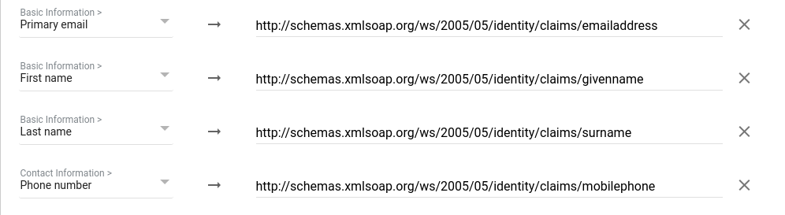

# Authentication using Google Workspace

With an [identity federation](../../add-federation.md), you can use [Google Workspace](https://workspace.google.com/) to authenticate users in an organization.

Setting up authentication includes the following steps:

1. [Creating and setting up a SAML application in Google Workspace](#gworkspace-settings).

1. [Creating and setting up a federation in {{ org-full-name }}](#yc-settings).

1. [Setting up Single Sign-On (SSO)](#sso-settings).

1. [Authentication](#test-auth).

## Getting started {#before-you-begin}

To use the instructions in this section, you'll need a subscription to Google Workspace services and a verified domain to set up your SAML application for.

## Creating and setting up a SAML application in Google Workspace {#gworkspace-settings}

### Create a SAML application and download a certificate {#create-app}

A SAML application in Google Workspace acts as an identity provider (IdP). Create a SAML application and download a certificate:

1. Open the [Google Workspace Admin Console](https://admin.google.com/).

1. In the left-hand panel, select **Mobile and web applications**.

1. Click **Add** → **Add a custom SAML app**.

1. Enter the name of the app, select the logo, and click **Continue**.

1. In the **Google IdP information** step, the IdP server data is shown. You'll need this data when [setting up a federation in {{ org-full-name }}](#yc-settings).



Don't close the page where you create an app in Google Workspace: you'll get the necessary configuration data for the **Service provider information** step in [further steps](#add-link).



## Creating and setting up a federation in {{org-full-name}} {#yc-settings}

### Create a federation {#create-federation}



- Management console

   1. Go to [{{ org-full-name }}]({{ link-org-main }}).

   1. In the left-hand panel, select [Federations]({{ link-org-federations }}) .

   1. Click **Create federation**.

   1. Give your federation a name. It must be unique within the folder.

   1. You can also add a description, if required.

   1. In the **Cookie lifetime** field, specify the period of time that must elapse before the browser asks the user to re-authenticate.

   1. In the **IdP Issuer** field, enter the link from the **Object ID** field on the Google Workspace **Google IdP information** page. The link should have the following format:

      ```
      https://accounts.google.com/o/saml2?idpid=<SAML app ID>
      ```

   1. In the **Link tothe IdP login page** field, enter the link from the **SSO URL** field on the Google Workspace **Google IdP information** page. The link should have the following format:

      ```
      https://accounts.google.com/o/saml2/idp?idpid=<SAML app ID>
      ```

   1. Enable **Automatically create users** to add authenticated users to your organization automatically. If you do not enable this option, you will need to [manually add](../../add-account.md#add-user-sso) your federated users.

      

- CLI

   

   

   1. See the description of the create federation command:

      ```
      yc organization-manager federation saml create --help
      ```

   1. Create a federation:

      ```bash
      yc organization-manager federation saml create --name my-federation \
          --organization-id <organization ID> \
          --auto-create-account-on-login \
          --cookie-max-age 12h \
          --issuer "https://accounts.google.com/o/saml2?idpid=<SAML application ID>" \
          --sso-binding POST \
          --sso-url "https://accounts.google.com/o/saml2/idp?idpid=<SAML application ID>"
      ```

      Where:

      * `name`: Federation name. It must be unique within the folder.

      * `organization-id`: Your organization ID.

      * `auto-create-account-on-login`: Flag to enable the automatic creation of new cloud users following authentication on the IdP server.

         This option makes it easier to create users however, users created this way will not be able to do anything with cloud resources. This does not apply to the resources the `allUsers` or `allAuthenticatedUsers` [system group](../../../iam/concepts/access-control/system-group.md) roles are assigned to.

         If this option is disabled, users who are not added to the organization cannot log in to the management console, even if they authenticate with your server. In this case, you can manage a list of users allowed to use {{ yandex-cloud }} resources.

      * `cookie-max-age`: Time that must elapse before the browser asks the user to re-authenticate.

      * `issuer`: IdP server ID to be used for authentication.

         Use the link from the **Object ID** field on the Google Workspace **Google IdP information** page. This is a link in the format:

         ```
         https://accounts.google.com/o/saml2?idpid=<SAML app ID>
         ```

      * `sso-url`: URL of the page that the browser redirects the user to for authentication.

         Use the link from the **SSO URL** field on the Google Workspace **Google IdP information** page. The link should have the following format:

         ```
         https://accounts.google.com/o/saml2/idp?idpid=<SAML app ID>
         ```

      * `sso-binding`: Specify the Single Sign-on binding type. Most Identity Providers support the `POST` binding type.

- API

   1. [Get the ID of the folder](../../../resource-manager/operations/folder/get-id.md) to create a federation in.
   1. Create a file with the request body, e.g., `body.json`:

      ```json
      {
        "folderId": "<folder ID>",
        "name": "my-federation",
        "organizationId": "<organization ID>",
        "autoCreateAccountOnLogin": true,
        "cookieMaxAge":"43200s",
        "issuer": "https://accounts.google.com/o/saml2?idpid=<SAML application ID>",
        "ssoUrl": "https://accounts.google.com/o/saml2/idp?idpid=<SAML application ID>",
        "ssoBinding": "POST"
      }
      ```

      Where:

      * `folderId`: ID of the folder.

      * `name`: Federation name. It must be unique within the folder.

      * `organizationId`: Organization ID.

      * `autoCreateAccountOnLogin`: Flag to activate the automatic creation of new cloud users after authenticating on the IdP server.
         This option makes it easier to create users however, users created this way will not be able to do anything with cloud resources. This does not apply to the resources the `allUsers` or `allAuthenticatedUsers` [system group](../../../iam/concepts/access-control/system-group.md) roles are assigned to.

         If this option is disabled, users who are not added to the organization cannot log in to the management console, even if they authenticate with your server. In this case, you can manage a list of users allowed to use {{ yandex-cloud }} resources.

      * `cookieMaxAge`: Time that must elapse before the browser asks the user to re-authenticate.

      * `issuer`: IdP server ID to be used for authentication.

         Use the link from the **Object ID** field on the Google Workspace **Google IdP information** page. The link should have the following format:

         ```
         https://accounts.google.com/o/saml2?idpid=<SAML app ID>
         ```
      * `ssoUrl`: URL of the page the browser redirects the user to for authentication.

         Use this as the destination when copying the link from the **SSO URL** field on the Google Workspace **Google IdP information** page. The link should have the following format:

         ```
         https://accounts.google.com/o/saml2/idp?idpid=<SAML app ID>
         ```
      * `ssoBinding`: Specify the Single Sign-on binding type. Most Identity Providers support the `POST` binding type.

   1. 

- {{ TF }}

   If you do not have {{ TF }} yet, [install it and configure the {{ yandex-cloud }} provider](../../../tutorials/infrastructure-management/terraform-quickstart.md#install-terraform).

   1. Specify the federation parameters in the configuration file:

      * `name`: Federation name. It must be unique within the folder.
      * `description`: Federation description.
      * `organization_id`: Organization ID.
      * `labels`: Set of key/value label pairs assigned to the federation.
      * `issuer`: IdP server ID to be used for authentication.

         Use the link from the **Object ID** field on the Google Workspace **Google IdP information** page. The link should have the following format:

         ```
         https://accounts.google.com/o/saml2?idpid=<SAML app ID>
         ```

      * `sso_binding`: Specify the Single Sign-on binding type. Most Identity Providers support the `POST` binding type.
      * `sso_url`: URL of the page the browser redirects the user to for authentication.

         Use this as the destination when copying the link from the **SSO URL** field on the Google Workspace **Google IdP information** page. The link should have the following format:

         ```
         https://accounts.google.com/o/saml2/idp?idpid=<SAML app ID>
         ```

      * `cookie_max_age`: Time, in seconds, before the browser asks the user to re-authenticate. The default value is `8 hours`.
      * `auto_create_account_on_login`: Flag to activate the automatic creation of new cloud users after authenticating on the IdP server.
         This option makes it easier to create users however, users created this way will not be able to do anything with cloud resources. This does not apply to the resources the `allUsers` or `allAuthenticatedUsers` [system group](../../../iam/concepts/access-control/system-group.md) roles are assigned to.

         If this option is disabled, users who are not added to the organization cannot log in to the management console, even if they authenticate with your server. In this case, you can manage a list of users allowed to use {{ yandex-cloud }}resources.
      * `case_insensitive_name_ids`: Flag that indicates whether usernames are case-insensitive.
         If the option is enabled, the IDs of federated user names are case-insensitive.
      * `security_settings`: Federation security settings:
         * `encrypted_assertions`: Sign authentication requests.
            If this option is enabled, all authentication requests from {{ yandex-cloud }} will have a digital signature. You need to download and install a {{ yandex-cloud }} certificate.

      Example of the configuration file structure:

      ```
      resource "yandex_organizationmanager_saml_federation" federation {
       name            = "my-federation"
       organization_id = "<organization ID>"
       auto_create_account_on_login = "true"
       issuer          = "https://accounts.google.com/o/saml2?idpid=<SAML application ID>"
       sso_url         = "https://accounts.google.com/o/saml2/idp?idpid=<SAML application ID>"
       sso_binding     = "POST"
       security_settings {
          encrypted_assertions = "true"
          }
      }
      ```

   1. Make sure the configuration files are valid.

      1. In the command line, go to the directory where you created the configuration file.
      1. Run the check using this command:

         ```
         $ terraform plan
         ```

      If the configuration is described correctly, the terminal displays the federation parameters. If the configuration contains any errors, {{ TF }} will point them out.

   1. Create a federation.

      1. If the configuration does not contain any errors, run this command:

         ```
         $ terraform apply
         ```

      1. Confirm you want to create a federation.

      This creates the federation in the specified organization. You can check that the federation is there and its settings are correct in the organization's [Federations]({{ link-org-federations }}) section.



### Add certificates {#add-certificate}

While authenticating, the {{ org-name }} service should be able to verify the IdP server certificate. To enable this, download a certificate from the open Google Workspace **Google IdP Information** page and add it to the created federation:



- Management console

   1. In the left-hand panel, select [Federations]({{ link-org-federations }}) .

   1. Click the name of the federation to add a certificate to.

   1. At the bottom of the page, click **Add certificate**.

   1. Enter the certificate name and description.

   1. Choose how to add the certificate:

      * To add a certificate as a file, click **Choose a file** and specify the path to it.

      * To paste the contents of a copied certificate, select the **Text** method and paste the contents.

   1. Click **Add**.

- CLI

   

   

   1. View a description of the add certificate command:

      ```
      yc organization-manager federation saml certificate create --help
      ```

   1. Add a federation certificate by specifying the certificate file path:

      ```
      yc organization-manager federation saml certificate create --federation-id <federation ID> \
        --name "my-certificate" \
        --certificate-file certificate.pem
      ```

- API

   Use the [create](../../api-ref/Certificate/create.md) method for the [Certificate](../../api-ref/Certificate/index.md) resource:

   1. Generate the request body. In the `data` property, specify the contents of the certificate:

      ```json
      {
        "federationId": "<federation ID>",
        "name": "my-certificate",
        "data": "-----BEGIN CERTIFICATE..."
      }
      ```

   1. Send the add certificate request:

      ```bash
      $ export IAM_TOKEN=CggaATEVAgA...
      $ curl -X POST \
          -H "Content-Type: application/json" \
          -H "Authorization: Bearer ${IAM_TOKEN}" \
          -d '@body.json' \
          "https://organization-manager.{{ api-host }}/organization-manager/v1/saml/certificates"
      ```





To ensure the authentication is not interrupted when the certificate expires, we recommend adding multiple certificates to the federation, i.e. both the current one and those to use afterwards. If a certificate turns out to be invalid, {{ yandex-cloud }} will attempt to verify the signature with another certificate.



### Get a console login link {#get-link}

When you set up federation authentication, users can log in to the management console from a link containing the federation ID. The same link must be provided when configuring the authentication server.

Obtain and save this link:

1. Get the federation ID:

   1. In the left-hand panel, select [Federations]({{ link-org-federations }}) .

   1. Copy the ID of the federation you are configuring access for.

1. Generate a link using this ID:

   `https://{{ auth-host }}/federations/<federation ID>`

## Setting up Single Sign-On (SSO) {#sso-settings}

### Add a console login link {#add-link}

Once you've created a federation and received a link to log in to the console, complete the creation of the SAML application in Google Workspace:

1. Go back to the SAML app creation page's **Google IdP information** step and click **Continue**.

1. In the **Service provider information** step, specify information about {{ yandex-cloud }} that acts as a service provider:

   * In the **ACS URL** and **Entity ID** fields, enter the previously obtained [console login link](#get-link).

   * Enable **Signed Response**.

1. Click **Continue**.

   

   For a user to be able to contact {{ yandex-cloud }} technical support from the [management console]({{ link-console-support }}), in the **Mapping attributes** step, click **Add new mappings** and set up attribute transmission:
   * **Primary email**.
   * **First name**.
   * **Last name**.

   User attributes supported by {{ org-full-name }} services are listed in [{#T}](#claims-mapping).

   

1. To complete the creation of the app, click **Ready**.

### Add users {#add-users}

1. On the app page, under **User access**, click **Disabled for everyone**.

1. In the page that opens, select who can authenticate with this identity federation:

   * To enable access for all federation users, select **ON for everyone**.

   * To enable access for an individual organizational unit, select the unit from the list on the left and configure the service status for this unit. The child units inherit access settings from the parent units by default.

1. Click **Save**.

### Mapping user attributes {#claims-mapping}

| User data | Comment | Application Attributes |
------------------- | ----------- | -------------------
| Unique user ID | Required attribute. Using an email address is recommended. | **Name ID** field in service provider settings |
| Last name | Displayed in {{ yandex-cloud }} services.<br> Value length limit: {{ saml-limit-last-name }}. | `http://schemas.xmlsoap.org/ws/2005/05/identity/claims/surname` |
| Name | Displayed in {{ yandex-cloud }} services.<br> Value length limit: {{ saml-limit-first-name }}. | `http://schemas.xmlsoap.org/ws/2005/05/identity/claims/givenname` |
| Full name | Displayed in {{ yandex-cloud }} services.<br>Example: John Smith.<br> Value length limit: {{ saml-limit-display-name }}. | Attribute unavailable |
| Email | Used to send notifications from {{ yandex-cloud }} services.<br>Example:&nbsp;`smith@example.com`.<br> Value length limit: {{ saml-limit-email }}. | `http://schemas.xmlsoap.org/ws/2005/05/identity/claims/emailaddress` |
| Phone | Used to send notifications from {{ yandex-cloud }} services.<br>Example: +71234567890.<br> Value length limit: {{ saml-limit-phone }}. | `http://schemas.xmlsoap.org/ws/2005/05/identity/claims/mobilephone` |
| Profile image | Displayed in {{ yandex-cloud }} services.<br> Value length limit: {{ saml-limit-thumbnail-photo }}. | Attribute unavailable |



The `thumbnailPhoto` attribute value exceeding the length limit is ignored. If the value of a different attribute exceeds the limit, the value part that goes beyond the limit is truncated.



> Attribute mapping example:
>
> 

### Add users to your organization {#add-users-to-org}

If you did not enable the **Automatically create users** option when [creating a federation](#yc-settings), you will have to add federated users to your organization manually.

To do this, you will need user Name IDs. They are returned by the IdP server along with a response confirming successful authentication.



A user can be added by an organization administrator (the `organization-manager.admin` role) or owner (the `organization-manager.organizations.owner` role). For information on assigning roles to users, see [Roles](../../roles.md#admin).



- Management console

   1. [Log in to an account]({{ link-passport }}) that belongs to an organization administrator or owner.

   1. Go to [{{ org-full-name }}]({{ link-org-main }}).

   1. In the left-hand panel, select [Users]({{ link-org-users }}) .

   1. In the top-right corner, click on the arrow next to the **Add user** button. Select **Add federated users**.

   1. Select the identity federation to add users from.

   1. List the Name IDs of users, separating them with line breaks.

   1. Click **Add**. This will give the users access to the organization.

- CLI

   

   

   1. View a description of the add user command:

      ```
      yc organization-manager federation saml add-user-accounts --help
      ```

   1. Add users by listing their Name IDs separated by a comma:

      ```
      yc organization-manager federation saml add-user-accounts --id <federation ID> \
        --name-ids=alice@example.com,bob@example.com,charlie@example.com
      ```

      Where:

      * `id`: Federation ID.

      * `name-ids`: User name IDs.

- API

   To add identity federation users to the cloud:

   1. Create a file with the request body, e.g., `body.json`. In the request body, specify the array of Name IDs of users you want to add:

      ```json
      {
        "nameIds": [
          "alice@example.com",
          "bob@example.com",
          "charlie@example.com"
        ]
      }
      ```
   1. Send the request by specifying the Federation ID in the parameters:

      ```bash
      $ curl -X POST \
        -H "Content-Type: application/json" \
        -H "Authorization: Bearer <IAM token>" \
        -d '@body.json' \
        https://organization-manager.{{ api-host }}/organization-manager/v1/saml/federations/<federation ID>:addUserAccounts
      ```



## Authentication {#test-auth}

When you finish configuring the server, test that everything works properly:

1. Open your browser in guest or private browsing mode.

1. Follow the [console login link](#get-link) you obtained previously. The browser forwards you to the Google authentication page.

1. Enter your credentials and click **Sign in**.

If the authentication is successful, the IdP server will redirect you back to the console login link, and then to the [management console]({{ link-console-main }}) home page. In the top-right corner, you can see that you are logged in to the console as a federated user.

#### What's next {#what-is-next}

* [Assign roles to the new users](../../roles.md#add-role).
