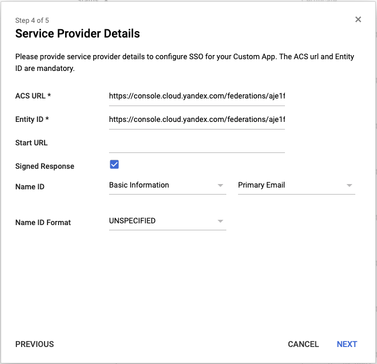
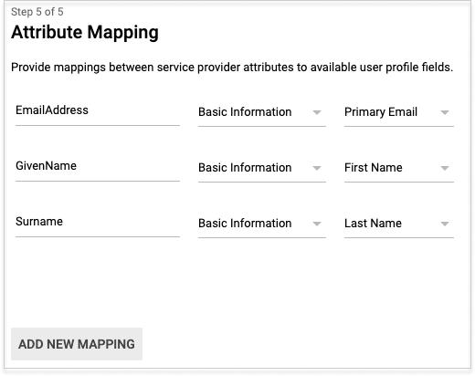

# Authentication using Google Workspace

If you have an [identity federation](../../add-federation.md) you can use [Google Workspace](https://workspace.google.com/) to authenticate in the cloud.

To set up authentication:

1. [Begin creating an SAML app](#configure-sso-gworkspace-start).
1. [Create a federation in your organization](#create-federation).
1. [Add certificates to the federation](#add-certificate).
1. [Get a console login link](#get-link).
1. [Complete your SAML app](#configure-sso-gworkspace-finish).
1. [Add users to your organization](#add-users).
1. [Test the authentication process](#test-auth).

## Before you start {#before-you-begin}

To be able to use the instructions in this section, you will need an activated domain for which you will configure the SAML application in Google Workspace.

## Start creating an SAML app {#configure-sso-gworkspace-start}

Before you create a federation in your organization, you need to get information about the Identity Provider (IdP), which is the SAML application in Google Workspace:

1. Open [Google Workspace Admin Console](https://admin.google.com/).
1. Click the **Apps** icon.
1. Click on the **SAML apps** card.
1. Click the add app button (the **+** icon in the lower-right corner of the page).
1. At the bottom of the window that opens, click **Set up my own custom app**.
1. The **Google IdP Information** page shows the IdP server data. Don't close this window: you need this data to [create an identity federation](#create-federation) and [add a certificate](#add-certificate).

## Create a federation in your organization {#create-federation}



- Management console
  1. Go to [{{org-full-name}}]({{link-org-main}}).
  1. In the left panel, select the [Federations]({{link-org-federations}})  section.
  1. Click **Create federation**.
  1. Enter a name for the federation. The name must be unique within the folder.
  1. Add a description if necessary.
  1. In the **Cookie lifetime** field, specify the time before the browser asks the user to re-authenticate.
  1. In the **IdP Issuer** field, enter the link from the **Object ID** field on the Google Workspace **Google IdP information** page. This is a link in the format:

      ```
      https://accounts.google.com/o/saml2?idpid=<SAML app ID>
      ```
  1. In the **Link tothe IdP login page** field, enter the link from the **SSO URL** field on the Google Workspace **Google IdP information** page. This is a link in the format:

      ```
      https://accounts.google.com/o/saml2/idp?idpid=<SAML app ID>
      ```
  1. Enable **Automatically create users** to add authenticated users to your organization automatically. If you don't enable this option, you will need to [add manually](../../add-account.md#add-user-sso) your federated users.

- CLI

    

    

    1. See the description of the create federation command:

        ```
        yc organization-manager federation saml create --help
        ```

    1. Create a federation:

        ```
        yc organization-manager federation saml create --name my-federation \
            --auto-create-account-on-login \
            --cookie-max-age 12h \
            --issuer "https://accounts.google.com/o/saml2?idpid=C03xolm0y" \
            --sso-binding POST \
            --sso-url "https://accounts.google.com/o/saml2/idp?idpid=C03xolm0y"
        ```

        Where:

        * `name`: Federation name. The name must be unique within the folder.

        * `auto-create-account-on-login`: Flag for automatically creating new users in the cloud after authenticating on the IdP server. This option simplifies user setup but users created this way are only assigned the ` resource-manager.clouds.member`  role by default and they are not able to do anything with cloud resources. Exceptions are the resources that the `allUsers` or `allAuthenticatedUsers` system group roles are assigned to.

            If this option is disabled, users who aren't added to the cloud can't log in to the management console, even if they authenticate with your server. This enables you to manage a white list of users allowed to use{{ yandex-cloud }} resources.

        * `cookie-max-age`: Time before the browser asks the user to re-authenticate.

        * `issuer`: IdP server ID to be used for authentication.

            Use this as the destination when you copy the link from the **Object ID** on the Google Workspace **Google IdP information** page. This is a link in the format:

            ```
            https://accounts.google.com/o/saml2?idpid=<SAML app ID>
            ```

        * `sso-url`: URL of the page that the browser redirects the user to for authentication.

            Use this as the destination when copying the link from the **SSO URL** field on the Google Workspace  **Google IdP information** page. This is a link in the format:

            ```
            https://accounts.google.com/o/saml2/idp?idpid=<SAML app ID>
            ```

        * `sso-binding`: Specify the Single Sign-on binding type. Most Identity Providers support the `POST` binding type.

- API

    1. [Get the ID of the folder](../../../resource-manager/operations/folder/get-id.md) to create your federation in.

    1. Create a file with the request body (for example, `body.json`):

        ```json
        {
          "folderId": "<folder ID>",
          "name": "my-federation",
          "autocreateUsers": true,
          "cookieMaxAge":"43200s",
          "issuer": "https://accounts.google.com/o/saml2?idpid=C03xolm0y",
          "ssoUrl": "https://accounts.google.com/o/saml2/idp?idpid=C03xolm0y",
          "ssoBinding": "POST"
        }
        ```

        Where:

        * `folderId`: ID of the folder.

        * `name`: Federation name. The name must be unique within the folder.

        * `autocreateUsers`: Flag for automatically creating new users in the cloud after authenticating on the IdP server. This option simplifies user setup but users created this way are only assigned the ` resource-manager.clouds.member`  role by default and they are not able to do anything with cloud resources. Exceptions are the resources that the `allUsers` or `allAuthenticatedUsers` system group roles are assigned to.

            If this option is disabled, users who aren't added to the cloud can't log in to the management console, even if they authenticate with your server. This enables you to manage a white list of users allowed to use{{ yandex-cloud }} resources.

        * `cookieMaxAge`: Time before the browser asks the user to re-authenticate.

        * `issuer`: IdP server ID to be used for authentication.

            Use this as the destination when you copy the link from the **Object ID** on the Google Workspace **Google IdP information** page. This is a link in the format:

            ```
            https://accounts.google.com/o/saml2?idpid=<SAML app ID>
            ```

        * `ssoUrl`: URL of the page that the browser redirects the user to for authentication.

            Use this as the destination when copying the link from the **SSO URL** field on the Google Workspace  **Google IdP information** page. This is a link in the format:

            ```
            https://accounts.google.com/o/saml2/idp?idpid=<SAML app ID>
            ```

        * `ssoBinding`: Specify the Single Sign-on binding type. Most Identity Providers support the `POST` binding type.

    1. 



## Specify certificates for the federation {#add-certificate}

When the identity provider (IdP) informs {{org-full-name}} that a user has been authenticated, they sign the message with their certificate. To enable {{org-name}} to verify this certificate, add it to the created federation.



Download the certificate from the open Google Workspace  **Google IdP information** page. Add this certificate to the federation created.

To add a certificate to a federation:



- Management console
  1. Go to [{{org-full-name}}]({{link-org-main}}).
  1. In the left panel, select the [Federations]({{link-org-federations}})  section.
  1. Click the name of the federation to add a certificate to.
  1. At the bottom of the page, click **Add certificate**.
  1. Enter the certificate's name and description.
  1. Choose how to add the certificate:
      * To add a certificate as a file, click **Choose a file** and specify the path to it.
      * To paste the contents of a copied certificate, select the **Text** method and paste the contents.
  1. Click **Add**.

- CLI

  

  

  1. View a description of the add certificate command:

      ```
      yc organization-manager federation saml certificate create --help
      ```

  1. Add a federation certificate by specifying the certificate file path:

      ```
      yc organization-manager federation saml certificate create --federation-name my-federation \
        --name "my-certificate" \
        --certificate-file test.pem
      ```

- API

  To add the certificate, use the [create](../../../organization/api-ref/grpc/certificate_service.md#Create) method for the [Certificate](../../../organization/api-ref/grpc/certificate_service.md) resource:

  1. Create a request body by specifying the contents of the certificate's `data` property:

      ```json
      {
        "federationId": "<federation ID>",
        "name": "my-certificate",
        "data": "MII...=="
      }
      ```

  2. Send the add certificate request:

      ```bash
      $ export IAM_TOKEN=CggaATEVAgA...
      $ curl -X POST \
          -H "Content-Type: application/json" \
          -H "Authorization: Bearer ${IAM_TOKEN}" \
          -d '@body.json' \
          "https://organization-manager.api.cloud.yandex.net/organization-manager/v1/saml/certificates"
      ```



## Get a console login link {#get-link}

When you set up federation authentication, users can log in to the management console from a link containing the federation ID. You must specify the same link when configuring the authentication server.

Obtain and save this link:

1. Get the federation ID:
    1. Go to [{{org-full-name}}]({{link-org-main}}).
    1. In the left panel, select the [Federations]({{link-org-federations}})  section.
    1. Copy the ID of the federation you're configuring access for.

2. Generate a link using this ID:

    `https://console.cloud.yandex.com/federations/<federation ID>`

## Complete creating your SAML app {#configure-sso-gworkspace-finish}

Once you have created a federation and received a link to log in to the console, complete the creation of the SAML application in Google Workspace:

1. Re-open the SAML app creation window and click **Next**.

1. Enter a name for your SAML app, like <q>yandex-cloud-federation</q>. Add a description and upload a logo if necessary. Click **Next**.

1. Enter information about {{ yandex-cloud }}  that is acting as your service provider:

    * In the **ACS URL** and **Entity ID** fields, enter the previously obtained [console login link](#get-link).

    * Enable **Signed Response**.

    * In the **Name ID** field, specify what the server will return as Name ID (the unique ID of the identity federation user).

        Select **Basic Information** and **Primary Email** next to it.

    * The other fields are optional, so you can skip them and click **Next**.

    

1. For a user to be able to contact {{ yandex-cloud }} technical support from the [management console](https://console.cloud.yandex.com/support), click **Add new mappings** and configure the server to transmit the user's email address. We also recommend that it passes the user's first and last name. User attributes supported by {{ org-full-name }} services, are listed in  [{#T}](#claims-mapping). Then click **Finish**.

    

1. On the next page, you can check the data entered for your SAML app.

1. Enable your SAML app by clicking **Edit service**.

1. In the page that opens, select who can authenticate with this identity federation:
    * To enable access for all federation users, select **ON for everyone**.
    * To enable access for an individual organizational unit, select the unit from the list on the left and configure the service status for this unit. The child units inherit access settings from the parent units by default.

### Mapping attributes {#claims-mapping}

For the types of personal data supported by {{ org-full-name }} for Google Workspace, see below.

| User data | Comments | Application Attributes |
| ------------------- | ----------- | ------------------- |
| Unique user ID | Required attribute. Using an email address is recommended. | **Name ID** field in service provider settings |
| Last name | Displayed in {{yandex-cloud}} services. | `http://schemas.xmlsoap.org/ws/2005/05/identity/claims/surname` |
| Name | Displayed in {{yandex-cloud}} services. | `http://schemas.xmlsoap.org/ws/2005/05/identity/claims/givenname` |
| Full name | Displayed in {{yandex-cloud}} services.<br>Example: Ivan Ivanov | Attribute unavailable |
| Mail | Used to send notifications from {{yandex-cloud}} services.<br>Example:&nbsp;`ivanov@example.com` | `http://schemas.xmlsoap.org/ws/2005/05/identity/claims/emailaddress` |
| Phone | Used to send notifications from {{yandex-cloud}} services.<br>Example: +71234567890 | `http://schemas.xmlsoap.org/ws/2005/05/identity/claims/mobilephone` |
| Profile image | Displayed in {{yandex-cloud}} services. | Attribute unavailable |

> Attribute mapping example:
>
> 



## Add users to your organization {#add-users}

If you did not enable the **Automatically create users** option when creating a federation, federated users must be manually added to your organization.

To do this, you need to know the Name IDs of the users that the Identity Provider Server (IdP) returns along with the successful authentication confirmation. This is usually the user's primary email address. If you don't know what the server returns as the Name ID, contact the administrator who configured authentication for your federation.

To add federation users to an organization:



- Management console
  1. [Log in]({{link-passport}}) to the organization's administrator account.
  1. Go to [{{org-full-name}}]({{link-org-main}}).
  1. Go to the left panel and select [Users]({{link-org-users}}) .
  1. In the upper-right corner, click on the arrow next to the **Add user** button. Select **Add federated users**.
  1. Select the identity federation to add users from.
  1. List the Name IDs of users, separating them with line breaks.
  1. Click **Add**. This will give the users access to the organization.

- CLI

  

  

  1. View a description of the add user command:

      ```
      yc organization-manager federation saml add-user-accounts --help
      ```

  1. Add users by listing their Name IDs separated by a comma:

      ```
      yc organization-manager federation saml add-user-accounts --name my-federation \
        --name-ids=alice@example.com,bob@example.com,charlie@example.com
      ```

- API

  To add identity federation users to the cloud:

  1. Create a file with the request body (for example, `body.json`). In the request body, specify the array of Name IDs of users you want to add:

      ```json
      {
        "nameIds": [
          "alice@example.com",
          "bob@example.com",
          "charlie@example.com"
        ]
      }
      ```

  1. Send the request by specifying the Federation ID in the parameters:

      ```bash
      $ curl -X POST \
        -H "Content-Type: application/json" \
        -H "Authorization: Bearer <IAM token>" \
        -d '@body.json' \
        https://organization-manager.api.cloud.yandex.net/organization-manager/v1/saml/federations/<federation ID>:addUserAccounts
      ```



## Test the authentication process {#test-auth}

When you finish configuring the server, you can test that everything is up and running:

1. Open the browser in guest or incognito mode to protect your work done in the console from your Yandex account.
1. Follow the [console login link](#get-link) obtained earlier. The browser forwards you to the Google authentication page.
1. Enter your authentication data. By default, enter your UPN and password. After that, click **Sign in**.
1. If the authentication is successful, the server redirects you back to the console login link and then to the management console home page. In the upper-right corner, you can see that you are logged in to the console as a federated user.

#### What's next {#what-is-next}

* [Assign roles to the new users](../../../iam/operations/roles/grant.md#access-to-federated-user).

