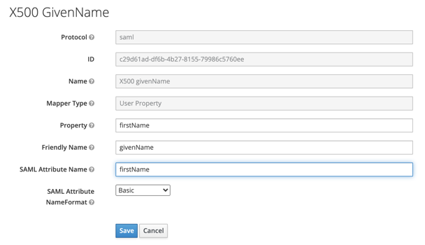

# Authentication using Keycloak

With an [identity federation](../../add-federation.md), you can use [Keycloak](https://www.keycloak.org/) to authenticate users in an organization.

Setting up authentication includes the following steps:

1. [Creating and setting up a federation in {{org-full-name}}](#yc-settings).

1. [Creating and setting up a SAML application in Keycloak](#keycloak-settings).

1. [Adding users to {{org-full-name}}](#add-users).

1. [Authentication](#test-auth).

## Before you start {#before-you-begin}

To use the instructions in this section, you will need:​

1. Docker platform. If you don't have Docker installed, [install it](https://docs.docker.com/get-docker/). Make sure the Docker Engine is running.

1. [Keycloak](https://www.keycloak.org/) local IdP server. To install Keycloak, run the commands:
   ```bash
   git clone https://github.com/keycloak/keycloak-containers.git
   cd ./keycloak-containers/docker-compose-examples
   docker-compose -f keycloak-postgres.yml up
   ```

1. A valid certificate that is used for signing in the Keycloak service. To get it:

   1. Follow the link: [http://localhost:8080/auth/realms/master/protocol/saml/descriptor](http://localhost:8080/auth/realms/master/protocol/saml/descriptor).

   1. Copy the contents of the tag `<ds:X509Certificate>...</ds:X509Certificate>`.

   1. Save the certificate as a text file with the `.cer` extension in the following format:

   ```
   -----BEGIN CERTIFICATE-----
   <X509Certificate value>
   -----END CERTIFICATE-----
   ```



To enable employees on a corporate network or the internet to use Keycloak for authentication in your application, deploy the Keycloak IdP server on the network and set up a public address. Read more in the [Keycloak documentation](https://www.keycloak.org/server/hostname).



## Creating and setting up a federation in {{org-full-name}} {#yc-settings}

### Create a federation {#create-federation}



- Management console

   1. Go to [{{org-full-name}}]({{link-org-main}}).

   1. In the left panel, select [Federations]({{link-org-federations}}) .

   1. Click **Create federation**.

   1. Enter a name for the federation. The name must be unique within the folder.

   1. Add a description if necessary.

   1. In the **Cookie lifetime** field, specify the period of time that must elapse before the browser asks the user to re-authenticate.

   1. In the **IdP Issuer** field, enter a link like `http://<host>:8080/auth/realms/master`

      If you set up a [public address](https://www.keycloak.org/server/hostname) for the IdP server, specify its URL. For example:

      ```
      http://keycloak.example.com:8080/auth/realms/master
      ```

   1. In the **Link to the IdP login page** field, enter a link in `http://<host>:8080/auth/realms/master/protocol/saml` format.

      If you set up a [public address](https://www.keycloak.org/server/hostname) for the IdP server, specify its URL. For example:

      ```
      http://keycloak.example.com:8080/auth/realms/master/protocol/saml
      ```

   1. Enable **Automatically create users** to add authenticated users to your organization automatically. If this option is disabled, you will need to [manually add](../../add-account.md#add-user-sso).

   1. To make sure that all authentication requests from {{ yandex-cloud}} contain a digital signature, enable the **Sign authentication requests** option. To complete the configuration, download and [install](#signature) a {{ yandex-cloud }} certificate. You can download the certificate in the **Sign authentication requests** field immediately after creating a federation.

   1. Click **Create federation**.

- CLI

   

   

   1. See the description of the create federation command:

      ```
      yc organization-manager federation saml create --help
      ```

   1. Create a federation:

      ```bash
       yc organization-manager federation saml create --name my-federation \
           --organization-id <organization ID> \
           --auto-create-account-on-login \
           --encrypted-assertions \
           --cookie-max-age 12h \
           --issuer "http://<host>:8080/auth/realms/master" \
           --sso-binding POST \
           --sso-url "http://<host>:8080/auth/realms/master/protocol/saml"       
      ```

      Where:

      * `name`: Federation name. The name must be unique within the folder.

      * `organization-id`: Your organization ID.

      * `auto-create-account-on-login`: A flag to enable the automatic creation of new cloud users following authentication on the IdP server.
         
         This option makes it easier to create users, but users created this way won't be able to do anything with cloud resources. Exceptions are the resources that the `allUsers` or `allAuthenticatedUsers` [system group](../../../iam/concepts/access-control/system-group.md) roles are assigned to.

         If this option is disabled, users who aren't added to the organization can't log in to the management console, even if they authenticate with your IdP server. In this case, you can manage a list of users allowed to use {{ yandex-cloud }} resources.

      * `encrypted-assertions`: A flag that enables a digital signature for authentication requests. To complete the configuration, download and [install](#signature) a {{ yandex-cloud }} certificate.

      * `cookie-max-age`: Time that must elapse before the browser asks the user to re-authenticate.

      * `issuer`: ID for the IdP server to perform authentication on: `http://<host>:8080/auth/realms/master`

         If you set up a [public address](https://www.keycloak.org/server/hostname) for the IdP server, specify its URL. For example:

         ```
         http://keycloak.example.com:8080/auth/realms/master
         ```

      * `sso-url`: URL of the page that the browser redirects the user to for authentication: `http://<host>:8080/auth/realms/master/protocol/saml`

         If you set up a [public address](https://www.keycloak.org/server/hostname) for the IdP server, specify its URL. For example:

         ```
         http://keycloak.example.com:8080/auth/realms/master/protocol/saml
         ```

      * `sso-binding`: Specify the Single Sign-on binding type. Most Identity Providers support the `POST` binding type.

- API

   1. [Get the ID of the folder](../../../resource-manager/operations/folder/get-id.md) to create a federation in.

   1. Create a file with the request body (for example, `body.json`).

      ```json
      {
         "folderId": "<folder ID>",
         "name": "my-federation",
         "organizationId": "<organization ID>",
         "autoCreateAccountOnLogin": true,
         "cookieMaxAge":"43200s",
         "issuer": "http://<host>:8080/auth/realms/master",
         "ssoUrl": "http://<host>:8080/auth/realms/master/protocol/saml",
         "securitySettings": {
             "encryptedAssertions": true
             },
         "ssoBinding": "POST"
       }       
      ```
      Where:

      * `folderId`: ID of the folder.

      * `name`: Federation name. The name must be unique within the folder.

      * `organizationId`: Organization ID.

      * `autoCreateAccountOnLogin`: A flag to activate the automatic creation of new cloud users after authenticating on the IdP server.
         This option makes it easier to create users, but users created this way won't be able to do anything with cloud resources. Exceptions are the resources that the `allUsers` or `allAuthenticatedUsers` [system group](../../../iam/concepts/access-control/system-group.md) roles are assigned to.

         If this option is disabled, users who aren't added to the organization can't log in to the management console, even if they authenticate with your IdP server. In this case, you can manage a list of users allowed to use {{ yandex-cloud }} resources.

      * `cookieMaxAge`: Time that must elapse before the browser asks the user to re-authenticate.

      * `issuer`: ID for the IdP server to perform authentication on: `http://<host>:8080/auth/realms/master`

         If you set up a [public address](https://www.keycloak.org/server/hostname) for the IdP server, specify its URL. For example:

         ```
         http://keycloak.example.com:8080/auth/realms/master
         ```

      * `ssoUrl`: URL of the page that the browser redirects the user to for authentication: `http://<host>:8080/auth/realms/master/protocol/saml`

         If you set up a [public address](https://www.keycloak.org/server/hostname) for the IdP server, specify its URL. For example:

         ```
         http://keycloak.example.com:8080/auth/realms/master/protocol/saml
         ```

      * `encryptedAssertions`: A flag that enables a digital signature for authentication requests. To complete the configuration, download and [install](#signature) a {{ yandex-cloud }} certificate.

      * `ssoBinding`: Specify the Single Sign-on binding type. Most Identity Providers support the `POST` binding type.

   1. 

- {{ TF }}

   If you don't have {{ TF }}, [install it and configure the {{ yandex-cloud }} provider](../../../tutorials/infrastructure-management/terraform-quickstart.md#install-terraform).

   1. Specify the federation parameters in the configuration file:

      * `name`: Federation name. The name must be unique within the folder.
      * `description`: Federation description.
      * `organization_id`: Organization ID.
      * `labels`: A set of key/value label pairs assigned to the federation.
      * `issuer`: ID for the IdP server to perform authentication on: `http://<host>:8080/auth/realms/master`

         If you set up a [public address](https://www.keycloak.org/server/hostname) for the IdP server, specify its ID. For example:

         ```
         http://keycloak.example.com:8080/auth/realms/master
         ```

      * `sso_binding`: Specify the Single Sign-on binding type. Most Identity Providers support the `POST` binding type.
      * `sso_url`: URL of the page that the browser redirects the user to for authentication: `http://<host>:8080/auth/realms/master/protocol/saml`

         If you set up a [public address](https://www.keycloak.org/server/hostname) for the IdP server, specify its URL. For example:

         ```
         http://keycloak.example.com:8080/auth/realms/master/protocol/saml
         ```


      * `cookie_max_age`: Time, in seconds, before the browser asks the user to re-authenticate. The default value is `8 hours`.
      * `auto_create_account_on_login`: A flag to activate the automatic creation of new cloud users after authenticating on the IdP server.
         This option makes it easier to create users, but users created this way won't be able to do anything with cloud resources. Exceptions are the resources that the `allUsers` or `allAuthenticatedUsers` [system group](../../../iam/concepts/access-control/system-group.md) roles are assigned to.

         If this option is disabled, users who aren't added to the organization can't log in to the management console, even if they authenticate with your server. In this case, you can manage a list of users allowed to use {{ yandex-cloud }} resources.
      * `case_insensitive_name_ids`: A flag that indicates if usernames are case-insensitive.
         If the option is enabled, the IDs of federated users' names are case-insensitive.
      * `security_settings`: Federation security settings:
         * `encrypted_assertions`: Sign authentication requests.
            If this option is enabled, all authentication requests from {{yandex-cloud}} will have a digital signature. You need to download and install a {{yandex-cloud}} certificate.

      Example configuration file structure:

      ```
      resource "yandex_organizationmanager_saml_federation" federation {
       name            = "my-federation"
       organization_id = "<organization ID>"
       auto_create_account_on_login = "true"
       issuer          = "http://<host>:8080/auth/realms/master"      
       sso_url         = "http://<host>:8080/auth/realms/master/protocol/saml"
       sso_binding     = "POST"
       security_settings {
          encrypted_assertions = "true"
          }
      }
      ```

   1. Make sure that the configuration files are correct.

      1. In the command line, go to the directory where you created the configuration file.
      1. Run the check using the command:

         ```
         $ terraform plan
         ```

      If the configuration is described correctly, the terminal displays the federation parameters. If there are errors in the configuration, {{ TF }} points them out.

   1. Create a federation.

      1. If the configuration doesn't contain any errors, run the command:

         ```
         $ terraform apply
         ```

      1. Confirm that you want to create the federation.

      This creates the federation in the specified organization. You can check that the federation is there and its settings are correct in the organization's [Federations]({{link-org-federations}}) section.



### Add certificates {#add-certificate}

While authenticating, the {{org-name}} service should be able to verify the IdP server certificate. To enable this, add the certificate to the federation:



- Management console

   1. In the left panel, select [Federations]({{link-org-federations}}) .

   1. Click the name of the federation to add a certificate to.

   1. At the bottom of the page, click **Add certificate**.

   1. Enter the certificate's name and description.

   1. Choose how to add the certificate:

      * To add a certificate as a file, click **Choose a file** and specify the path to it.

      * To paste the contents of a copied certificate, select the **Text** method and paste the contents.

   1. Click **Add**.

- CLI

   

   

   1. View a description of the add certificate command:

      ```
      yc organization-manager federation saml certificate create --help
      ```

   1. Add a federation certificate by specifying the certificate file path:

      ```
      yc organization-manager federation saml certificate create \
        --federation-id <federation ID> \
        --name "my-certificate" \
        --certificate-file certificate.cer
      ```

- API

   Use the [create](../../api-ref/Certificate/create.md) method for the [Certificate](../../api-ref/Certificate/index.md) resource:
   1. Generate the request body. In the `data` property, specify the contents of the certificate:

      ```json
      {
        "federationId": "<federation ID>",
        "name": "my-certificate",
        "data": "-----BEGIN CERTIFICATE..."
      }
      ```

   1. Send the add certificate request:

      ```bash
      $ export IAM_TOKEN=CggaATEVAgA...
      $ curl -X POST \
          -H "Content-Type: application/json" \
          -H "Authorization: Bearer ${IAM_TOKEN}" \
          -d '@body.json' \
          "https://organization-manager.{{ api-host }}/organization-manager/v1/saml/certificates"
      ```





To ensure that authentication isn't interrupted when the certificate expires, we recommend adding several certificates to the federation: the current one and the ones that will be used after. If a certificate turns out to be invalid, {{ yandex-cloud }} will attempt to verify the signature with another certificate.



### Get a console login link {#get-link}

When you set up federation authentication, users can log in to the management console from a link containing the federation ID.

Get the link:

1. Copy the Federation ID:

   1. In the left panel, select [Federations]({{link-org-federations}}) .

   1. Copy the ID of the federation you're configuring access for.

1. Generate a link using this ID:

   `{{ link-console-main }}/federations/<federation ID>`

## Creating and setting up a SAML application in Keycloak {#keycloak-settings}

A SAML application in Keycloak acts as an identity provider (IdP). To create and set up a SAML application:

1. Log in to the [Keycloak administrator account](http://localhost:8080/auth/admin). To do this, specify:
   * **User name or email** : `admin`.
   * **Password** : `pa55w0rd`.

1. Create a SAML application:

   1. In the left panel, select **Clients**. Click **Create**.

   1. In the **Client ID** field, enter the [console login link](#get-link) obtained earlier.

   1. In the **Client Protocol** field, select **saml**.

   1. Click **Save**.

1. Set up the SAML application parameters in the **Settings** tab:

   1. Enter the previously obtained [console login link](#get-link) in the fields:
      * **Valid Redirect URIs**;
      * **Base URL**;
      * **IDP Initiated SSO Relay State**.

   1. Enable the options:
      * **Include AuthnStatement**;
      * **Sign Assertions**;
      * **Force POST Binding**;
      * **Front Channel Logout**.

   1. In the **Signature Algorithm** field, select **RSA_SHA256**.

   1. In the **SAML Signature Key Name** field, select **CERT_SUBJECT**.

   1. Select the desired format from the list in the **Name ID Format** field. To make sure this format is passed regardless of the {{org-full-name}} settings, enable the **Force Name ID format** option.

   1. Click **Save**.

1. If, when [creating a federation](#create-federation) in {{org-full-name}}, you enabled the **Sign authentication requests** option, set up verifying a digital signature in the SAML application:

   1. In the SAML application settings, select **Encrypt Assertions** and **Client Signature Required** and save the application to update the available tabs.

   1. In the SAML application's **Keys** tab, the **Signing Key** section, click **Import**.

   1. In the **Archive Format** field, select **Certificate PEM**.
      {#signature}
   1. Click **Select file** and select the certificate to be used for signing authentication requests. The certificate is available on the {{org-full-name}} federation information page in the **Sign authentication requests** field.

   1. Click **Import**.

1. Add users:

   1. In the left panel, select **Users**.

   1. Click **Add user** and specify user data.

   1. Click **Save**.

   1. In the **Credentials** tab, enter a password and click **Set Password**.

## Adding users to {{org-full-name}} {#add-users}

If you did not enable the **Automatically create users** option when [creating a federation](#yc-settings), federated users must be manually added to your organization.

To do this, you will need user Name IDs. They are returned by the IdP server along with a response confirming successful authentication.



- Management console

   1. [Log in]({{link-passport}}) to the organization's administrator account.

   1. Go to [{{org-full-name}}]({{link-org-main}}).

   1. In the left panel, select [Users]({{link-org-users}}) .

   1. In the upper-right corner, click on the arrow next to the **Add user** button. Select **Add federated users**.

   1. Select the identity federation to add users from.

   1. List the Name IDs of users, separating them with line breaks.

   1. Click **Add**. This will give the users access to the organization.

- CLI

   

   

   1. View a description of the add user command:

      ```
      yc organization-manager federation saml add-user-accounts --help
      ```

   1. Add users by listing their Name IDs separated by a comma:

      ```
      yc organization-manager federation saml add-user-accounts --id <federation ID> \
        --name-ids=alice@example.com,bob@example.com,charlie@example.com
      ```

      Where:

      * `id`: Federation ID.

      * `name-ids`: User's Name IDs.

- API

   To add identity federation users to the cloud:

   1. Create a file with the request body (for example, `body.json`). In the request body, specify the array of Name IDs of users you want to add:

      ```json
      {
        "nameIds": [
          "alice@example.com",
          "bob@example.com",
          "charlie@example.com"
        ]
      }
      ```
   1. Send the request by specifying the Federation ID in the parameters:

      ```bash
      $ curl -X POST \
        -H "Content-Type: application/json" \
        -H "Authorization: Bearer <IAM token>" \
        -d '@body.json' \
        https://organization-manager.{{ api-host }}/organization-manager/v1/saml/federations/<federation ID>:addUserAccounts
      ```



### Setting up user attribute mappings {#claims-mapping}

Following user authentication, the IdP server will send an SAML message to {{ yandex-cloud }} containing:

* Information about successful authentication.

* User attributes such as a list of roles, the user's first and last names, and email address.

You can set up a mapping between the SAML message attributes and the personal data stored on the IdP server. To do this:

1. Enable the option for mapping the identity provider roles and {{org-full-name}}:

   1. In the left panel, select **Client Scopes** → **role_list**.

   1. Go to the **Mappers** tab and select **role list**.

   1. Enable the **Single Role Attribute** option.

1. Set up the attributes to be passed to {{ yandex-cloud }}:

   1. In the left panel, select **Clients** and open your SAML application's settings.

   1. In the **Mappers** tab, click **Add Builtins**.

   1. Select the desired attributes in the list and click **Add selected**. The following user attributes are available in Keycloak by default:
      * `X500 email`: Email address.
      * `X500 surname`: Last name.
      * `X500 givenName`: First name.
      * `role list`: List of roles.

   1. You can create additional user attributes such as a phone number. To do this, click **Create**, select **User Attribute** in the **Mapper Type** field, and set attribute parameters.

   1. Sync Keycloak attributes and {{ org-full-name }}: open an attribute and edit the **SAML Attribute Name** value.  The **SAML Attribute Name** values supported in {{ org-full-name }} are given below.

1. If you created additional attributes, add them to user parameters:

   1. In the left panel, select **Users**, open the user parameters, and go to the **Attributes** tab.

   1. In the **Key** field, enter the **Name** given to the additional attribute.

   1. In the **Value** field, enter the user data to be passed in the attribute.

   1. Click **Add** and then click **Save**.

| User data | Comment | SAML Attribute Name |
------------------- | ----------- | -------------------
| Email | Used to send notifications from {{yandex-cloud}} services.<br>Example: `smith@example.com` | `email` |
| Last name | Displayed in {{ yandex-cloud }} services. | `lastName` |
| Name | Displayed in {{ yandex-cloud }} services. | `firstName` |
| Phone | Used to send notifications from {{yandex-cloud}} services.<br>Example: +71234567890+972571234567 | `phone` |

> Attribute mapping example:
>
> 

## Authentication {#test-auth}

When you finish setting up SSO, test that everything works properly:

1. Open your browser in guest or private browsing mode.

1. Follow the [console login link](#yc-settings) obtained earlier. The browser forwards you to the Keycloak authentication page.

1. Enter your credentials and click **Sign in**.

If the authentication is successful, the IdP server redirects you back to the console login link and then to the [management console]({{ link-console-main }}) home page. In the upper-right corner, you can see that you are logged in to the console as a federated user.
