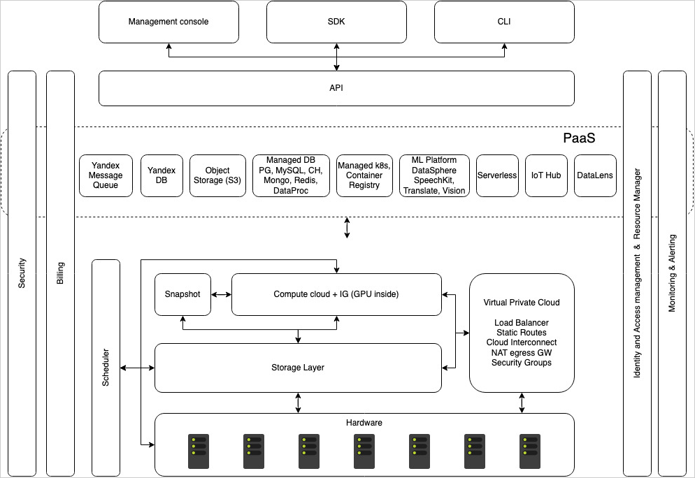
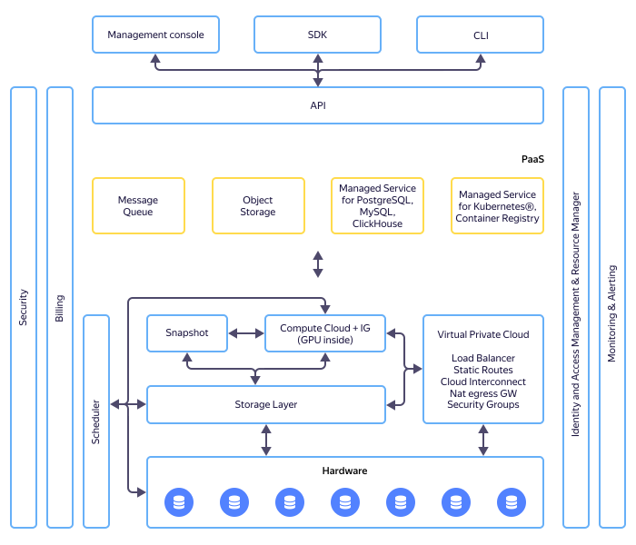

# Platform architecture {{ yandex-cloud }}

{{ yandex-cloud }} is natively designed to provide a single pool of unified hardware resources. {{ yandex-cloud }} has no dedicated physical management servers, and many platform services are deployed on virtual machines similar to end-user VMs.

This approach ensures easy scalability of the platform: at minimal cost, you can automatically add infrastructure capacity ranging from a single server to an entire data center running thousands of machines.

The {{ yandex-cloud }} architecture looks like this:









The Storage Layer is at the core of {{ yandex-cloud }}. This enables storage of data and system information for all services. The Storage Layer uses the Yandex native DBMS {{ ydb-full-name }}: it provides for the secure and efficient storage of data, accommodates heavy data loads, and horizontal scaling as grows {{ yandex-cloud }}. The dedicated replication mechanism of {{ ydb-short-name }} covers all the hardware storage capacities used by {{ yandex-cloud }}.

{{ compute-full-name }} is built on top of the storage. It allows you to manage virtual machines used both by external users and internal platform components. KVM functions as the hypervisor, with QEMU as the emulator. VirtIO drivers are used for device [virtualization](../glossary/virtualization)virtualization. Scheduler is an important component to enable hardware infrastructure allocation for your VMs. This is what determines which physical server to deploy a VM on.

This layer also includes other [Infrastructure]({{ link-cloud-services-infrastructure }}) services.

The next level includes platform services (Platform as a Service, PaaS). These include Data Storage & Analytics, Machine Learning & Artificial Intelligence (such as {{ speechkit-full-name }} and {{ translate-full-name }})Containers, and other.

By using {{ iam-name }} ({{ iam-short-name }}) and {{ resmgr-name }}, you can enable role-based access control for your resources: each user gets a role that permits certain operations. For example, the {{ roles-editor }} role allows the user to create, delete, and edit resources, but disables resource access control.