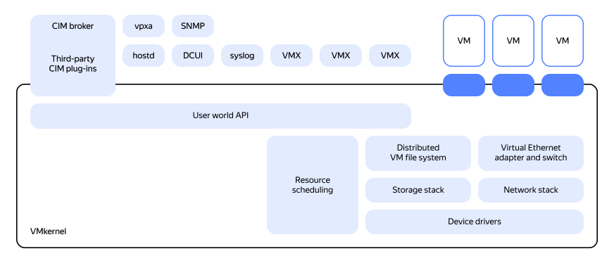

# Computing infrastructure

## Hypervisor types {#hypervisors-types}

The first x86 hypervisors were services inside a host OS. However, this caused both performance and high availability issues, as such services are very hard to cluster in these conditions.

As a result, one had to classify hypervisor types, defining the scope of application for each.

### VMware ESXi {#vmware-esxi}

VMware ESXi is a 1+ hypervisor that does not require a general purpose OS. The hypervisor itself is a monolith that manages both computing resource distribution and I/O operations. The [protection ring 0](https://en.wikipedia.org/wiki/Protection_ring) contains a microkernel on top of which all managing structures work.

In terms of its architecture, management commands are run via an API agent that operates on top of VMkernel. There is no direct access to the hypervisor, which benefits this type of hypervisor from the security perspective.

On the downside, you need to maintain its compatibility with the server hardware. Device drivers are rotated from version to version to ensure the platform is thin enough and not too complex, making the physical infrastructure dependent on the hardware compatibility list (HCL).

### {{ yandex-cloud }} hypervisor: QEMU/KVM {#yc-qemu}

Just as VMware ESXi, {{ yandex-cloud }} hypervisor, QEMU/KVM, belongs to the 1+ type.

_QEMU (Quick EMUlator)_ is general-purpose software for emulating hardware of various platforms, distributed under the GPL v2 license. In addition to Intel x86, it supports other CPU architectures.

With the versatility of a fully virtualized platform, QEMU lacked performance comparable to a non-virtualized system. This is why we added Qumranet's KVM (kernel-based virtual machine) to accelerate QEMU on x86. QEMU/KVM has the qcow2 (QEMU copy-on-write 2) virtual disk format for all platforms, as well as convenient management of synthetic devices.

## Hypervisor features: CPU overcommitment {#specificity}

_CPU overcommitment_ refers to the ratio of physical host cores to vCPUs allocated on a hypervisor.

_vCPU_ is a virtual CPU that cuts off the hypervisor from the physical CPU when creating virtual machines. A vCPU contains at least one core. The number of vCPUs determines the number of threads a multithreaded app can use.

The hypervisor's job is to distribute resources (time) between physical and virtual CPUs.

### CPU overcommitment {#oversubscription-by-cores}

#|
|| **VMware Cloud Director** | **{{ yandex-cloud }}** ||
|| VMware vSphere allows very flexible management of overcommitment both within an ESXi cluster and within a single physical core through the `MaxVCPUsPerCore` and `MaxVCPUsPerCluster` settings. This is done by the cloud administrator at the vSphere level. Generally, service providers plan for target and acceptable overcommitment. This approach maximizes VM placement density, while the scheduler ensures optimal performance.

It is important to consider workload requirements to the virtualization platform, since there are applications that do not allow vCPU overcommitment. Those that do have certain requirements for the acceptable ratio of allocated cores to physical ones in a virtualized environment.

For example, virtually all enterprise database systems require 1:1 overcommitment, while terminal solutions, such as VMware Horizon or Microsoft RDS, may allow 1:10.
| {{ yandex-cloud }} allows you to manage vCPU overcommitment for VM configurations with as many as 4 cores. By default, VMs are set to the recommended 1:1 overcommitment for production workloads.

The number of vCPUs for a VM is a multiple of two, and each pair of vCPUs is mapped into two SMT threads within one physical core, which prevents Spectre/Meltdown attacks from another customer's VM.

For more information, see the relevant [documentation](../../../compute/concepts/performance-levels.md). ||
|#

### Memory overcommitment {#oversubscription-by-memory}

#|
|| **VMware Cloud Director** | **{{ yandex-cloud }}** ||
|| VMware uses a complex system of memory allocation, where _Limit_ is the maximum memory size, _Reservation_ is the minimum threshold of allocated memory, and _Shares_ is the share of total host resources allocated to a virtual machine.

VMware uses memory ballooning, a tool that optimizes virtual machines with RAM. This hypervisor memory management technique allows an ESX host to run virtual machines whose total allocated memory is greater than the total memory of the host. This means the actual allocated memory on the hypervisor and in VMware clouds can be overcommited and set dynamically based on the configuration. For more details, see [this VMware guide](https://docs.vmware.com/en/VMware-vSphere/7.0/com.vmware.vsphere.hostclient.doc/GUID-49D7217C-DB6C-41A6-86B3-7AFEB8BF575F.html).
| {{ yandex-cloud }} uses a static memory allocation tool without overcommitment and memory ballooning: a virtual machine has access to all its allocated RAM, and it cannot be used by other virtual machines on the same host. Total memory allocated for virtual machines does not exceed the available physical memory on the host. ||
|#

## Live VM migration {#vm-live-migration}

_Live migration_ refers to moving a running virtual machine from one physical server to another without stopping the VM or its services. This reduces the recovery time objective (RTO) to zero for planned downtime and server maintenance and, as a result, minimizes the actual downtime.

#|
|| **VMware Cloud Director** | **{{ yandex-cloud }}** ||
|| Clouds in VMware Cloud Director require the _DRS (Dynamic Resource Scheduler)_ option to be enabled. It allows you to automatically balance VMs across hosts depending on load to reduce resource fragmentation in the cluster and provide a service level for VMs.

Since workloads inside VMs can be sensitive to network packet loss during live migration, such as some IP telephony services, hosting such workloads on allocated hypervisors is recommended for any virtualization or cloud solution.

vSphere vMotion allows you to quickly migrate workloads from one server to another without downtime, and it is not managed by Cloud Director.

Configuring affinity and anti-affinity rules involves live migration across individual hosts, which is convenient in some licensing scenarios. This makes administration more complex, since if a host fails, a VM may not run anywhere, but also prevents its unauthorized migration. In the Cloud Director scenario, this approach is not quite applicable, since a cluster must have DRS (Dynamic Resource Scheduler), which may require manual intervention from service providers.

In other cases, network unavailability during the switchover usually does not exceed 1 or 2 lost packets. This is due to the synthetic network adapter switching to another host's virtual switch.
| {{ compute-name }} uses a live migration feature that allows you to move running [virtual machines](../../../compute/concepts/vm.md) across physical servers without stopping or rebooting them. The downtime usually does not exceed 10 seconds.

Live migration does not change any VM settings. The live migration process moves a running VM from one server to another in the same [availability zone](../../concepts/geo-scope.md). This does not affect any VM properties, including [internal and external IP addresses](../../../vpc/concepts/address.md), [metadata](../../../compute/concepts/vm-metadata.md), memory, [network](../../../vpc/concepts/network.md#network), OSs, or application status.

{{ compute-name }} starts live migration in the following cases:

* Scheduled hardware maintenance and upgrades.

* Unscheduled maintenance in the event of failed hardware, including CPUs, NICs, and power supply units.

* OS, BIOS, and firmware updates.

* OS configuration updates.

* Security updates.

It is highly recommended to host services that are sensitive to packet loss, e.g., IP telephony, on [dedicated hosts](../../../compute/concepts/dedicated-host.md). ||
|#

## NUMA topology {#numa}

_Non-uniform memory access_, or _NUMA_, is a type of architecture with non-uniform access to memory. Within this architecture, each CPU has its own local memory, which is accessed directly and with low latency. Access to the memory of other CPUs is indirect and with higher latency, which leads to reduced performance.

### NUMA topology in VMware ESXi (vNUMA) {#vnuma}

vNUMA allows you to inform the guest OS in a VM of a virtual NUMA topology for machines where the vCPU or vRAM is larger than the NUMA node or the number of virtual sockets is more than one.

The NUMA virtual architecture, which requires virtual hardware version 8 or later, can in some cases provide significant performance benefits for wide virtual machines, i.e., virtual machines with more virtual CPUs than the number of cores in each physical NUMA node. However, such benefits are highly dependent on the level of NUMA optimization in the guest operating system and applications.

Starting with vSphere version 6.5 and later, vNUMA processing is improved to automatically determine the correct vNUMA topology to represent the guest OS based on the underlying ESXi host. In cases where VMs on multiple NUMA nodes have an odd number of cores, the performance of the guest service drops sharply, and it is hard for the hypervisor scheduler to manage CPU resources.

In addition, it is important to note that vNUMA is not applicable to VMs with the vCPU Hot Add option enabled, and in situations where VM resources extend beyond a single NUMA node. In these situations, there may be performance issues with the guest OS, negatively impacting neighboring VMs.

Below, you can see a table of virtual machine configurations for a dual socket server with 10 physical vCPUs per socket:

| Physical CPU | Number of vCPUs | Memory size, less than or equal to | Number of sockets | vCPUs per socket | Number of NUMA nodes |
|:----------------------------------------------------------------:|:----------:|:------------------------------:|:------------------:|:------------------:|:------------------:|
| Intel, 2 sockets, 10 vCPUs per socket, 256 GB RAM, 128 GB RAM per socket | 1 | 128 | 1 | 1 | 1 |
|                                                                  | 2 | 128 | 1 | 2 | 1 |
|                                                                  | 3 | 128 | 1 | 3 | 1 |
|                                                                  | 4 | 128 | 1 | 4 | 1 |
|                                                                  | 5 | 128 | 1 | 5 | 1 |
|                                                                  | 6 | 128 | 1 | 6 | 1 |
|                                                                  | 7 | 128 | 1 | 7 | 1 |
|                                                                  | 8 | 128 | 1 | 8 | 1 |
|                                                                  | 9 | 128 | 1 | 9 | 1 |
|                                                                  | 10 | 128 | 1 | 10 | 1 |
|                                                                  | 11 | 128 | Not&nbsp;optimal | Not&nbsp;optimal | Not&nbsp;optimal |
|                                                                  | 12 | 128 | 1 | 6 | 2 |
|                                                                  | 13 | 128 | Not&nbsp;optimal | Not&nbsp;optimal | Not&nbsp;optimal |
|                                                                  | 14 | 128 | 1 | 7 | 7 |
|                                                                  | 15 | 128 | Not&nbsp;optimal | Not&nbsp;optimal | Not&nbsp;optimal |
|                                                                  | 16 | 128 | 2 | 8 | 2 |
|                                                                  | 17 | 128 | Not&nbsp;optimal | Not&nbsp;optimal | Not&nbsp;optimal |
|                                                                  | 18 | 128 | 2 | 9 | 2 |
|                                                                  | 19 | 128 | Not&nbsp;optimal | Not&nbsp;optimal | Not&nbsp;optimal |
|                                                                  | 20 | 128 | 2 | 10 | 2 |

### NUMA topology in {{ yandex-cloud }} {#yc-numa}

{{ yandex-cloud }} does not have anything like vNUMA. Furthermore, when you create and edit a virtual machine, you use statically defined CPU/RAM configurations, which means users cannot create a VM with a suboptimal vCPU/RAM configuration. However, the requirements for NUMA support from the service in the guest OS remain the same.

Small-sized VMs are placed on a single socket, while large-sized ones are evenly distributed across two sockets, with 50% of memory and vCPUs taken from NUMA0, and another 50%, from NUMA1.

The table below shows VM placement by NUMA topology for different platforms:

| Platform | NUMA0 configuration | NUMA0 + NUMA1 configuration |
|:-----------:|:------------------------:|:----------------------------:|
| standard-v2 | 18 vCPUs or fewer | Over 18 vCPUs |
| standard-v3 | 32 vCPUs or fewer | Over 36 vCPUs |

## VM integration components {#vm-integration}

#|
|| **VMware Cloud Director** | **{{ yandex-cloud }}** ||
|| _VMware Tools_ is a set of synthetic device drivers and guest OS services. Integration components, by polling the VMware Tools services on the ESXi host side, allow you to get guest OS data such as a hostname, network adapter IP addresses, and OS state. VMware Tools also allow you to use _PowerCLI_ (PowerShell modules that support VMware products) on the virtualization administrator side to copy files to VMs and run commands on the guest OS side with the admin password and without connecting to the guest via SSH or RDP.
| In {{ yandex-cloud }}, integration components are optional. There is no centralized package with ICs. To work with external cloud services, you can use the following guest tools:

* [{{ unified-agent-full-name }}](../../../monitoring/concepts/data-collection/unified-agent/index.md): Delivering guest OS metrics to {{ monitoring-full-name }}.
* [Agent for resetting Windows administrator password](../../../compute/operations/vm-guest-agent/install.md).
* [Yandex Cloud Backup Agent](../../../backup/operations/connect-vm-linux.md): {{ backup-name }} agent which ensures backup consistency.
* [OSLogin](../../../organization/concepts/os-login.md): Agent for SSH access for IAM users. ||
|#

## Console connection to virtual machines {#vm-console-connect}

#|
|| **VMware Cloud Director** | **{{ yandex-cloud }}** ||
|| VMware has tools and reserved network ports for accessing the local virtual machine console. Now VMware also provides web interface access to the console, which is broadcast by both vSphere and Cloud Director.

You can access the local console via VMware Remote Console (VMRC). In this case, access to the hypervisor is not required, you only need to log in to Cloud Director, and, if successful, Remote Console Proxy will broadcast the local VM console, which simplifies troubleshooting of the guest OS in case of failure.
| In {{ yandex-cloud }}, there is no support for broadcasting the console or a utility to display it on the user's computer. This is because the QEMU/KVM hypervisor requires direct access to the host where the VM is running in order to transmit the image from the local screen via the broadcasting service.

Instead, {{ yandex-cloud }} offers a [serial console](../../../compute/operations/serial-console/index.md) for local VM access as a tool for local text access to VMs. In this scenario, troubleshooting the OS is less straightforward, but still possible. ||
|#
