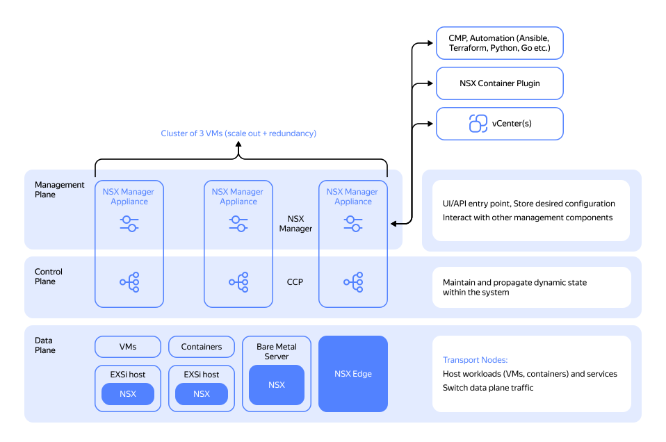
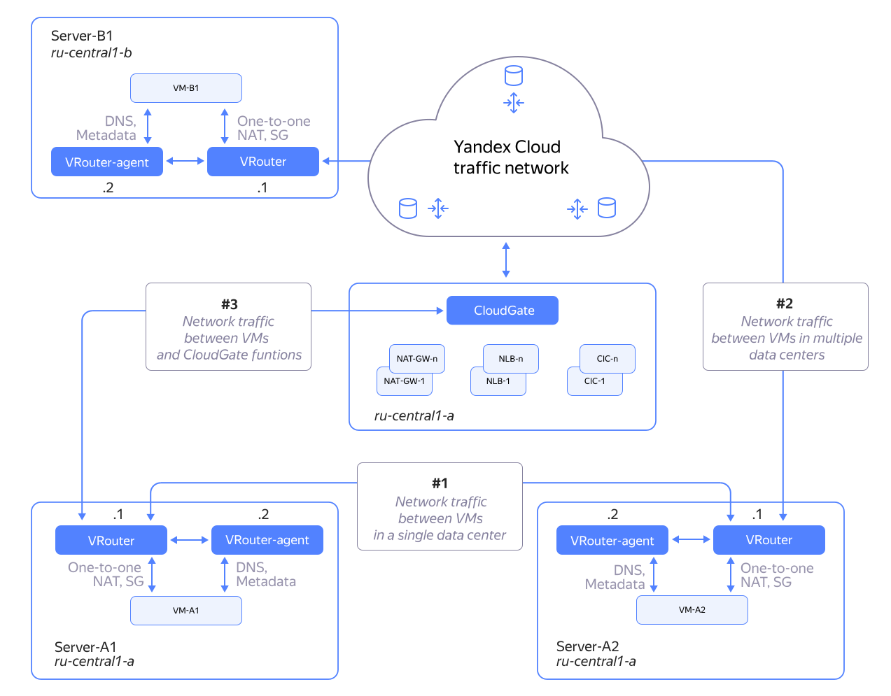
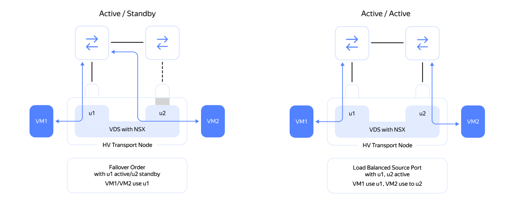
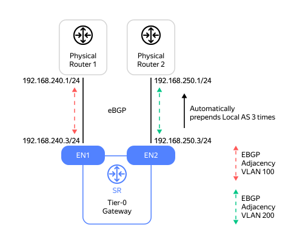

# Network

## General VMware NSX architecture {#architecture-vmware-nsx}

VMware uses its own NSX-T network architecture for its platforms. For a detailed description of this architecture, see the [VMware NSX design guide](https://communities.vmware.com/t5/VMware-NSX-Documents/VMware-NSX-T-Reference-Design/ta-p/2778093).

## Virtual network in {{ yandex-cloud }} {#yc-network}

For more information about the {{ yandex-cloud }} virtual network, see our [{{ vpc-short-name }} network overview](../../../vpc/concepts/network-overview.md).

The key components of the NSX-T network architecture include:

* **Data plane**: Data transfer layer. Its main goal is to ensure high-performance and reliable transfer of network traffic within and outside the NSX fabric.

* **Control plane**: Routing information transfer and storage layer. The main goal of this layer is to update and reliably store the tables required for network connectivity, such as route tables, ARP tables, and TEP tables.

* **Management plane**: NSX network monitoring and management layer. The main goal of this layer is to configure and monitor the NSX network and automate NSX operation using the API.

The control plane and management plane layers use clustering. To minimize the number of virtual machines, both control plane and management plane processes run on the same NSX Manager Appliance VM. However, the master is selected independently in the control plane and management plane clusters.

The CMP (cloud management platform) layer rests above the management plane layer and provides cloud orchestration for building a private cloud based on a software-defined data center.

## Comparison of key network architecture components {#comparison}

### Data plane layer {#data-plane}

#|
|| **VMware Cloud Director** | **{{ yandex-cloud }}** ||
|| This layer contains both distributed components, such as the NSX router, and centralized components (running on dedicated nodes), such as NSX Edge. The latter are virtual machines or bare-metal servers that provide high-performance interface between the NSX overlay network and the physical data center network. 
| {{ yandex-cloud }} implements a similar SDN design approach: each hypervisor contains vRouter components that handle network packet routing and processing, as well as cloud gateway components that interface SDN clouds with the outside world.

The main differences lie in the overlay encapsulation technologies and the methods used to ensure connectivity between the solution system components.

While NSX-T uses the Geneve encapsulation, {{ yandex-cloud }} is based on MPLSoverUDP.

Both approaches enable granular load balancing of network traffic at the transport layer, as well as expanding the header to transfer additional service data at the transport layer (telemetry and tracing), if required. ||
|#

### Control plane and management plane layers {#control-management-planes}

#|
|| **VMware Cloud Director** | **{{ yandex-cloud }}** ||
|| In NSX-T, control plane and management plane are hosted on the NSX-T Manager cluster nodes (three nodes in total). Each node runs control plane and management plane processes, with all system state variables being stored in CorfuDB. 
| In {{ yandex-cloud }}, control plane and management plane are deployed on different nodes (unlike in NSX-T). The controller cluster can include more than three nodes. ||
|#

### Transport zones and nodes {#transport-zones}

#|
|| **VMware Cloud Director** | **{{ yandex-cloud }}** ||
|| NSX transport zones (TZs) define the boundaries for network segments, such as VLANs and software overlays.

A transport zone can contain multiple types of vSphere clusters.

In NSX-T, transport zones can be either overlay or VLAN-based. 
| In {{ yandex-cloud }}, an [availability zone](../../concepts/geo-scope.md) (AZ) may serve as an SDN equivalent to an NSX-T overlay transport zone. L2 within each availability zone is unique and does not extend across other zones.

{{ yandex-cloud }} has no transport zones of the VLAN type. Since all hosts, including dedicated ones, are virtualized, you can use overlay segments to connect cloud workloads.

A logical switch created in a transport zone (TZ) will run on all virtualized infrastructure nodes that have been added as transport nodes to that TZ. Similarly, a distributed logical router (LR) linked to logical switches in that TZ will create an LR instance on each virtualization node attached to the transport zone. ||
|#

### Virtual switches {#virtual-switches}

#|
|| **VMware Cloud Director** | **{{ yandex-cloud }}** ||
|| In NSX-T, it specifically refers to a virtual switch that operates within the kernel of each hypervisor. It provides virtual ports for connecting a virtual machine to the network infrastructure using uplinks, i.e., physical host interfaces. It implements Geneve overlay encapsulation.

The NSX-T infrastructure supports multicast (L2/L3) and VRRP/HSRP. 
| {{ yandex-cloud }} uses vRouter as the equivalent. It is a virtual router that similarly operates within the kernel of each host hypervisor and performs similar functions with the MPLSoverUDP encapsulation: high entropy for outgoing flows, granular traffic flow balancing, and potential use of extended headers for packet tracing and telemetry collection.

Unlike N-VDS, vRouter features integrated routing across all virtual ports, including those that are technically within a single subnet. In N-VDS, traffic through the ports within a single subnet is not routed.

Therefore, {{ yandex-cloud }} does not support such protocols as VRRP/HSRP and multicast (L2/L3). ||
|#

### Distributed routers {#distributed-routers}

#|
|| **VMware Cloud Director** | **{{ yandex-cloud }}** ||
|| All NSX-T fabric hosts are initially set up as transport nodes. For their further configuration and monitoring with NSX-T Manager, you need to install the required software components.

For distributed traffic routing, the NSX-T infrastructure uses a logical router (LR), which has a complex internal architecture:

  * Tier1-GW: Tenant component.

  * Tier0-GW: Inter-tenant (provider) component.

Both Tier1-GW and Tier0-GW have a distributed router (DR) and a service router (SR). The DR is deployed across all transport nodes within the selected transport zone, while the SR is limited to Edge nodes (which are interface nodes, virtual or bare-metal) within the selected transport zone. 
| In {{ yandex-cloud }}, the vRouter routing module running on all cloud hosts serves as the equivalent of the DR in Tier0-GW and Tier1-GW.

Edge gateways are implemented as dedicated virtual machines without a distributed router component inside. In this sense, the {{ yandex-cloud }} SDN architecture is more similar to the NSX-v for vSphere architecture. ||
|#

### Fault-tolerance of host connections to the network fabric {#fault-tolerance}

**VMware Cloud Director**

NSX-T uses various load balancing methods as shown on the chart below:

**{{ yandex-cloud }}**

In {{ yandex-cloud }}, the host connects to the physical network fabric via a single 25 Gbps interface. This helps to avoid extra challenges in maintaining (setting up and diagnosing) the teaming policy on servers.

### SDN fabric interface with the outside world and service nodes {#junction}

**VMware Cloud Director**

In NSX-T, the Edge VM is quite complex.

It contains its own virtual switch with uplink and internal ports as shown below:

 

In NSX-T, the Edge node not only handles traffic routing but also performs service functions, such as NAT gateway, VPN, perimeter firewall, basic load balancer, and DHCP server.

In NSX-T, NAT is implemented within the Tier0-GW or Tier1-GW SR components on the Edge node.

In NSX-T, the perimeter firewall can be set up on the Tier0-GW SR component of the Edge node.

You can also configure policy-based IPSEC VPN on the Tier0-GW and Tier1-GW SR components. 

**{{ yandex-cloud }}**

In {{ yandex-cloud }}, the Cloud Gateway edge nodes are somewhat simpler, similar to those in NSX-v for vSphere: they are dedicated virtual machines containing no additional virtual switch.

Network address translation (NAT) runs directly on the hypervisor of the host where the VM with a public IP address resides. The host runs distributed 1-to-1 NAT.

In {{ yandex-cloud }}, you can run NAT from a virtual machine by deploying either an egress NAT GW (cloud access) or a dedicated custom [VM that will work as a NAT instance](../../../tutorials/routing/nat-instance/index.md).

Currently, there are no service VPNs or service Firewalls in {{ yandex-cloud }}. However, you can still add these functions from images available on {{ marketplace-short-name }} or those you created yourself. To make this easier, we have added the following sections to our tutorials and [GitHub](https://github.com/yandex-cloud/yc-solution-library-for-security) repository:

  * [Firewall configuration](../../../tutorials/routing/network-segmentation-checkpoint.md)

  * [VPN configuration](../../../tutorials/routing/ipsec/index.md)

### Internal routing and integration with external networks {#internal-routing}

**VMware Cloud Director**

Static routes are used within NSX-T SDN (not at the transport layer).

Both IPv4 and IPv6 are supported.

To enable external access, NSX-T can use OSPF and eBGP on the Edge nodes (particularly, on Tier0-GW SR of the Edge node):

**{{ yandex-cloud }}**

Similarly, {{ yandex-cloud }} uses static routes within SDN.

IPv4 is supported, while IPv6 is not.

To enable a dedicated connection between the customer's on-premise infrastructure and the cloud, one uses [{{ interconnect-name }}](../../../interconnect/concepts/index.md), a service for creating private dedicated network connections. It leverages BGP to exchange routing information. 

 

### Network efficiency {#efficiency}

#|
|| **VMware Cloud Director** | **{{ yandex-cloud }}** ||
|| In NSX-T, you can use dedicated clusters for a specific class of workload.

For high-performance interfacing with external networks, NSX-T supports the use of Bare Metal Edge clusters.

To reduce the NSX-T network traffic processing load on guest VMs, you can offload overlay encapsulation using SR-IOV, DPU, or SmartNIC. 
| In {{ yandex-cloud }}, you can use [dedicated virtualized hosts](../../../compute/concepts/dedicated-host.md).

You can also set up a [software-accelerated network](../../../compute/concepts/software-accelerated-network.md) for load balancing. ||
|#

### Load balancing {#load-balancer}

#|
|| **VMware Cloud Director** | **{{ yandex-cloud }}** ||
|| In NSX-T, you can use either the built-in L7 load balancer or the VMware NSX Advanced Load Balancer (AVI).

Both options enable traffic balancing at L4 and L7. 
| In {{ yandex-cloud }}, you can use the L4 load balancer, [{{ network-load-balancer-name }}](https://yandex.cloud/ru/services/network-load-balancer) (NLB), and the L7 load balancer ([{{ alb-name }}](https://yandex.cloud/ru/services/application-load-balancer), or ALB), separately.

The application traffic balancer (ALB) can also serve as an ingress in Managed K8s, similar to the NSX-T Basic/Advanced Load Balancer. ||
|#

### Security and microsegmentation {#security}

#|
|| **VMware Cloud Director** | **{{ yandex-cloud }}** ||
|| NSX-T has no native DDoS protection. You have to integrate the relevant services separately.

To address microsegmentation and internal threat protection issues, NSX-T offers a tool package known as NSX-T Security, which includes NSX-T Distributed FW (Application-Layer Gateway + L7 filtering), Distributed IDS, and Malware Prevention.

For perimeter protection, NSX-T features integrated Gateway Firewall which you can configure on NSX-T Edge. Although it is not a next-generation firewall, it supports FQDN analysis and URL filtering. 
| {{ yandex-cloud }} features [{{ ddos-protection-name }}](https://yandex.cloud/ru/services/ddos-protection) and [{{ sws-name }}](https://yandex.cloud/ru/services/smartwebsecurity) for DDoS protection.

You can also integrate [Security Groups](../../../vpc/concepts/security-groups.md) for network access management. This will provide L4 stateful traffic filtering at the hypervisor level. Each network interface of VMs in the cloud can have its own L4 Firewall configured.

Currently, {{ yandex-cloud }} has no equivalents to Distributed IDS and Distributed Malware Protection. As an alternative, you can use specialized custom VMs from [Marketplace](https://yandex.cloud/ru/marketplace?search=ids&categories=security), although, in this case, you will need [network segmentation](../../../tutorials/routing/network-segmentation-checkpoint.md). ||
|#

### Network diagnostics {#network-diagnostics}

**VMware Cloud Director**

To troubleshoot network connectivity issues within an overlay network segment, NSX-T offers a built-in tool called [Traceflow](https://docs.vmware.com/en/VMware-NSX-T-Data-Center/3.2/administration/GUID-A85621BC-1CFD-4703-846A-2B3D36E7ABAC.html). Not only does it allow you to verify the topology and integrity of virtual channels, but also enables performing comprehensive data plane diagnostics using custom network packets.

To diagnose virtual and physical network interface issues, as well as map networking between information systems, NSX-T offers [VMware Aria Operations for Networks](https://www.vmware.com/products/cloud-infrastructure/aria-operations-for-networks#features). 

**{{ yandex-cloud }}**

In {{ yandex-cloud }}, it is the network team that handles the virtual and physical network interface issues using their own operational network diagnostic tools.

To identify issues in {{ yandex-cloud }} overlay (cloud) networks, there is a tool called [Cloud Network Map](../../../vpc/concepts/network.md#map). In enables you to quickly verify the configuration of virtual network connectivity between cloud objects (cloud wiring).

