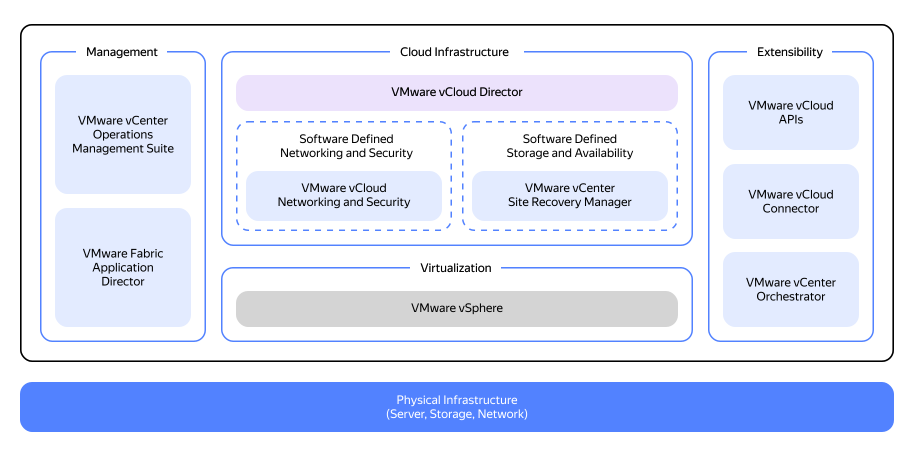

# Resource and role model

In this article, we will compare the private cloud architecture models: VMware Cloud Director (vCloud Director or vCD) vs. {{ yandex-cloud }}.

## VMware resource model {#resource-vmware}

_VMware Cloud Director_ is a solution that implements a multi-tenant approach where each customer gets their isolated container of resources within logical security boundaries.

vCloud Director is an abstraction layer that includes:

* Layer of VMware ESXi physical server clusters and data centers they reside in.
* Management tools, such as `vCenter Server`, for managing ESXi clusters.

The chart below shows the VMware Cloud Director (vCD) resource model.

This chart allows us to outline the main layers in the vCD architecture:

* The lowest layer of architecture is made up of hardware.
* The VMware ESXi virtualization layer resides on physical servers. All VMware ESXi hypervisors are clustered and managed by VMware vCenter. This integration is called _vSphere_. vSphere enables creating resource pools and virtual switches (Distributed vSwitch), as well as connecting shared storage for virtual machines.
* Each vCenter is integrated with the VMware NSX-T overlay network manager on one side and is managed by the Cloud Director web portal.
* Cloud Director has users, organizations, and virtual machines logically divided among various tenants.
vCD communicates with vCenter Server via the vSphere API.

The vCD solution provides multi-tenancy, making inheritance of user and group models from vSphere seem unfeasible.

vCD has its own identity provider with its own subjects and role model. You can integrate Cloud Director tenants with Active Directory through SAML federation using the _service provider initiated Web SSO_ feature.

## {{ yandex-cloud }} resource model {#resource-yc}

All {{ yandex-cloud }} resources, such as [virtual machines](../../../compute/concepts/vm.md), [disks](../../../compute/concepts/disk.md), [networks](../../../vpc/concepts/network.md#network), and others, reside in [folders](../../../resource-manager/concepts/resources-hierarchy.md#folder). When creating a resource, you specify the folder to place it in.

Each folder belongs to a single [cloud](../../../resource-manager/concepts/resources-hierarchy.md#cloud). There are no folders outside a cloud. You cannot create a folder inside another folder.

A [cloud](../../../resource-manager/concepts/resources-hierarchy.md#cloud) belongs to an organization.

Organizations are isolated from one another. Resources belonging to one organization cannot communicate with those from another organization through {{ yandex-cloud }} tools. Organizations are managed with [{{ org-full-name }}](../../../organization/).

Within your organization, you can configure access permissions for a resource at the following [levels](../../../resource-manager/concepts/resources-hierarchy.md#access-rights-inheritance):

* Organization.
* Cloud.
* Folder.
* Individual resource if the relevant service supports such granular access management.

By default, a new user within an organization does not have access to the organization's cloud resources. Access permissions must be granted explicitly by assigning a role specifically for a resource or its folder, cloud, or organization.

To learn more about the {{ yandex-cloud }} resource model, see the [relevant documentation](../../../resource-manager/concepts/resources-hierarchy.md).

Below, we will compare the main concepts of Cloud Director and vSphere entities with those in {{ yandex-cloud }}.

## Comparison of resource models {#resource-models-comparison}

### Virtual Datacenters {#virtual-datacenters}

#|
|| **VMware Cloud Director** | **{{ yandex-cloud }}** ||
|| _Virtual Datacenters (vDCs)_ are an isolated environment provided to cloud users for placing resources, storing data, and operating applications and systems.

For vDCs, cloud administrators set quotas for the number of vCPUs, amount of RAM, and disk space for VM virtual disks. Structurally, a vDC is a child container within an organization. Architecturally, one vDC is equivalent to a specific vCenter Server instance. When creating a vDC, vSphere defines a resource pool with info on vCPU and RAM quotas and storage policies.
| The closest equivalent to a vDC is a cloud, which is a child container within an organization. The difference is that a cloud is not linked to a specific availability zone and represents a geographically distributed logical organization unit. ||
|#

### Organizations {#organizations}

#|
|| **VMware Cloud Director** | **{{ yandex-cloud }}** ||
|| _Organizations_ are a root container for managing users, groups, identity federations, and computing resources.

Cloud system administrators, or service provider administrators, can create and initialize organizations.

Organization administrators, or tenant administrators, can create users, groups, and service folders.

Cloud users cannot create organizations based on vCD. Tenant administrators have no access to the cloud infrastructure level.
| In {{ yandex-cloud }}, organizations also serve as root containers for resources and are designed to manage subjects, subject groups, identity federations, and underlying folders and services. ||
|#

### Users and service accounts {#users-sa}

#|
|| **VMware Cloud Director** | **{{ yandex-cloud }}** ||
|| Organization administrators can create users, user groups, or service accounts manually or through scripts, or get integrated with a folder service, such as LDAP, through a SAML federation.

By default, users and user groups belong to the respective organization and are managed by Cloud Director. All operations with Tanzu virtual machines, networks, and containers are performed under a system account with administrative permissions in vSphere.
| Every {{ yandex-cloud }} platform user has their own account used for identification when running resource operations.

This can be either a Yandex ID account or a federated account of an identity federation.

In addition, there are service accounts: a special type of account your software can use to perform operations with {{ yandex-cloud }} resources. You can read more about accounts [here](../../../iam/concepts/users/accounts.md). ||
|#

### Organization Networks {#organization-networks}

#|
|| **VMware Cloud Director** | **{{ yandex-cloud }}** ||
|| VMware Cloud Director uses organization networks for network management. Each network is only available to a specific organization and all vApps within that organization. You can connect such networks to external networks, if required.
| In {{ yandex-cloud }}, {{ vpc-name }} residing in folders offers the similar features.

The key difference between {{ yandex-cloud }} {{ vpc-short-name }} and organization networks in VMware is that the former implements a multi-folder scenario enabling VPC network access within a single cloud. ||
|#

### vApp {#vapp}

#|
|| **VMware Cloud Director** | **{{ yandex-cloud }}** ||
|| In VMware, a _vApp_ is a child vDC container that holds one or more virtual machines. vApps can group multiple virtual machines running together as a single stack of interconnected systems or applications within a single VM.

A vApp allows you to manage the order for starting and stopping virtual machines. If at least one VM in a vApp is stopped, such vApp is considered partially started. You cannot place Cloud Director VMs outside a vApp.
| In {{ yandex-cloud }}, a folder is the nearest equivalent to a vApp; however it is important to clarify that a {{ yandex-cloud }} folder is a resource and service container used for storing and isolating the services, since most cloud services reside in folders. A folder has no option to manage services as a single entity; rather than that, there are other orchestration tools that perform this function.

{{ yandex-cloud }} also features [Instance Groups](../../../compute/concepts/instance-groups/index.md) to manage the order for starting a group of VMs (which is called an instance group in the {{ yandex-cloud }} terms). ||
|#

## Role model comparison {#role-models-comparison}

In both vCloud Director and {{ yandex-cloud }}, roles define permissions that dictate what actions and resource operations the users can perform.

#|
|| **vCloud Director** | **{{ yandex-cloud }}** ||
|| _Service provider_ is a company that delivers cloud services. | - ||
|| _Tenant (customer)_ is a user of cloud resources. | - ||
|| By default, Cloud Director comes with the following predefined roles:

* `Organization Administrator`: Role for administering the relevant organization (full access).

* `Catalog Author`: Role for creating and publishing new folders with templates.

* `Console Access Only`: Role with permissions to view the VM status and properties and use the guest OS through the console.

* `Defer to Identity Provider`: Role for delegating permissions according to the data from external identity providers.

* `vApp Author`: Role with permissions to use the relevant folder and create vApps.

* `vApp User`: Users of vApps created by others.

* `Kubernetes Cluster Author`: Role with permissions to create and manage Kubernetes clusters.
| There are two types of roles:

* _Primitive roles_: Contain permissions that apply to all types of {{ yandex-cloud }} resources. These are `admin`, `editor`, `viewer`, and `auditor`.

* _Service roles_: Contain permissions only for a specific resource type in a particular service. For example, the `compute.images.user` role enables using images in {{ compute-full-name }}.

A service role can be assigned for the resource the role is intended for or the one from which the permissions are inherited. For example, you can assign the `compute.images.user` role for a folder or cloud, as images inherit permissions from them.

For a detailed description of primitive and service roles and their hierarchy, see the [{{ iam-short-name }}](../../../iam/concepts/access-control/roles.md) and [{{ resmgr-name }}](../../../resource-manager/concepts/resources-hierarchy.md) documentation. ||
|| To create custom roles, one needs to contact VMware Cloud Director administrators. Permissions for such roles are defined by service providers or created for the tenant through support.
| Currently, users are not allowed to create new roles with custom permissions. ||
|#