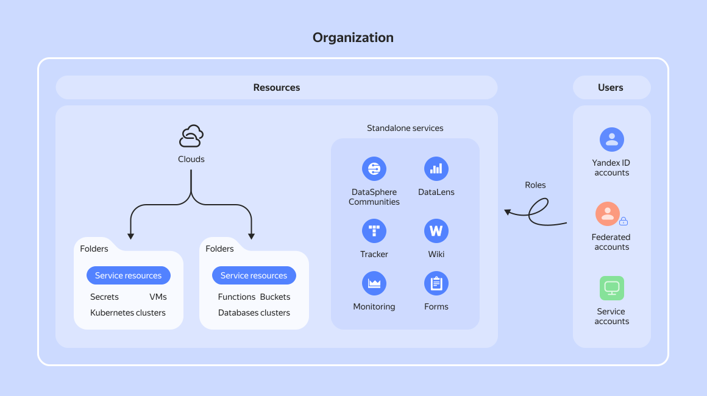

# Interaction between users and {{ yandex-cloud }} resources

All {{ yandex-cloud }} services work based on the common _resource and role model_. Its underlying entity is _organization_ that combines different types of resources and users in a single workspace.

## {{ yandex-cloud }} resources {#resources}

When using {{ yandex-cloud }} services, you create _resources_: [VMs](../compute/concepts/vm.md), managed database and [{{ k8s }}](../managed-kubernetes/concepts/index.md) clusters, [registries](../container-registry/concepts/registry.md), [secrets](../lockbox/concepts/secret.md), and more. Most services store the resources they create in [folders](../resource-manager/concepts/resources-hierarchy.md#folder). Folders belong to [clouds](../resource-manager/concepts/resources-hierarchy.md#cloud), and clouds belong to organizations.

In addition, organizations may have the following enabled: [{{ ml-platform-full-name }}]({{ link-datasphere-main }}), a [{{ datalens-full-name }}]({{ link-datalens-main }}) instance, as well as [{{ tracker-full-name }}]({{ link-tracker }}), [{{ wiki-full-name }}]({{ link-wiki }}), and [{{ forms-full-name }}]({{ link-forms-b2b }}). All of them store their resources on their own, yet are able to exchange information with other services within the same organization. Organizations do not interact with each other.

In the [{{ cloud-center }} interface]({{ cloud-center-link }}), you can [look up](../organization/concepts/manage-services.md) the clouds and services existing in your organization.

[Learn more about the resource hierarchy in {{ yandex-cloud }}](../resource-manager/concepts/resources-hierarchy.md).

## Users {#users}

Each {{ yandex-cloud }} user has an _account_ of their own used for identification when performing operations with resources. This can be either a [Yandex ID](https://yandex.ru/id/about) account or a federated account of an [identity federation](../organization/concepts/add-federation.md). In addition, there are service accounts: a special type of account your software can use to perform operations with {{ yandex-cloud }} resources. [Learn more about accounts](../iam/concepts/users/accounts.md).

Each user belongs to at least one organization. When logging in to {{ yandex-cloud }} with your Yandex ID for the first time, you will be prompted to register your own organization. After creating an organization, you can enable and disable {{ yandex-cloud }} services, create clouds, folders, and other resources.

You can invite other members with Yandex accounts to your organization to grant them access to its services and resources. If your company already uses a different account management system (such as [Active Directory](https://learn.microsoft.com/windows-server/identity/ad-ds/get-started/virtual-dc/active-directory-domain-services-overview) or [Keycloak](https://www.keycloak.org/)), you can [configure an identity federation](../organization/concepts/add-federation.md). This will allow company employees to use their corporate accounts to access {{ yandex-cloud }} services. For bulk access management, users can be combined into [groups](../organization/operations/manage-groups.md).

## Access management {#access}

{{ yandex-cloud }} resource access rights are managed using [roles](../iam/concepts/access-control/roles.md). To enable an account (_subject_) to perform actions on a resource (_object_), assign appropriate roles for the resource either to the account or the group to which it belongs. Basically, each role is a list of permitted object operations. Permissions to access {{ yandex-cloud }} resources are managed by [{{ iam-full-name }}](../iam/concepts/index.md).

To authenticate users, {{ yandex-cloud }} services request [credentials](../iam/concepts/authorization/index.md). The type of data requested depends on the account type, the service, and request interface. When using the [API](api.md), the [folder ID](../resource-manager/operations/folder/get-id.md) is also required to uniquely identify the resource and verify the permissions. If actions are performed on behalf of a service account, the ID of its folder is used by default.
