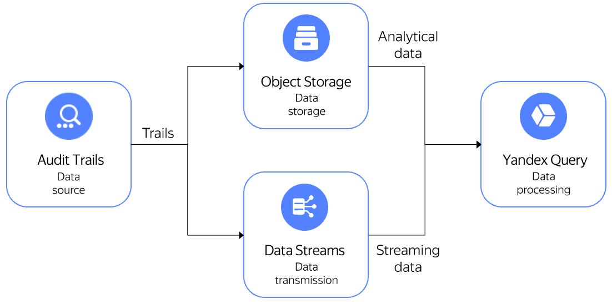

{{ at-full-name }} and {{ yq-full-name }} are integrated with each other to enable standard search operations in audit logs and run a custom search in YQL.

## Standard search tasks in {{ at-full-name }}

{{ yq-full-name }} provides ready-made queries to implement standard scenarios for searching data in {{ at-full-name }} trails.

For example, you can use standard scenarios to:
- Find out who deleted a folder.
- Find out who added permissions to access the VM serial console.
- Find out who edited permissions to access a {{ objstorage-full-name }} bucket.
- Find out who was granted administrator privileges.

For a full list of searches and their descriptions, see the [GitHub repository](https://github.com/yandex-cloud/yc-solution-library-for-security/tree/master/auditlogs/_use_cases_and_searches).

## Setup {{ at-full-name }}

Before you start, [set up {{ at-full-name }}](../../audit-trails/quickstart.md).

## Setting up integration between {{ at-full-name }} and {{ yq-full-name }}

To set up integration:
1. Open the list of trails in the {{ yandex-cloud }} console.
1. Select the desired trail and click **Process in YQ**.
1. When switching from {{ at-full-name }} to {{ yq-full-name }} for the first time, set up integration:
   1. In the **{{ yq-full-name }}** interface, select the service account to be used to read data from {{ objstorage-full-name }} in the connection creation dialog and click **Create**.
   1. In the **{{ yq-full-name }}** interface, check the preset parameters by clicking **Preview** in the binding creation dialog box. Next, click **Create** to complete the integration process.
   1. Once the integration settings are configured, you'll be redirected to the **Audit Trails** section automatically.

## Running analytical queries to data stored in {{ objstorage-full-name }}

To query {{ at-full-name }} analytical data stored in {{ objstorage-full-name }}:
1. Under **Audit Trails** in the **{{ yq-full-name }}** interface, select **Analytical** as the data analysis type and then select the desired [data binding](../../query/concepts/glossary.md#binding) from the list if there are multiple bindings.
1. Select the desired query to data from {{ objstorage-full-name }} in the list and click **Run**.

## Running streaming queries to data transferred via {{ yds-full-name }}

To query {{ at-full-name }} streaming data transferred via {{ yds-full-name }}:
1. Under **Audit Trails** in the **{{ yq-full-name }}** interface, select **Streaming** as the data analysis type and then select the desired [data binding](../../query/concepts/glossary.md#binding) from the list if there are multiple bindings.
1. Select the desired query to data from {{ objstorage-full-name }} in the list and click **Run**.

## Handling results

Depending on the type of processed data, streaming or analytical, there are various options for handling results.

### Handling results of data batch processing
You can do the following with batch processing results:
1. Download them through the {{ yq-full-name }} GUI by clicking **Export**.
1. [Save them to a {{ objstorage-full-name }} bucket](../../query/sources-and-sinks/object-storage-write.md).
1. [Visualize them](../../query/tutorials/datalens.md) in {{ datalens-full-name }}.
1. Get and process them via the [{{ yq-full-name }} HTTP API](../api/index.md).

### Handling results of data streaming processing
You can do the following with streaming processing results:
1. [Send them to {{ monitoring-full-name }}](../../query/sources-and-sinks/monitoring.md) as metrics.
1. [Send them to an output {{ yds-full-name }} stream](../../query/sources-and-sinks/data-streams-write.md) as data that can be processed using [{{ sf-full-name }} triggers](../../functions/operations/trigger/data-streams-trigger-create.md).

## See also
* [{{ objstorage-full-name }}](../../storage/).
* [{{ yds-full-name }}](../../data-streams/).
* [{{ datalens-full-name }}](../../datalens/).
* [{{ sf-full-name }}](../../functions/).