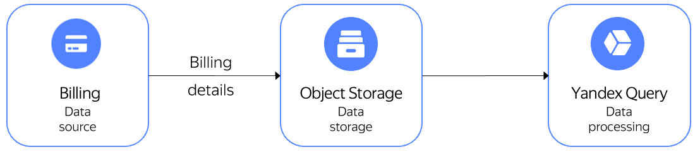

Billing and {{yq-full-name}} are integrated with each other to enable standard tasks for analyzing billing details and run a custom search in YQL.

## Standard tasks for searching data in Billing details

{{yq-full-name}} provides ready-made queries to implement standard scenarios for searching data in Billing details.

Examples of standard search tasks:
- Consumption by month.
- Consumption in the current month broken down by service and product.
- Consumption in the current month broken down by cloud and folder.
- Top 10 most expensive resources.
- Payment for fixed consumption.
- Utilization of fixed consumption.
- Details by K8S clusters.

## Setting up integration between Billing and {{yq-full-name}}

To set up integration:
1. Open the list of billing detail exports in the {{yandex-cloud}} console.
1. Select the desired details and click **Process in YQ**.
1. When switching from Billing to {{yq-full-name}} for the first time, set up integration:
   1. In the **{{yq-full-name}}** interface, select the service account to be used to read data from {{objstorage-full-name}} in the connection creation dialog box and click **Create**.
   1. In the **{{yq-full-name}}** interface, check the preset parameters by clicking **Preview** in the binding creation dialog box. Next, click **Create** to complete the integration process.
   1. Once the integration settings are configured, you'll be redirected to the **Billing** section automatically.

## Running queries to data stored in {{objstorage-full-name}}
To query Billing analytical data stored in {{objstorage-full-name}}:
1. Under **Billing** in the **{{yq-full-name}}** interface, select the desired [data binding](../../query/concepts/glossary.md#binding) from the list if there are multiple bindings.
1. Select the desired query to data from {{objstorage-full-name}} in the list and click **Run**.

## Handling results

You can do the following with data processing results:
1. Download them through the {{yq-full-name}} GUI by clicking **Export**.
1. [Save them to a {{objstorage-full-name}} bucket](../../query/sources-and-sinks/object-storage-write.md).
1. [Visualize them](../../query/tutorials/datalens.md) in {{datalens-full-name}}.
1. Get and process them via the [{{yq-full-name}} HTTP API](../api/index.md).

## See also
* [{{objstorage-full-name}}](../../storage/).
* [{{datalens-full-name}}](../../datalens/).