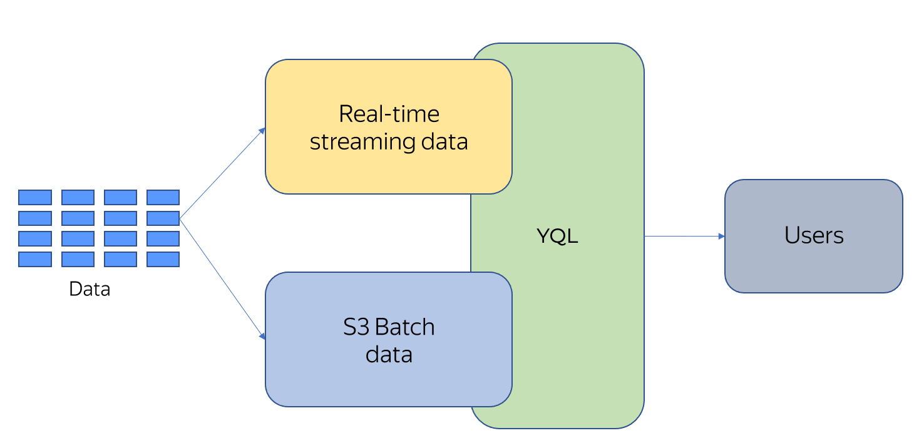

# {{ yq-full-name }} overview

{{ yq-full-name }} is a data processing service that can execute queries to [{{objstorage-full-name}}](../../storage/concepts/index.md) and real-time streams in [{{yds-full-name}}](../../data-streams/concepts/index.md) using a common SQL dialect called YQL, and aggregate query execution results across these systems.

{{ yq-full-name }} is a fully managed cloud service, meaning that you don't need to have running servers where software is deployed. Any resources that are necessary for making queries are allocated once you run them and released after they are executed. The queries themselves start executing instantly.

{{ yq-full-name }} lets you:

* Use the same written query in scenarios for analyzing data stored in {{objstorage-full-name}} and analyzing data in real time.
* Aggregate query execution results across different systems.
* Save on development thanks to using a common query language, YQL, and a common approach.

{{ yq-full-name }} combines data virtualization features and a real-time streaming data analysis system. This architecture is called [Unified Lambda](../concepts/unified-processing.md).

The Unified Lambda model uses a unified SQL query text for processing streaming data and data stored in storage systems of different classes.

## Support for raw data storage

Companies prefer to store large volumes of rarely accessed data in object storage of the {{ objstorage-full-name }} class. Long-term storage of rarely processed data in storage systems like this is most cost-efficient. Data is stored in {{ objstorage-full-name }} in unstructured form and this data needs to be processed in a simple and analyst-friendly way.

## Streaming data processing

Streaming processing is based on grouping window functions that receive data streams, group them by source and time window, make computations, and send execution results to external systems. A distinctive feature of {{ yq-full-name }} is a unified text of SQL queries used for both streaming and batch processing.

## Integration with external systems

### Streaming processing

Streaming queries can get data from the following sources:

* {{ yds-full-name }}. Application logs, [Debezium](../tutorials/debezium.md) database CDC streams, or any other information can be used as input data.

Streaming processing results are exported to:

* {{monitoring-name}} as metrics for creating charts and dashboards or alerting.
* {{ yds-full-name }}. Using {{ data-transfer-full-name }}, data from {{ yds-full-name }} can be sent to different systems, including a variety of DBMS.

### Batch processing {#analytic}

Analytical queries in {{ yq-full-name }} can get data from {{ objstorage-full-name }} in JSON format.

You can download query execution results from the {{ yq-full-name }} user interface.

