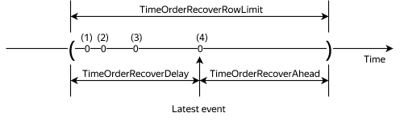

# MATCH_RECOGNIZE

The `MATCH_RECOGNIZE` expression performs pattern recognition in a sequence of rows and returns the hits. This has various applications in different areas, such as fraud detection, pricing analysis in finance, and sensor data processing. These tasks fall within the domain of _complex event processing (CEP)_, where pattern recognition is a key tool. For a `MATCH_RECOGNIZE` use case, follow [this link](#example).

## Data processing algorithm

Here is the breakdown of how `MATCH_RECOGNIZE` works:

1. The input table or data stream is split into non-overlapping groups. Each group consists of input dataset rows with identical values in columns listed after `PARTITION BY`.
1. Each group is sorted according to `ORDER BY`. For data streams, [windowed sorting](#time_order_recover) is used.
1. In each sorted group, `PATTERN` recognition is performed independently.
1. Pattern search in a row sequence is performed step-by-step: rows are checked for a pattern match one by one. From all the matches which start in the first row, the one consisting of most rows is selected. If no such match is found, the search continues from the next row.
1. After a match is found, columns defined by expressions in `MEASURES` are computed.
1. Depending on the `ROWS PER MATCH` mode, either one or all rows of the match are returned.
1. The `AFTER MATCH SKIP` mode determines from which row the pattern recognition resumes.

## Syntax {#syntax}

```sql
MATCH_RECOGNIZE (
    [ PARTITION BY <partition_1> [ ... , <partition_N> ] ]
    [ ORDER BY <sorting_key_1> [ ... , <sorting_key_N> ] ]
    [ MEASURES <expression_1> AS <column_name_1> [ ... , <expression_N> AS <column_name_N> ] ]
    [ ROWS PER MATCH ]
    [ AFTER MATCH SKIP ]
    PATTERN (<pattern_to_search_for>)
    DEFINE <variable_1> AS <predicate_1> [ ... , <variable_N> AS <predicate_N> ]
)
```

Here is a brief description of the SQL syntax elements of the `MATCH_RECOGNIZE` expression:

* [`DEFINE`](#define): Section for declaring variables which describe the search pattern and conditions the rows must meet for each variable.
* [`PATTERN`](#pattern): [Regular expression](https://ru.wikipedia.org/wiki/Регулярные_выражения) which describes the search pattern.
* [`MEASURES`](#measures): Defines columns for output data. Each column is set by an SQL expression for its computation.
* [`ROWS PER MATCH`](#rows_per_match): Determines the output data structure and the number of rows per match.
* [`AFTER MATCH SKIP`](#after_match_skip): Sets the method of continuing the search after a match.
* [`ORDER BY`](#order_by): Determines sorting of input data. Pattern search is performed within the data sorted according to the list of columns or expressions listed in `<sorting_key_1> [ ... , <sorting_key_N> ]`.
* [`PARTITION BY`](#partition_by): Divides the input dataset as per the specified rules in accordance with `<partition_1> [ ... , <partition_N> ]`. Pattern search is performed independently in each part.

### DEFINE {#define}

```sql
DEFINE <variable_1> AS <predicate_1> [ ... , <variable_N> AS <predicate_N> ]
```

The `DEFINE` clause declares variables used to describe the search pattern specified in [`PATTERN`](#pattern). Variables are named SQL expressions calculated over input data. The syntax of SQL expressions in `DEFINE` matches the SQL syntax of predicate expressions in `WHERE`. For example, the `button = 1` expression searches for all rows where the `button` column value is `1`. Any SQL expressions that can be used to perform a search, including aggregation functions like `LAST` or `FIRST`, can act as conditions, e.g., `button > 2 AND zone_id < 12` or `LAST(button) > 10`.

In the example below, the `A.button = 1` SQL expression is declared as the `A` variable.

```sql
DEFINE
    A AS A.button = 1
```



`DEFINE` does not currently support aggregation functions (e.g., `AVG`, `MIN`, or `MAX`) or the `PREV` and `NEXT` functions.



When processing each row of data, all SQL expressions describing variables in `DEFINE` are calculated. When the SQL expression describing the respective variable from `DEFINE` gets the `TRUE` value, such a row is labeled with the `DEFINE` variable name and added to the list of rows subject to pattern matching.

#### **Example** {#define-example}

When defining variables in SQL expressions, you can reference other variables:

```sql
DEFINE
    A AS A.button = 1 AND LAST(A.zone_id) = 12,
    B AS B.button = 2 AND FIRST(A.zone_id) = 12
```

An input data row will be calculated as the `A` variable if it contains a column named `button` set to `1`, and the last row of the set that had previously matched `A` has a column named `zone_id` set to `12`. A row will be calculated as the `B` variable if it contains a column named `button` set to `2`, and the first row of the set that had previously matched `A` has a column named `zone_id` set to `12`.

### PATTERN {#pattern}

```sql
PATTERN (<pattern_to_search_for>)
```

The `PATTERN` keyword describes the search pattern in the format derived from variables in the `DEFINE` section. The `PATTERN` syntax is similar to the one of [regular expressions](https://en.wikipedia.org/wiki/Regular_expressions).



If a variable from `PATTERN` has not been previously described in `DEFINE`, it is assumed that its value is always `TRUE`.



You can use [quantifiers](https://en.wikipedia.org/wiki/Regular_expression#Quantification) in `PATTERN`. In regular expressions, they determine the number of repetitions of an element or subsequence in the matched pattern. Here is the list of supported quantifiers:

|Quantifier|Description|
|-|-|
|`A+`|One or more occurrences of `A`|
|`A*`|Zero or more occurrences of `A`|
|`A?`|Zero or one occurrence of `A`|
|`B{n}`|Exactly `n` occurrences of `B`|
|`C{n, m}`|From `n` to `m` occurrences of `C`|
|`D{n,}`|At least `n` occurrences of `D`|
|`(A\|B)`|Occurrence of `A` or `B` in the data|
|`(A\|B){,m}`|From zero to `m` occurrences of `A` or `B`||

Supported pattern search sequences:

|Supported sequences|Syntax|Description|
|-|-|-|
|Sequence|`A B+ C+ D+`|The system searches for the exact specified sequence, the occurrence of other variables within the sequence is not allowed. The pattern search is performed in the order of the pattern variables.|
|One of|`A \| B \| C`|Variables are listed in any order with a pipe `\|` between them. The search is performed for any variable from the specified list.|
|Grouping|`(A \| B)+ \| C`|Variables inside round brackets are considered a single group. In this case, quantifiers apply to the entire group.|
|Excluding from the result|`{- A B+ C -}`|When [ALL ROWS PER MATCH](#rows_per_match) mode is selected, the rows found by the pattern in brackets will be excluded from the result. |

#### **Example** {#pattern-example}

```sql
PATTERN (B1 E* B2+ B3)
DEFINE
    B1 as B1.button = 1,
    B2 as B2.button = 2,
    B3 as B3.button = 3
```

The `DEFINE` section describes the `B1`, `B2`, and `B3` variables, while it does not describe `E`. Such notation allows interpreting `E` as any event, so the following pattern will be searched: one `button 1` click, one or more `button 2` clicks, and one `button 3` click. Meanwhile, between a click of `button 1` and `button 2`, any number of any other events may occur.

### MEASURES {#measures}

```sql
MEASURES <expression_1> AS <column_name_1> [ ... , <expression_N> AS <column_name_N> ]
```

`MEASURES` describes the set of returned columns when a pattern is found. The set of returned columns should be represented by an SQL expression with aggregate functions over the variables declared in the [`DEFINE`](#define) statement.

#### **Example** {#measures-example}

In this example, the input data is as follows:

|ts|button|device_id|zone_id|
|:-:|:-:|:-:|:-:|
|100|1|3|0|
|200|1|3|1|
|300|2|2|0|
|400|3|1|1|

```sql
MEASURES
    AGGREGATE_LIST(B1.zone_id * 10 + B1.device_id) AS ids,
    COUNT(DISTINCT B1.zone_id) AS count_zones,
    LAST(B3.ts) - FIRST(B1.ts) AS time_diff,
    42 AS meaning_of_life
PATTERN (B1+ B2 B3)
DEFINE
    B1 AS B1.button = 1,
    B2 AS B2.button = 2,
    B3 AS B3.button = 3
```

Result:

|ids|count_zones|time_diff|meaning_of_life|
|:-:|:-:|:-:|:-:|
|[3,13]|2|300|42|

The `ids` column contains a list of `zone_id * 10 + device_id` values counted among the rows that had matched the `B1` variable. The `count_zones` column contains the number of the unique `zone_id` column values among the rows that had matched the `B1` variable. The `time_diff` column contains the difference between the `ts` column value in the last row of the set that matched the `B3` variable and the `ts` column value in the first row of the set that had matched the `B1` variable. The `meaning_of_life` column contains the `42` constant. Thus, an expression in `MEASURES` may contain aggregate functions over multiple variables, but only one variable must be inside a single aggregate function.

### ROWS PER MATCH {#rows_per_match}

`ROWS PER MATCH` sets the number of rows in the result per match and defines the output columns. The default mode is `ONE ROW PER MATCH`.

`ONE ROW PER MATCH` sets the `ROWS PER MATCH` mode to output one row per match. The output data structure matches the columns listed in [`PARTITION BY`](#partition_by) and [`MEASURES`](#measures).

`ALL ROWS PER MATCH` sets `ROWS PER MATCH` to output all rows per match except those explicitly excluded by parentheses. In addition to columns from the original dataset, the output data structure includes the columns specified in [`MEASURES`](#measures).

#### **Examples** {#rows_per_match-examples}

The input data for all examples are:

|ts|button|
|:-:|:-:|
|100|1|
|200|2|
|300|3|

##### **Example 1** {#rows_per_match-example1}

```sql
MEASURES
    FIRST(B1.ts) AS first_ts,
    FIRST(B2.ts) AS mid_ts,
    LAST(B3.ts) AS last_ts
ONE ROW PER MATCH
PATTERN (B1 {- B2 -} B3)
DEFINE
    B1 AS B1.button = 1,
    B2 AS B2.button = 2,
    B3 AS B3.button = 3
```

Result:

|first_ts|mid_ts|last_ts|
|:-:|:-:|:-:|
|100|200|300|

##### **Example 2** {#rows_per_match-example2}

```sql
MEASURES
    FIRST(B1.ts) AS first_ts,
    FIRST(B2.ts) AS mid_ts,
    LAST(B3.ts) AS last_ts
ALL ROWS PER MATCH
PATTERN (B1 {- B2 -} B3)
DEFINE
    B1 AS B1.button = 1,
    B2 AS B2.button = 2,
    B3 AS B3.button = 3
```

Result:

|first_ts|mid_ts|last_ts|button|ts|
|:-:|:-:|:-:|:-:|:-:|
|100|200|300|1|100|
|100|200|300|3|300|

### AFTER MATCH SKIP {#after_match_skip}

`AFTER MATCH SKIP` sets the method of resuming the search after a match. In `AFTER MATCH SKIP TO NEXT ROW` mode, the search resumes at the first row of the previous match; in `AFTER MATCH SKIP PAST LAST ROW` mode, it resumes at the last row of the previous match. The default mode is `PAST LAST ROW`.

#### **Examples** {#after_match_skip-examples}

The input data for all examples are:

|ts|button|
|:-:|:-:|
|100|1|
|200|1|
|300|2|
|400|3|

##### **Example 1** {#after_match_skip-example1}

```sql
MEASURES
    FIRST(B1.ts) AS first_ts,
    LAST(B3.ts) AS last_ts
AFTER MATCH SKIP TO NEXT ROW
PATTERN (B1+ B2 B3)
DEFINE
    B1 AS B1.button = 1,
    B2 AS B2.button = 2,
    B3 AS B3.button = 3
```

Result:

|first_ts|last_ts|
|:-:|:-:|
|100|400|
|200|400|

##### **Example 2** {#after_match_skip-example2}

```sql
MEASURES
    FIRST(B1.ts) AS first_ts,
    LAST(B3.ts) AS last_ts
AFTER MATCH SKIP PAST LAST ROW
PATTERN (B1+ B2 B3)
DEFINE
    B1 AS B1.button = 1,
    B2 AS B2.button = 2,
    B3 AS B3.button = 3
```

Result:

|first_ts|last_ts|
|:-:|:-:|
|100|400|

### ORDER BY {#order_by}

```sql
ORDER BY <sorting_key_1> [ ... , <sorting_key_N> ]

<sorting_key> ::= { <column_names> | <expression> }
```

`ORDER BY`: Configures the sorting of input data. Before performing all pattern search operations, the data will be pre-sorted according to the specified keys or expressions. The syntax is similar to the `ORDER BY` SQL expression.

#### **Example** {#order_by-example}

```sql
ORDER BY CAST(ts AS Timestamp)
```

#### **Aspects of sorting in streaming queries** {#time_order_recover}

Streaming data is potentially infinite, so it is sorted within the window (`TimeOrderRecover`). In this algorithm, you can specify exactly one [`Timestamp`]({{ ydb.docs }}/yql/reference/types/primitive#datetime) type expression as the sorting columns, with ascending (`ASC`) as the only available sorting order. You can manage window size using the following parameters:

* **TimeOrderRecoverAhead**, in microseconds, default = -10,000,000 (-10s), must be < 0.
* **TimeOrderRecoverDelay**, in microseconds, default = 10,000,000 (10s), must be > 0.
* **TimeOrderRecoverRowLimit**, number of rows, default = 1,000,000, must be > 0.



Windowed sorting works as follows:

* If the event is not in the window, it is allowed through without sorting.
* If the event is in the left half of the window, it goes into sorting.
* If the number of events in the window exceeds `TimeOrderRecoverRowLimit`, the oldest event in the window leaves `TimeOrderRecover` and gets into `MATCH_RECOGNIZE`.
* If the event is the right half of the window, the window shifts to the right and the newly arrived event becomes `Latest row`. All events falling outside the window leave `TimeOrderRecover` and get into `MATCH_RECOGNIZE`.

##### **Examples** {#time_order_recover-examples}

##### **Example 1** {#time_order_recover-example1}

It is of no concern that events can run forward a lot; however, it does matter that hour-long lags may occur:

```sql
PRAGMA config.flags("TimeOrderRecoverDelay", "-3600000000"); -- -1 hour
PRAGMA config.flags("TimeOrderRecoverAhead", "3155760000000000"); -- 100 years
```

##### **Example 2** {#time_order_recover-example2}

You do not want events from the distant future to disrupt the sorting window. At the same time, you know that events are guaranteed to come at least once an hour:

```sql
PRAGMA config.flags("TimeOrderRecoverDelay", "-3600000000"); -- -1 hour
PRAGMA config.flags("TimeOrderRecoverAhead", "3600000000"); -- 1 hour
```

### PARTITION BY {#partition_by}

```sql
PARTITION BY <partition_1> [ ... , <partition_N> ]

<partition> ::= { <column_names> | <expression> }
```

`PARTITION BY`: This expression splits the source data into several non-overlapping groups with an independent pattern search in each group. If no expression is specified, all data is processed as a single group. Records with identical values of the columns listed after `PARTITION BY` are grouped together.

#### **Example** {#partition_by-example}

```sql
PARTITION BY device_id, zone_id
```

## Limitations {#limitations}

Our support for the `MATCH_RECOGNIZE` expression will eventually comply with [SQL-2016](https://ru.wikipedia.org/wiki/SQL:2016); currently, however, the following limitations apply:

- [`ORDER_BY`](#order_by). In streaming queries, you can specify exactly one [`Timestamp`]({{ ydb.docs }}/yql/reference/types/primitive#datetime) type expression as the sorting columns, with ascending (`ASC`) as the only available sorting order.
- [`MEASURES`](#measures). The `PREV`/`NEXT` functions are not supported.
- [`AFTER MATCH SKIP`](#after_match_skip). The only supported modes are `AFTER MATCH SKIP TO NEXT ROW` and `AFTER MATCH SKIP PAST LAST ROW`.
- [`PATTERN`](#pattern). Union pattern variables are not implemented.
- [`DEFINE`](#define). Aggregation functions are not supported.

## Usage example {#example}

Here is a real-world example of pattern recognition in a data stream produced by an IoT device whose buttons trigger certain events. Let's assume you need to find and process the following sequence of button clicks: `button 1`, `button 2`, and `button 3`.

The structure of the data to transmit is as follows:

|ts|button|device_id|zone_id|
|:-:|:-:|:-:|:-:|
|600|3|17|3|
|500|3|4|2|
|400|2|17|3|
|300|2|4|2|
|200|1|17|3|
|100|1|4|2|

SQL query body:

```sql
PRAGMA FeatureR010="prototype"; -- Pragma to enable MATCH_RECOGNIZE

SELECT * FROM input MATCH_RECOGNIZE ( -- Searching for patterns from input stream
    PARTITION BY device_id, zone_id -- Partitioning data into groups by `device_id` and `zone_id` columns
    ORDER BY ts -- Viewing events based on the `ts` column data sorted ascending
    MEASURES
        LAST(B1.ts) AS b1, -- Getting the latest timestamp of clicking button 1 in the query results
        LAST(B3.ts) AS b3  -- Getting the latest timestamp of clicking button 3 in the query results
    ONE ROW PER MATCH            -- Getting one result row per match hit
    AFTER MATCH SKIP TO NEXT ROW -- Moving to the next row once the match is hit
    PATTERN (B1 B2+ B3)      -- Searching for a pattern that includes one button 1 click, one or more button 2 clicks, and one button 3 click
    DEFINE
        B1 AS B1.button = 1, -- Defining the B1 variable as button 1 click event (the `button` field set to 1)
        B2 AS B2.button = 2, -- Defining the B2 variable as button 2 click event (the `button` field set to 2)
        B3 AS B3.button = 3  -- Defining the B3 variable as button 3 click event (the `button` field set to 3)
);
```

Result:

|b1|b3|device_id|zone_id|
|:-:|:-:|:-:|:-:|
|100|500|4|2|
|200|600|17|3|
