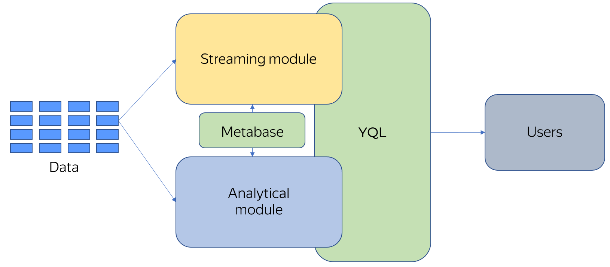
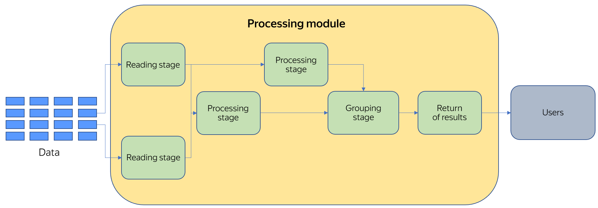

# Query processing

{{ yq-full-name }} is a [massively parallel system](https://en.wikipedia.org/wiki/Massively_parallel) that consists of two modules: batch processing and streaming analysis. Both modules store data in a single query metabase. A query can be analytical or streaming. The query runtime is selected depending on its type.

The runtime module divides a query into stages, each performing its own function. The more complicated a query is, the more stages its execution involves.

## Batch processing module

Once an analytical query is received, it's split into a number of independent stages distributed across a large number of servers to be executed. {{ yq-full-name }} selects the number of stages automatically after analyzing the data volume. Any computation during processing is performed in-memory with no data saved to disk.

Currently, the batch processing module can get data from:
- {{ objstorage-full-name }}.

Since a query is executed in-memory, there are limitations on the maximum volume of data used in queries where data is aggregated (`GROUP BY`) or combined (`JOIN`).

Cluster-wide capacity is used to execute analytical queries. This capacity is used while processing the query, and is then released. If multiple analytical queries are run concurrently with large amounts of data being processed, new queries may receive errors due to insufficient resources during their execution. This doesn't happen often, and usually all you have to do is rerun a query so it starts.

## Streaming processing module

To perform streaming processing, data is read from a data stream bus and, like in the batch processing module, is split into independent stages distributed across servers. The number of stages is selected based on the analysis of the data stream capacity. Any computation during processing is performed in-memory with no data saved to disk.

Often, only a set of changes from the source system is transferred in data streams. This set of changes might be insufficient for processing a query and making a decision. Therefore, references are used to extend the semantics of processed data. A reference is a statical set of information that lets you enrich streaming data.

Currently, the streaming processing module can get data from:
- [{{ yds-full-name }}](../../data-streams/concepts/index.md).

References can be stored in:
- [{{ objstorage-full-name }}](../../storage/concepts/index.md).

To protect the system from overloading, computations are scaled automatically and insufficient memory is handled. To safeguard the system from failures, the current state of computations is saved to an external storage system on a regular basis.

